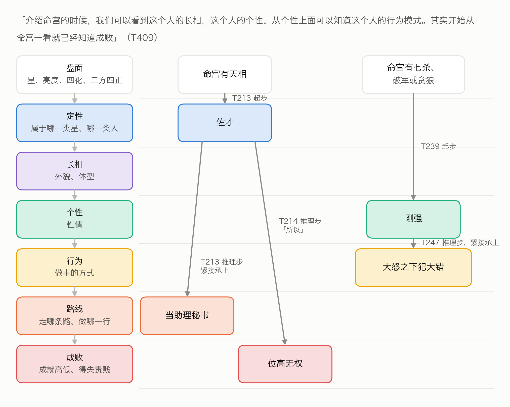
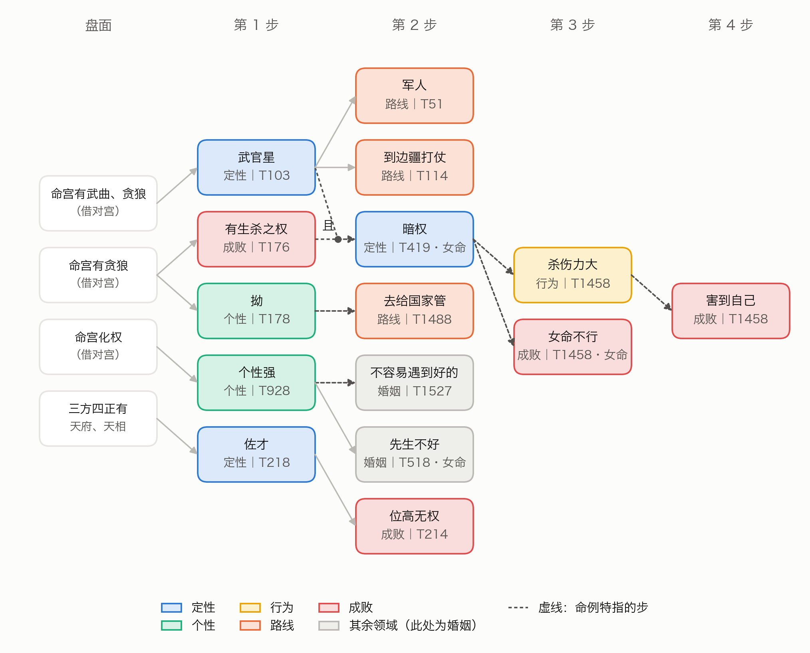

## 名词白话

不熟悉紫微斗数或编程的读者，可先看这几条；完整的名词表见补充材料 S1。

- **命盘、十二宫**：按出生时间排出的一张图，分十二格，每格叫一宫，各管一类人或事（命宫管本人，夫妻宫管配偶，官禄宫管事业……）。
- **星、亮度、四化**：宫里落的星。同一颗星落在不同的宫有强弱，叫亮度（庙、旺、利、陷）。出生年让四颗星分别带上化禄、化权、化科、化忌，叫四化。
- **三方四正、格局**：看一宫时连同对面一宫和隔四宫的两宫一起看，叫三方四正。几颗星按特定位置组合成的名目叫格。
- **先天、运限**：先天看一生；大限是每十年一段的运，流年是某一年的运。本文的引擎只推先天。
- **判断、结点**：倪海厦说的一个判断，例如「佐才」「位高无权」。不同讲次的说法归并后叫一个结点。
- **起步、推理步**：起步由盘面直接得出一个判断；推理步由前面已得出的判断推出后一个判断。一步接一步连起来叫链。
- **命主、命例**：命主是倪海厦在课上讲过命盘的人；命例是他讲某位命主的那一段话。
- **候选盘、随机盘**：出生时辰不能唯一确定时的几张可能的命盘，叫候选盘；用公开种子生成、不对应真人的命盘叫随机盘。
- **认本人检验**：给 AI 审者一份陈述（倪海厦讲某个人时说的话，改写成白话）和四份论断，其中一份由这个人的命盘推出，让审者挑出最贴近的一份。瞎猜认对的机会是四分之一。
- **AI 实例**：同一种大语言模型开出的、互相独立的一次会话或一次调用。下文的抽取者、核查者、归类者、审者都是 AI 实例。

## 一、引言

倪海厦（学生多称倪师）《天纪》讲座的紫微斗数部分流传很广。他讲看命宫的顺序是：

> 「介绍命宫的时候，我们可以看到这个人的长相，这个人的个性。从个性上面可以知道这个人的行为模式。其实开始从命宫一看就已经知道成败」（T409）

讲天相时，他先说它是什么样的星，再说这样的人能做到什么程度：

> 「是非常好的良佐，辅佐的人才，所以天相呢，一定是位高无权」（T214）

「位高无权」不是从星直接读出来的，是用「所以」从「佐才」推出来的。

作者的前一篇论文（下称前作）把同一份讲稿整理成 1064 条「如果……就……」的规则，各条规则各自命中，再按属性取舍。这样整理，上面的话会变成三条并列的规则：天相坐命 → 佐才；天相坐命 → 当助理；天相坐命 → 位高无权。三个结论都对，可它们之间的推导关系不见了。

本文做第四版：把这种推导关系做出来，回答四个问题：
1. 倪海厦「后一个判断由前一个判断推出」的推导，能不能从原话里忠实地抽出来？抽漏了多少？
2. 照这些推导，引擎在随机盘上推得动推不动？
3. 引擎能不能复现倪海厦自己读过的命例？这是事先登记的主检验。另用「认本人」检验，看引擎推出的论断整体上是否贴近倪海厦对这个人的描述。
4. 他明说出来的推导凭的是什么？借用《易传》解释卦爻的几种体例的名目来看，起步、推理步和《紫微斗数全书》各是什么样子？

本文的贡献有四：
1. 一个推理链知识库：1685 步、1028 个判断结点，每一步都附原话、标明出处；
2. 第四版引擎：从盘面出发一轮一轮往后推，每个判断都带着推出它的完整路径；
3. 一组事先登记的检验。主检验没有通过，照登记的口径报告；
4. 四项事先登记的补充研究：认本人（两次，题目设计不同）、推理方式、召回率。

本文只问引擎像不像倪海厦，不问紫微斗数准不准。

**可核对性。** 倪海厦已经过世，这套体系唯一的权威是他留下的讲课视频，找不到第二位能代表倪师体系的人来复核。本文的做法是让每一步都挂着原话与 T 编号（指向视频的分集与时间点，对照表见补充材料 S12），读者可以逐条核对倪海厦有没有这样说。归类与审者的判断仍是解释性的，本文不把「出处可核」写成「归类已核」。

## 二、相关研究

**把专家知识写成规则。** 把专家的条件式知识写成可执行规则、再前向推理，是专家系统的经典路线（Buchanan 与 Shortliffe，1984；Russell 与 Norvig，2020）。Feigenbaum（1977）指出，难处主要在获取与表示知识。本文的规则不是请专家口述的，而是从一位已故老师的讲课录音里逐句认出来的，每一步都要对得回原话。从文本里找出前提与结论是论证挖掘的课题（Lawrence 与 Reed，2019）；Toulmin（1958）把论证拆成依据、结论与担保；Walton、Reed 与 Macagno（2008）整理了日常论证的型式，例如由征兆推论、由规则推论、由语词归类推论、由类比推论、由因及果推论。本文讨论倪海厦的推理方式时会对照这些型式，但对照只是本研究的类比，不是文献的结论。

**象数与术数的推理。** 易学史研究把《易传》解释卦爻辞的体例归纳为取象、取义、爻位等：取象以卦所象的物、人释之，如《说卦》「乾为天……为君，为父」；取义以卦德释之，如「乾，健也。坤，顺也」；爻位以爻所处的位置及其关系释之，如《系辞下》「二与四同功而异位」（朱伯崑，转引自刘玉平，2002）。此外有象数与义理两种诠释取向的区分（郑吉雄，2006），以及对「象思维」的现代阐发（王树人，2012）；也有学者提醒，这类概念容易泛化成什么都能装的筐（邢玉瑞，2024）。汉学界讨论过中国的「关联性思维」（Needham，1956；Graham，1986）；Henderson（1984）写的是这种宇宙论从兴盛到衰落的历史，Puett（2002）专章讨论战国晚期的关联宇宙论。所以本文只说倪海厦的推理用到了这类资源，不说它代表「中国人的思维方式」。术数的认知特征也有专文讨论（郦全民，2018）。紫微斗数方面，已有源流考证（廖维骏，2020）、效度检验（张惠清，2018）与人类学田野研究（Homola，2023）。专门分析紫微斗数论断推理结构的研究，在本研究的检索范围内未见（检索途径与词表见补充材料 S13）。

**匹配检验。** 「从几份解读里认出本人」是检验占星解读的经典设计（Carlson，1985；Dean 与 Kelly，2003）。泛泛之论人人都觉得像自己，即巴纳姆效应（Forer，1949），是这类设计要防的主要偏差。已有研究的陪衬都是别人的真盘或真剖面；本文第二次认本人检验改用随机生成的盘作陪衬，这是新的设计，用两组对照检查它带来的偏差（7.7）。

**数字人文与 AI 作审者。** McCarty（2005）把建模看作人文计算的核心；把结论、推导与出处连起来，可借鉴知识图谱（Hogan 等，2021）与出处数据模型（Moreau 与 Missier，2013）。强模型作评审与人类的一致率可以很高（Zheng 等，2023），但也可能偏好与自己相似的文字（Panickssery 等，2024）。本文的抽取者、核查者属于同一种模型；新的检验与归类改用另一种模型（三、AI 的分工）。

## 三、材料与前作

**讲稿。** 倪海厦《天纪》讲座的紫微斗数部分（B 站视频 BV1KJsLekEfA），转写为开源语料 nihai-tianji-corpus，每条带视频分集与时间码。按整理主题归在紫微斗数各类之下的有 1593 条，去掉讲易经、医理的 177 条与讲排盘的 42 条，余下 1374 条是本文用的全部原话，前作已分成 35 批。下文用 T 编号引用原话。

**命例与随机盘。** 前作按讲课画面上的命盘反推出生资料，纳入检验的命主 28 人；每人记有倪海厦讲他的时段（前后各加 2 分钟）。有的人出生时辰不能唯一确定，有几张候选盘。检验另用 600 张留出随机盘（男命 313 张、女命 287 张），由公开种子逐项算出。

**《紫微斗数全书》。** 前作的全书分包把古籍原文切成 3025 个单元，其中 2990 句属古籍原文层，含卷一至卷三（与《中华道教大辞典》「三卷」之说相合）。本文从中随机抽 400 句，作推理方式的对照（7.8）。

**AI 的分工。** 知识库的抽取、裁定、核查、归一，以及第一次认本人检验、旧的推理类型归类、召回率，都由 Claude Opus 5.5 的独立实例完成（推理档位 high）。第二次认本人检验、传统框架的归类与《全书》切分，改由 Claude Fable 5.1 经 API 批量接口完成，每个任务一次独立调用，材料全文在提示里。全部交卷先审计、登记，再读答案或做统计（补充材料 S4）。没有人类专家复核，理由见引言的「可核对性」。

## 四、推理链的写法

照 T409 的顺序，把判断分成七层（表1）：盘面是起点，其余六层是判断。层是判断的类别，不是推导必须走的先后。六层以外另有财、婚姻、子女、健康等十三个领域，下文统称「其余领域」。

**表1　判断的分层**

| 层 | 管什么 | 知识库里的例子 |
|---|---|---|
| 盘面 | 星、亮度、四化、三方四正 | 命宫有天相 |
| 定性 | 这颗星让这个人属于哪一类 | 佐才、武官星、文官带、财星 |
| 长相 | 外貌、体型 | 五短、魁梧高大 |
| 个性 | 性情 | 刚强、个性强、拗 |
| 行为 | 做事的方式 | 意气用事、大怒之下犯大错 |
| 路线 | 走哪条路、做哪一行 | 当助理秘书、军人、做生意 |
| 成败 | 成就高低、得失贵贱 | 位高无权、有生杀之权 |

推理链只有两种步：
- **起步**：盘面条件 → 一个判断。条件全部成立，就在这一宫得出这个判断。
- **推理步**：一个或几个判断 → 后一个判断，可以再加盘面条件（附加条件）。

每一步写明出处（T 编号）、宫、适用（先天或运限）、条件或前提、结论（层、判断名、原话说法）、原话摘录、是不是命例特指；推理步另写承接前后的那几个字（连接），例如「所以」「代表」。

**什么算推理步。** 必须是倪海厦自己说出来的推导，下面两种情形有其一：有承接的话（所以、因为、代表、就会……）；或没有承接词，但紧接着的下一句明显在讲前一个判断的后果，连接写「紧接承上」。只是并列几个特征，或前后讲的是不同的星、不同的宫，都不算。原话没说出来的推导，不许为了连贯补上。

## 五、从原话到推理链

**抽取与裁定。** 35 批原话，每批由抽取者甲、乙各自独立抽取，裁定者对照原话和两份抽取逐步定稿。定稿 1826 步：起步 1399 步，推理步 427 步。定稿步里甲乙都抽到的有 1678 步（91.9%）。正式抽取之前先拿 2 批试抽，改定说明后 35 批全部重抽。

**核对与核查。** 脚本核对每一步的原话摘录是该条原话里逐字连续的一段，条件合乎条件词表，1826 步全部合格。全部步再交给没参与抽取的核查者逐步判「成立」与否：起步问原话是不是由这些盘面条件得出这个判断，推理步问原话是不是明说了由前提推出结论。起步 1399 步判成立 1314 步（93.9%），推理步 427 步判成立 373 步（87.4%）；判不成立的 139 步不进知识库（例子见补充材料 S2）。

**判断归一。** 不同讲次说同一个判断用词不一样（「武官星」「将星」「武官的命」……），不归一链就接不上。1347 个判断名由两名归类者各自归并、裁定者定稿，归成 1084 个结点；两人的合并一致率 73.1%，最不稳的是路线、成败一组（63.6%）（补充材料 S3）。

**知识库。** 核查成立的 1687 步换成结点后，有 2 步变成自己推自己，不收。知识库定为 1685 步、1028 个结点（表2）。引擎这一版只推先天、只用可操作的步，共 1098 步。1685 步里命例特指的 676 步；引擎可用的 1098 步里有 339 步，条件一旦成立，引擎就当通则用（影响见 8.3）。

**表2　推理链知识库的规模（步数）**

| | 先天，可操作 | 先天，不可操作 | 运限，可操作 | 运限，不可操作 | 合计 |
|---|---|---|---|---|---|
| 起步 | 857 | 250 | 100 | 107 | 1314 |
| 推理步 | 241 | 22 | 94 | 14 | 371 |
| 合计 | 1098 | 272 | 194 | 121 | 1685 |

371 条推理步共有 434 条连线。主链六层之内的 176 条里，往后推的 134 条，同层的 27 条，往回推的 15 条。最多的是定性 → 路线（44 条）、路线 → 成败（29 条）、定性 → 成败（20 条）；个性 → 行为只有 11 条。推导集中在少数「枢纽」判断上，例如「武官星」一个判断推出 18 个后续判断（补充材料 S3）。

## 六、引擎第四版

引擎对一张盘的十二宫各推一遍。每一宫里，起步的条件成立就得出判断（深度 1）；推理步的前提都已得出、附加条件也成立，就得出后一个判断（深度 = 1 + 前提里最大的深度）；一轮推完再来一轮，直到推不出新的判断，最多 8 轮。同一层里既有吉又有凶的判断，都列出，标「两说」。读盘、条件判断、空宫借对宫完全沿用前作；候选盘各推一次，只留各张都推出来的判断（细节见补充材料 S5）。

示例盘沿用前作的随机盘 r30（写作之前就定下的）。命宫推出 69 个判断，其中 25 个至少经过一步推理步。最长的一条有 4 步（图4）：

> 命宫有贪狼（借对宫）→ 有生杀之权（T176）→ 暗权（T419；另需武官星，限女命）→ 杀伤力大（T1458）→ 害到自己（T1458）

每一步都对得上原话，例如「一般呢贪狼入命的人他有生杀之权」（T176），「那这种暗权的人她杀伤力会很大」（T1458）。T419 与 T1458 相隔一分多钟，讲的是同一位女命；第四版把它们当通则用（8.3）。前作第三版对同一张盘只给出一条条并列的命中，条与条之间没有关系；第四版把其中一部分接成了链。

