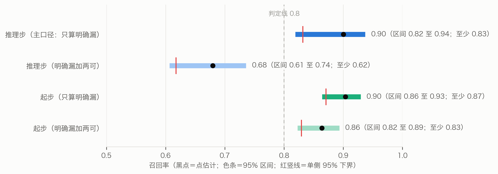

## 七、检验

检验方案、脚本与判据都在运行之前登记了数字指纹（SHA-256），结果不论好坏都报（表3）。主检验没通过之后做的诊断与补充分析，也都先登记、再运行；它们的细节放在补充材料 S6。此后又做了四项补充研究（7.5–7.8），方案都先交给独立的 AI 审稿人找茬，按意见改定之后才登记。

**表3　各项检验的结果**

| 检验 | 性质 | 结果 |
|---|---|---|
| 忠实度 | 描述 | 原话摘录全部逐字合格；独立核查判成立 1687 / 1826 步（92.4%） |
| 覆盖 | 描述 | 600 张留出随机盘，98.2% 的盘命宫推到行为、路线或成败；最长链中位数 2 步 |
| 可追溯 | 程序核对 | 150360 条推导路径、119075 个判断，全部合格 |
| 主检验 | 事先登记 | 复现倪海厦读过的命例：24 人平均 u = 0.432，p = 0.066，**未通过** |
| 认本人（第一次） | 补充研究 | 28 题认对 18 题（瞎猜 7 题），p < 0.001 |
| 认本人（第二次） | 补充研究 | 〔待结果〕 |
| 推理方式 | 补充研究 | 〔待结果〕 |
| 召回率 | 补充研究 | 只算明确漏：推理步 0.90（95% 区间 0.82–0.94，至少 0.83） |

### 7.1 忠实度、覆盖与可追溯

**忠实度**见 5.2：核查者与抽取者是同一种模型，核查结果没有人工复核。

**覆盖。** 在 600 张留出随机盘上各推一次，看命宫（图5）：
- 经推理步推到行为、路线、成败任一层的盘有 589 张（98.2%），推到成败的 542 张（90.3%）。
- 命宫最长一条链（含起步）中位数 2 步，最多 5 步；2 步的盘占 55.2%，4 步以上的约三分之一。
- 命宫推出的判断里，30.9% 至少要经过一步推理步。
- 4 步以上的长链，链上都至少用到一条命例步；只用通则步时，最长链最多 3 步。

所以推理链推得动，多数盘也能推到行为、路线、成败；但多是「起步 + 一步推理步」。

**可追溯**是程序自查：600 张盘上 119075 个判断、150360 条推导路径，每条都有 T 编号，原话摘录逐字出自那一条讲稿，推理步的前提都在同一宫里已经推出，全部合格。它不检验结论对不对。

### 7.2 主检验：复现倪海厦读过的命例

**设计**（图6）。
1. **判断集**：倪海厦讲某人时段内、标了命例特指、适用先天、宫是命宫或身宫的步，它们的结论合成这个人的判断集。
2. **剔除**：把这个人时段内的全部步剔除，引擎只用其余的步推。
3. **得分**：本人盘推出判断集里的几成。
4. **排位**：同一套剔除后的步，在 600 张留出随机盘上各算一个得分。u = 随机盘里得分比本人盘高的比例，相等的算一半；u = 0.5 表示与随机盘一样。
5. **统计**：各人 u 的平均数；每人改抽一张随机盘当「本人盘」，重复 10000 次求单侧 p，p < 0.05 算通过。

**结果。** 28 人里 4 人判断集为空，计入 24 人，判断集按人累计 156 个结点。平均 u = 0.432，即本人盘平均胜过 56.8% 的随机盘；单侧 p = 0.066，**没有达到事先定的 p < 0.05，主检验未通过**。平均 u 的 95% 区间（事后按人重抽）约为 0.33 至 0.53，既容得下没有效果，也容得下中等效果。14 人的本人盘一个判断也没推出。

**诊断**（运行前登记，只作描述，不改「未通过」的结论；全文见补充材料 S6）。
- **多数判断剔除后无处可推。** 156 个判断里，剔除之后引擎可用的步里还能推出的只有 63 个（40.4%）。查遍整个知识库，本人时段以外有 84 个连一步以它为结论的都没有。
- **推得出的，本人盘也多半没推出。** 63 个推得出的判断，本人盘只推出 16 个；11 人一个也没推出。
- **条件对不上盘。** 判断集里条件写得出的起步 61 步，在重建的本人命盘上成立的 32 步，不成立的 29 步。
- **换几种算法都只作描述。** 只用通则步、每张候选盘各算、只和同性别比、去掉前后 2 分钟，平均 u 在 0.39 至 0.43 之间。

### 7.8 召回率：抽取漏了多少

**做法。** 1374 条原话按知识库分三层（含推理步的、只有起步的、一步都没有的），依次随机抽 104、124、72 条，共 300 条。每条由两名找漏者各自照当初的抽取说明找漏，第三名裁定者判「明确漏」「两可」「不合规矩」或「已有」，标准与当初的核查相同。召回率 = 收下的步 ÷（收下的步 + 估计漏掉的步），区间用每层的 Gamma 后验合成。

**结果（图9）。**
- 只算明确漏（事先定的主口径）：推理步的召回率 0.90（95% 区间 0.82–0.94），至少 0.83（单侧 95% 下界）；起步 0.90（0.86–0.93）。照事先写好的解读，抽取漏得不多。
- 把「两可」也算作漏：推理步降到 0.68（0.61–0.74）。
- 样本里确认、能接进知识库的漏步有 10 条（推理步只有 2 条），补回去以后，600 张盘的最长链分布与原来完全相同。对不上结点的漏步、两可的推导会不会把链接长，本文没有检验。
- 同一种模型的几次抽取彼此相关：两名找漏者找到的漏步高度重合，据此推算「两人都漏」的是 0 条，这样估漏会偏低。

