# 从讲述到推理链：倪海厦紫微斗数断法的逐步推理引擎

——以倪海厦《天纪》讲稿为唯一规则来源

## 摘要

倪海厦看紫微命盘是一步接一步的：先从命宫看出这个人属于哪一类，再看个性，由个性推到行为，最后推到成败（T409）。前作把他的《天纪》讲稿整理成「盘面条件 → 结论」的规则，引擎让各条规则各自命中，结论之间没有推导关系。本文把「后一个判断由前一个判断推出」的步，从讲稿原话里逐条抽出来，做成推理链知识库和第四版引擎。

抽取由 AI 完成：1374 条原话由两名抽取者各自独立抽取，第三名逐步裁定，第四名逐步核查。定稿 1826 步，核查判成立 1687 步（定性步 93.9%，推理步 87.4%）。1347 个判断名经两人归类、一人裁定，归成 1084 个结点。

引擎从盘面出发，在每一宫里一轮一轮往后推。每个判断都记下推出它的那几步和原话，600 张随机盘上 15 万条推法全部追得到原话。在这 600 张盘上，98.2% 的盘命宫经推理步推到行为、路线或成败，90.3% 推到成败；最长一条链的中位数是 2 步，最多 5 步。

事先登记的主检验问：剔除倪海厦讲某位命主时说过的全部步，引擎还能不能在这个人的命盘上推出他对这个人的判断？24 人的平均 u 为 0.432（0.5 为随机水平），单侧 p = 0.066，没有达到事先定的 p < 0.05，**主检验未通过**。事后诊断（只作描述）显示，倪海厦对这些命主的 156 个判断，剔除之后有 93 个在知识库里已没有任何一步能推出；他讲命例时的 160 步里，51 步没说出盘面条件。

推理链把倪海厦的推法写成了可运行、每一步可追溯的算法。但只靠他讲通则时说出来的推法，复现不出他对具体命例的判断。

**关键词**：紫微斗数；倪海厦；推理链；前向推理；知识形式化；数字人文

**英文题目**：From Lectures to Reasoning Chains: A Step-by-Step Inference Engine for Ni Haixia's Zi Wei Dou Shu Chart Reading

**Abstract**: Ni Haixia reads a Zi Wei Dou Shu chart step by step: from the life palace he classifies the person, then infers temperament, behaviour, career route and success (T409). Our earlier engine fired if–then rules independently, with no inferential links between conclusions. Here we extract, from Ni's Tian Ji lectures alone, the steps in which one judgment is derived from another, and build a chained knowledge base and a fourth engine version. Two independent large-language-model extractors processed 1,374 lecture passages, a third adjudicated and a fourth checked every step: 1,687 of 1,826 final steps were judged faithful (93.9% of chart-to-judgment steps, 87.4% of judgment-to-judgment steps). Two coders and an adjudicator merged 1,347 judgment labels into 1,084 nodes. The engine forward-chains palace by palace and keeps, for every judgment, the steps and Ni's words behind it; all 150,360 derivations on 600 random charts trace back to the transcript. On these charts, 98.2% reach behaviour, route or success through at least one inference step, and 90.3% reach success; the longest chain has a median of 2 steps and a maximum of 5. The preregistered main test asked whether, after removing every step from the minutes in which Ni discussed a person, the engine still derives Ni's judgments about that person on his or her own chart more often than on random charts. Across 24 persons the mean rank statistic u was 0.432 (0.5 = chance), one-sided p = 0.066, so the test failed its preregistered threshold of p < 0.05. Post-hoc diagnostics show that 93 of Ni's 156 case judgments could no longer be derived by any remaining step, and that 51 of the 160 case-specific steps never state the chart conditions. Reasoning chains make Ni's inferences runnable and traceable, but the steps he states as general teaching do not reproduce his readings of specific people.

**Keywords**: Zi Wei Dou Shu; Ni Haixia; reasoning chain; forward chaining; knowledge formalization; digital humanities

## 一、引言

紫微斗数以出生年、月、日、时排出十二宫命盘，再依宫中的星断人的一生。倪海厦（学生多称倪师）《天纪》讲座的紫微斗数部分流传很广。他讲看命宫的顺序是这样的：

> 「介绍命宫的时候，我们可以看到这个人的长相，这个人的个性。从个性上面可以知道这个人的行为模式。其实开始从命宫一看就已经知道成败」（T409）

他讲星的时候，也常是一步接一步。讲天相，先说它是什么样的星，再说这样的人适合做什么、能做到什么程度：

> 「所以天相星是一个佐才星。你如果是天相入命的人你适合去当人家的助理当人家的秘书去当师爷」（T213）
>
> 「是非常好的良佐，辅佐的人才，所以天相呢，一定是位高无权」（T214）

这里有三个判断：「佐才」「当助理秘书」「位高无权」。后两个不是从星直接读出来的，是从「佐才」推出来的。

前作（第六稿）把同一份讲稿整理成 1064 条「如果……就……」的规则，引擎让各条规则各自命中，再按属性取舍。这样整理，上面三句会变成三条并列的规则：天相坐命 → 佐才；天相坐命 → 当助理；天相坐命 → 位高无权。三个结论都对，但它们之间「由此及彼」的关系不见了。读者看不出一个结论是根据哪个判断推出来的，也看不出倪海厦一层一层往后推的路径。

本文把这条路径做出来。要回答三个问题：
1. 倪海厦「后一个判断由前一个判断推出」的步，能不能从原话里忠实地抽出来？
2. 照这些步，引擎在随机盘上推得动推不动，能不能从命宫一路推到行为、路线、成败？
3. 引擎能不能复现倪海厦自己读过的命例？这是事先登记的主检验。

本文的贡献有三：
1. 一个推理链知识库：1685 步、1028 个判断结点，每一步都附原话，标明出处；
2. 第四版引擎：从盘面出发一轮一轮往后推，每个判断都带着推出它的完整路径（图1）；
3. 一组事先登记的检验。其中主检验没有通过；本文照登记的口径报告，并用事后诊断说明没通过的原因。

本文只问引擎像不像倪海厦，不问紫微斗数准不准。

**名词白话**（不熟悉紫微斗数的读者可先看这几条）：
- **命盘与十二宫**：按出生时间排出的一张图，分十二格，叫十二宫，每宫管一类人或事。命宫管本人，夫妻宫管配偶，官禄宫管事业，财帛宫管钱财。
- **星、亮度、四化**：宫里落的星；同一颗星落在不同的宫有强弱之分（亮度）；出生年让四颗星分别带上化禄、化权、化科、化忌（四化）。
- **三方四正、借对宫**：看一宫时连同对面一宫和隔四宫的两宫一起看，叫三方四正；一宫没有主星（空宫），就借对面那一宫的主星来看。
- **身宫**：命盘上另定的一宫，倪海厦用它看后天的发展。
- **步、结点、链**：本文把倪海厦说的每一个「由什么得出什么」叫一步；每个判断（如「佐才」）是一个结点；一步接一步连起来就是链。

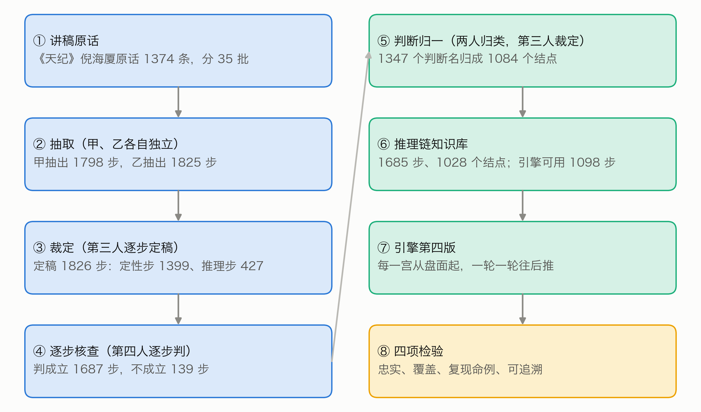

## 二、相关研究

**把专家知识写成规则。** 把专家的条件式知识写成可执行规则，是专家系统的经典路线（Buchanan 与 Shortliffe，1984）。规则可以串起来用：一条规则的结论成为另一条规则的条件，从已知事实一路往后推，就是前向推理（Russell 与 Norvig，2020）。Feigenbaum（1977）指出，这类系统的难处主要在获取与表示专家知识，而不在推理本身。本文的难处也在这里：推理很简单，难的是从讲课录音里把「由什么推出什么」认出来，并且不多认、不少认。

**论证的结构。** Toulmin（1958）把一个论证拆成依据、结论和二者之间的「担保」。倪海厦说「所以天相呢，一定是位高无权」，「佐才」是依据，「位高无权」是结论，「所以」把二者连起来。从文本里自动找出这类前提与结论，是论证挖掘研究的课题（Lawrence 与 Reed，2019）。本文借用这一思路，但不训练模型，而是让 AI 抽取者照一份写明规矩的说明逐条整理，再由另外的实例裁定和核查。

**数字人文与出处。** McCarty（2005）把建模看作人文计算的核心：把研究对象写成形式模型，模型对不上的地方往往最有启发。把结论、推导与出处连起来，可以借鉴知识图谱（Hogan 等，2021）与出处数据模型（Moreau 与 Missier，2013）。中国术数长期是社会史与思想史的研究对象（Smith，1991；Kalinowski，2003；李零，2006），但这些研究不处理断法能否写成可运行的推理。

**AI 作整理者与审者。** 本文的抽取、裁定、核查与归一都由大语言模型完成（Anthropic，2026）。强模型作评审与人类的一致率可以很高（Zheng 等，2023），但模型也可能偏好与自己相似的文字（Panickssery 等，2024）。本文的抽取者与核查者属于同一种模型，这一点列入局限。

## 三、材料与前作

**讲稿。** 来自倪海厦《天纪》讲座的紫微斗数部分（B 站视频 BV1KJsLekEfA），转写为开源语料 nihai-tianji-corpus（定版提交 c900061）。每条都带视频分集序号（分P）与时间码，可回原视频核对。本文用前作整理规则时用的同一批 1374 条原话，前作已按主题分成 35 批，每批附前后文。下文用 T 编号引用原话（如 T409）。

**命例。** 倪海厦在课堂上讲过命盘的人里，前作按画面反推出生资料、合并同一人后，纳入检验的有 28 人（第六稿 3 节）。每人记有倪海厦讲他的时段：分P 与起止时间，前后各加 2 分钟。28 人的时段覆盖了 1374 条里的 816 条。有的人出生时辰不能唯一确定，有几张候选盘，引擎只认各候选都推出来的判断。

**随机盘。** 检验用一批新的 600 张留出随机盘，出生资料由公开的种子（METIS-V4-留出随机盘-20261007）逐项算出，生成办法与第三版的留出盘相同。全部命盘都用前作的同一个定版排盘程序排出。

**前作。** 第六稿的知识库有 1064 条规则，引擎前后三版：第一版逐条推；第二版加一层综合取舍；第三版把流年改成倪海厦教的起法。在配对检验里（AI 审者从四份论断中挑出本人那一份），第三版的全文论断认出 23 题（共 28 题，瞎猜约 7 题）。第三版不变，作为本文的基线：第四版的成稿先写推理链一节，后面原样接第三版成稿，供对照（5.3）。推理链知识库是从同一批原话重新抽取的，不是在前作规则上加连线。

**AI 的分工。** 抽取、裁定、核查、归一，每一道都由独立的 AI 实例完成（Claude Opus 5.5，推理档位 high）。每个实例只读本批的材料文件夹，把结果写进指定的一个文件。存档时逐份审计工具记录：有没有读材料以外的文件，材料是不是每一行都读到了。全部 157 份存档，没有一份越界读取，都逐行读完（附录 C）。没有人类专家复核。

## 四、推理链的写法

### 4.1 七层

照 T409 的顺序，判断分七层（表1，图2）：盘面 → 定性 → 长相、个性 → 行为 → 路线 → 成败。前一层的判断可以推出后一层的判断。

**表1　判断的分层**

| 层 | 管什么 | 知识库里的例子 |
|---|---|---|
| 盘面 | 星、亮度、四化、三方四正 | 命宫有天相；三方四正有天府、天相 |
| 定性 | 这颗星让这个人属于哪一类 | 佐才、武官星、文官带、财星、暗权 |
| 长相 | 外貌、体型 | 五短、魁梧高大 |
| 个性 | 性情 | 刚强、个性强、拗 |
| 行为 | 做事的方式、容易做出的事 | 意气用事、大怒之下犯大错 |
| 路线 | 走哪条路、做哪一行 | 当助理秘书、军人、做生意、当老师 |
| 成败 | 成就高低、得失贵贱 | 位高无权、有生杀之权、做主管 |

主链以外，另有财、婚姻、子女、父母、兄弟、朋友合伙、健康、祖业田宅、福德、官非、意外、寿元、其他十三个领域，与前作知识库相同。原话里这些领域的推导照样抽，标明领域，下文统称「其余领域」。

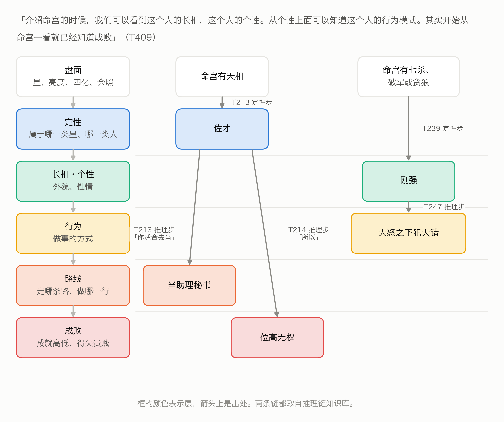

### 4.2 两种步

推理链只有两种步（图3）：
- **定性步**（起步）：盘面条件 → 一个判断。条件全部成立，就在这一宫得出这个判断。名字叫定性步，结论可以落在任何一层。
- **推理步**（承接）：一个或几个判断 → 后一个判断，可以再加盘面条件（附加条件）。前提的判断都已推出、附加条件也成立，就得出后一个判断。

每一步都写明：出处（T 编号）、宫、适用（先天、大限、流年、小限）、条件或前提、结论（层、判断名、原话里的说法、吉凶方向、强度）、原话摘录，以及是不是讲某个具体命例时说的（命例特指）。推理步另写原话里承接前后的那几个字（连接），例如「所以」「代表」「就会」。

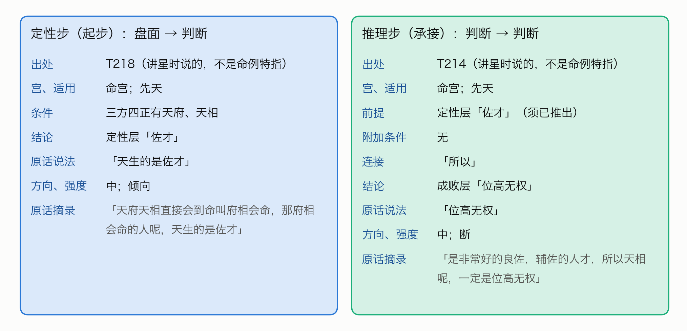

### 4.3 什么算推理步

推理步必须是倪海厦自己说出来的推导，有下面两种情形之一：
- 有承接的话，例如所以、因为、代表、就是说、那就、就会、难怪、「……的人就……」；
- 没有承接词，但紧接着的下一句明显在讲前一个判断的后果（连接写「紧接承上」）。

只是并列几个特征（如「聪明、好动、爱漂亮」），或前后两句讲的是不同的星、不同的宫，都不算。先说结论、后说原因的倒装句，按因果方向记。原话没说出来的推导，不许为了连贯补上。

条件的写法与前作知识库完全相同（第六稿附录 A 的条件词表）。有两类条件引擎不求值，与前作相同：
- 原话只给了格名、没给成格条件的，写「格:格名」；
- 原话没说出盘面、只说「这种命」「这样子」的，写「其他:」并加说明，这一步标为不可操作。

这两类步照样整理、照样存档，只是引擎用不上。

## 五、从原话到推理链

### 5.1 抽取与裁定

35 批原话，每批由甲、乙两名抽取者各自独立抽取。甲抽出 1798 步，乙抽出 1825 步。第三名裁定者对照原话和两份抽取，逐步定稿：两人都抽到的核对后收；只一人抽到的决定收不收，写明理由；层、宫、条件写错的改正。

正式抽取之前，先拿 2 批试抽，看说明写得清不清楚。根据试抽改定的说明登记之后，35 批全部重抽，试抽结果不进知识库。

定稿 1826 步：定性步 1399 步，推理步 427 步，分布在 838 条原话里；含推理步的原话有 291 条。两人的一致程度见图4：
- 按条：1374 条原话里，两人对「这条有没有推理步」判断一致的有 1306 条（95.1%）；
- 按步：定稿步里两人都抽到的 1678 步（91.9%），只甲抽到的 70 步，只乙抽到的 77 步，裁定者补入 1 步。

另有 161 条原话讲的是看盘的方法（例如先看格、再批流年），单独记下，不进推理链。

### 5.2 脚本核对与逐步核查

**脚本核对。** 每一步的原话摘录，必须是该条原话里逐字连续的一段（去掉空白后比较）；条件必须合乎条件词表；推理步的前提必须写成某一层的判断；前提与结论的原话说法，也必须出自原话。1826 步全部合格。

**逐步核查。** 全部步再交给没参与抽取和裁定的核查者，一批一名，逐步判「成立」或「不成立」并写理由：
- 定性步问：原话是不是由这些盘面条件得出这个判断；
- 推理步问：原话是不是明说了由前提推出结论。

结果（图4）：定性步 1399 步判成立 1314 步（93.9%），推理步 427 步判成立 373 步（87.4%），合计成立 1687 步（92.4%）。判不成立的 139 步不进引擎。推理步不成立的，多是把并列当成了推导，或漏了原话里的限定（表4）。

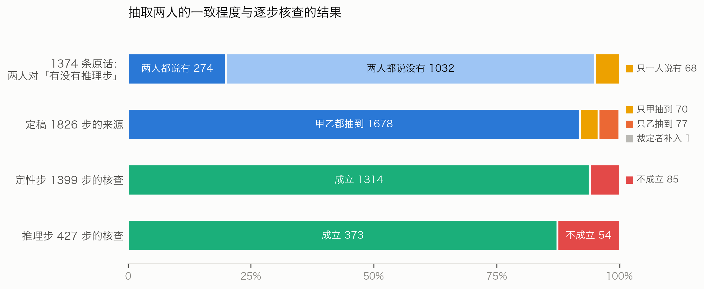

**表4　核查判「不成立」的推理步（按 T 编号顺序的前 5 条）**

| 出处 | 抽成的结论 | 核查理由（节录） |
|---|---|---|
| T6 | 先生当老板 | 两句同在「而且代表」之下，是并列列举紫微七杀的含义，没有承接词 |
| T86 | 宜嫁大 7 岁以上 | 「所以」承接的是另一句；这一步还漏了太阳不亮这个限定 |
| T109 | 成事 | 「有的事情一定要人和才能成事」是泛论，且是必要条件，不是推导 |
| T143 | 不见得是好人 | 原话是在否定「温和就是好人」这个推论，不是推出新结论 |
| T146 | 夫妻有名无实 | 中间隔着「跑掉」，「然后」只是叙事顺序 |

### 5.3 判断归一

不同讲次说同一个判断，用词不一样：「武官星」「将星」「武官带」「将命」说的是同一件事。不归一，链就接不上。

做法与抽取相同，也是两人加裁定：
1. 把定稿步里出现的所有判断名（前提和结论都算）按层列出，共 1347 个，每个附出现次数和一两例原话说法；按层分成六组。
2. 两名归类者各自独立归类：同义的归成一个结点；一个说法里并列两个判断的拆成两个结点；拿不准的不合并；层分错的可以改层，但只能改成本组的层。
3. 第三名裁定者定稿。

1347 个判断名归成 1084 个结点，其中 52 个判断名拆进了两个以上的结点。两名归类者的一致程度见图5：判断名两两配对，两人都放进同一结点的对数，占至少一人放进同一结点的对数，六组合计为 73.1%；最低的是路线、成败一组（63.6%），最高的是长相、个性、行为一组（93.5%）。若把「两人都不合并」也算一致，全部配对里两人判断相同的比例每组都在 99.7% 以上。成员最多的几个结点见附录 B。

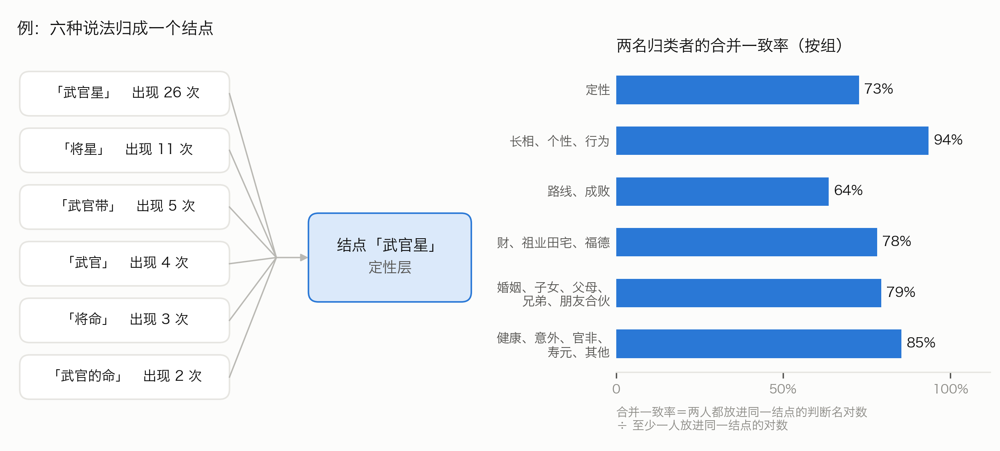

### 5.4 推理链知识库

把核查成立的 1687 步，按归一表换成结点。换算后有 2 步变成「自己推自己」（前提与结论归成了同一个结点），不收。知识库定为 1685 步、1028 个结点（表2）。

**表2　推理链知识库的规模**

| | 先天 | 大限 | 流年 | 小限 | 合计 |
|---|---|---|---|---|---|
| 定性步 | 1107 | 117 | 84 | 6 | 1314 |
| 推理步 | 263 | 64 | 42 | 2 | 371 |
| 合计 | 1370 | 181 | 126 | 8 | 1685 |

引擎这一版只做先天，只用可操作的步：定性步 857 步，推理步 241 步，共 1098 步。不可操作的 393 步（条件里有「其他:」）照样存档。1685 步里有 676 步是讲具体命例时说的；引擎可用的 1098 步里，这样的步有 339 步，其中推理步 103 步。它们的条件一旦成立，引擎就当通则用（7.3）。

371 条推理步共有 434 条连线（前提结点 → 结论结点）。按层统计（图6）：
- 主链上最多的是定性 → 路线（44 条）、路线 → 成败（29 条）、定性 → 成败（20 条）；
- 个性 → 行为只有 11 条，长相往后推的只有 2 条；
- 其余领域内部的推导最多（141 条），例如婚姻、子女各自内部一步推一步。

推导集中在少数「枢纽」判断上（图7）。「武官星」一个判断就推出 18 个后续判断：军人、警察、司法官、外交官、到边疆打仗，以及有生杀之权、威震边疆，等等。「佐才」推出当助理秘书、帮人做事领薪水、位高无权；「文官带」推出当公务员、当老师、在银行界。这正是 T409 说的次序：先定性，再推路线和成败。

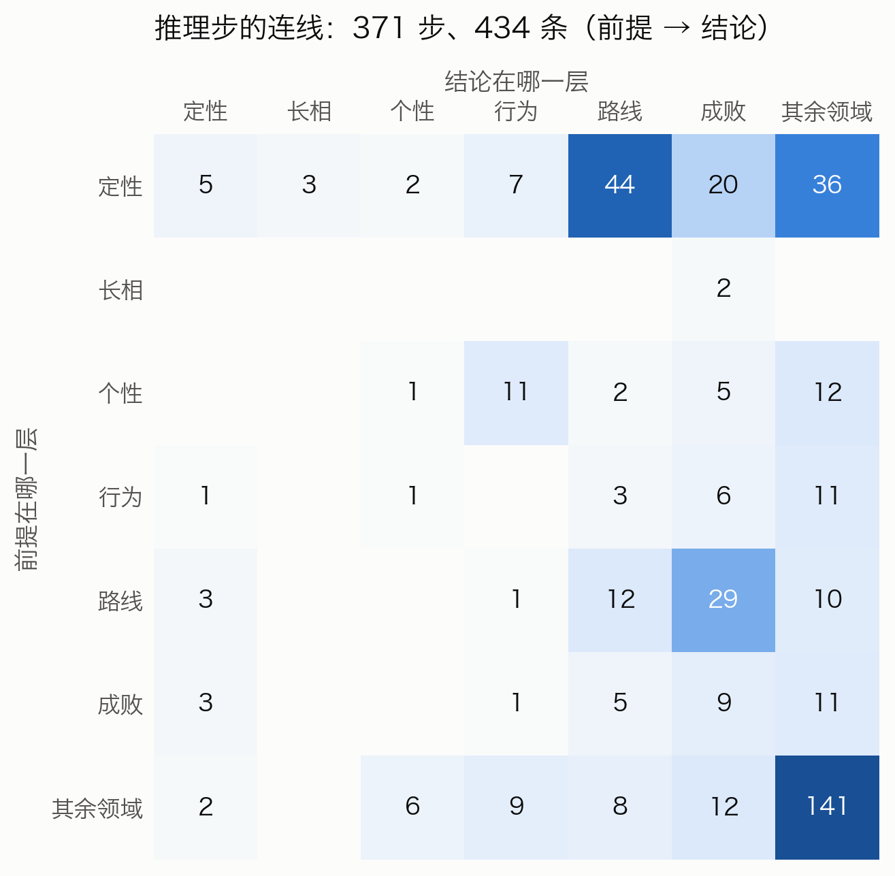

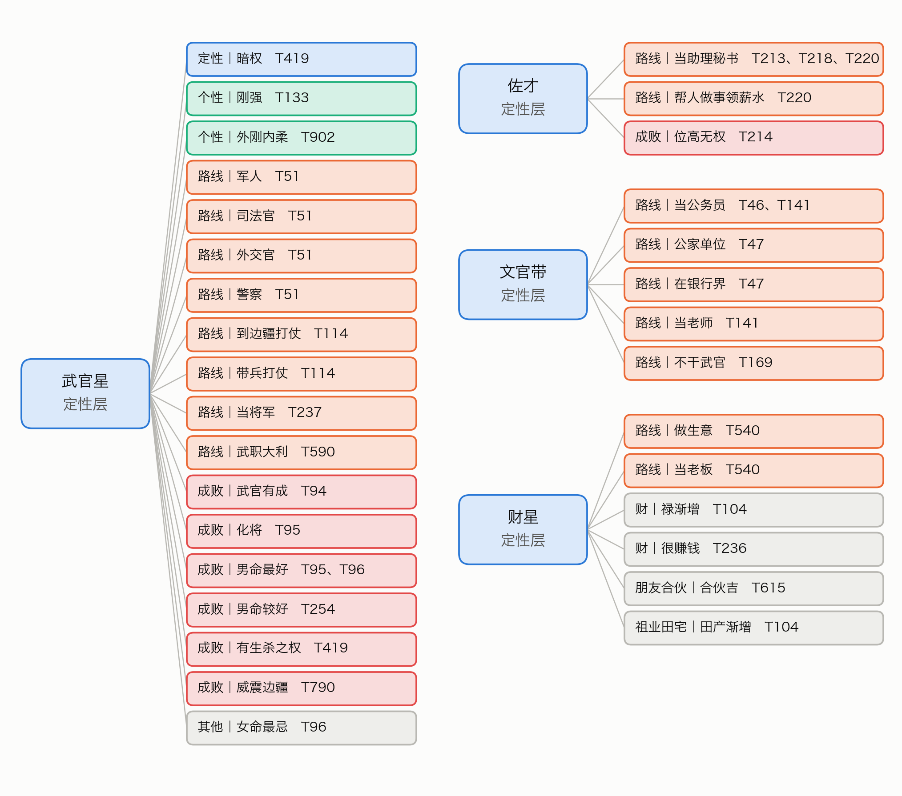

## 六、引擎第四版怎样一步步推

### 6.1 算法

引擎对一张盘的十二宫各推一遍（图8）。读盘、条件求值与空宫借对宫，完全沿用前作的第一版引擎；五种修正也照用，但只用于定性步，只改方向与强度。第一至三版的文件一个不改。

记一宫为 $g$。$D_g$ 是在这一宫已经得出的判断集合，$d_g(n)$ 是判断 $n$ 的深度。

**第一步，定性步。** 对每一条定性步 $q$（条件 $C_q$，结论 $n_q$）：

$$C_q \text{ 在 } g \text{ 都成立} \;\Rightarrow\; n_q \in D_g,\quad d_g(n_q) = 1$$

**第二步起，推理步。** 对每一条推理步 $r$（前提 $P_r$，附加条件 $A_r$，结论 $n_r$）：

$$P_r \subseteq D_g \text{ 且 } A_r \text{ 在 } g \text{ 都成立} \;\Rightarrow\; n_r \in D_g,\quad d_g(n_r) = 1 + \max_{p \in P_r} d_g(p)$$

一轮推完再来一轮，直到推不出新的判断为止，最多 8 轮。一个判断有几种推法时都记下，成稿显示深度最小的那一条。深度就是从盘面到这个判断经过的步数。

**两说。** 同一宫、同一层里既有吉的判断又有凶的判断，就标「两说」，都列出来，不投票，也不按条数取舍。

**一步用在哪一宫。** 步写某宫的，只用在那一宫；写身宫的，用在身宫所在之宫；写「任一宫」的（讲星的通义，没限定在哪一宫），照前作的用法：人宫（命宫、兄弟、夫妻、子女、仆役、父母）都用，事宫（财帛、官禄、田宅、疾厄、迁移、福德）只在结论合乎该宫宫性时用，例如路线、成败用在官禄宫。

**候选盘。** 出生时辰不定、有几张候选盘的，每张各推一次，只留各张在同一宫都推出来的判断。

**成稿。** 第四版写出「推理链」一节：先写命宫的主线，再写身宫和财帛、官禄、迁移，最后写其余各宫。每个判断写明由哪个判断（或哪些盘面条件）推出、出处的 T 编号和原话摘录。第三版的成稿不变，两者并排时推理链在前（6.3）。

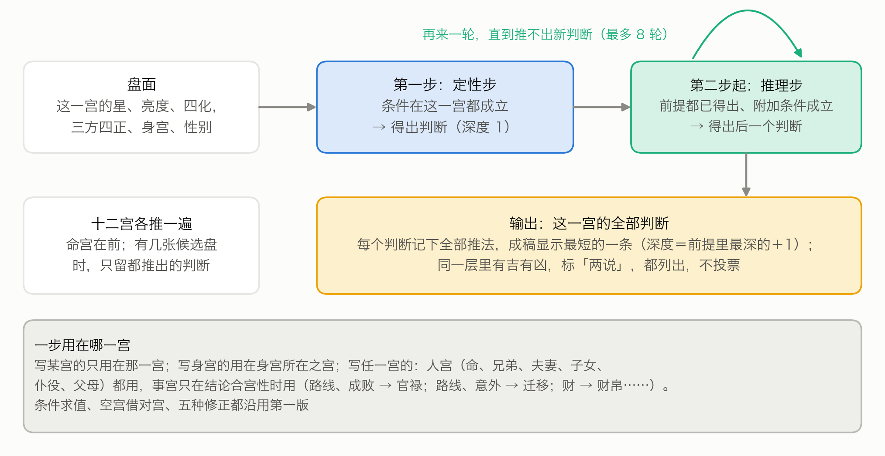

### 6.2 一张盘的示例

示例盘沿用第六稿的随机盘 r30，这是写作之前就定下的，不是看了结果再挑的（图9）。这是一张女命，命宫在未，是空宫，借对宫（丑）的武曲、贪狼；身宫在卯，落在财帛宫。

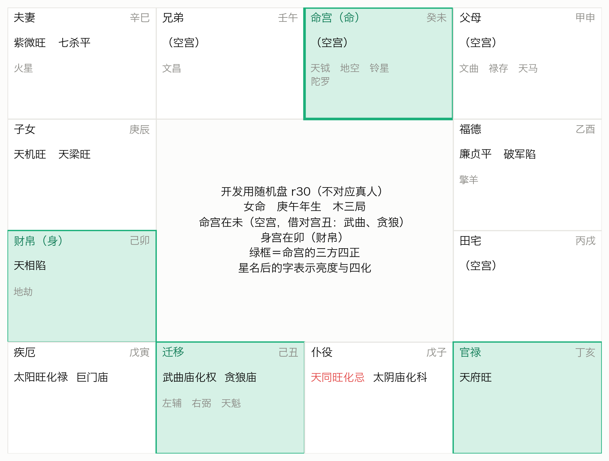

命宫一共推出 69 个判断，其中 25 个至少要经过一步推理步才得出。图10 画出命宫的几条主线。最长的一条有 4 步：

> 命宫有贪狼（借对宫）→ 有生杀之权（T176）→ 暗权（T419，女命）→ 杀伤力大（T1458）→ 害到自己（T1458）

每一步都对得上原话：「一般呢贪狼入命的人他有生杀之权」（T176）；「将军的命有生杀之权，那你又是阴……就是说她是暗权」（T419）；「那这种暗权的人她杀伤力会很大」（T1458）；「只有杀到自己就害到自己」（T1458）。T419 和 T1458 出自分P 13 里相隔一分多钟的同一段，是倪海厦讲一位女命时说的；第四版把它们当通则用，条件成立就推，这一点在 8.3 再谈。

另一条短链就是引言里的天相例：三方四正有天府、天相 → 佐才（T218）→ 位高无权（T214）。

这张盘推得比多数盘长：命宫用上的推理步有 30 条，600 张随机盘的上四分位是 23 条；最长链 4 步，等于 600 张盘的上四分位。命宫有 5 处两说，例如定性层同时有吉的「大财星」与凶的「杀星」。

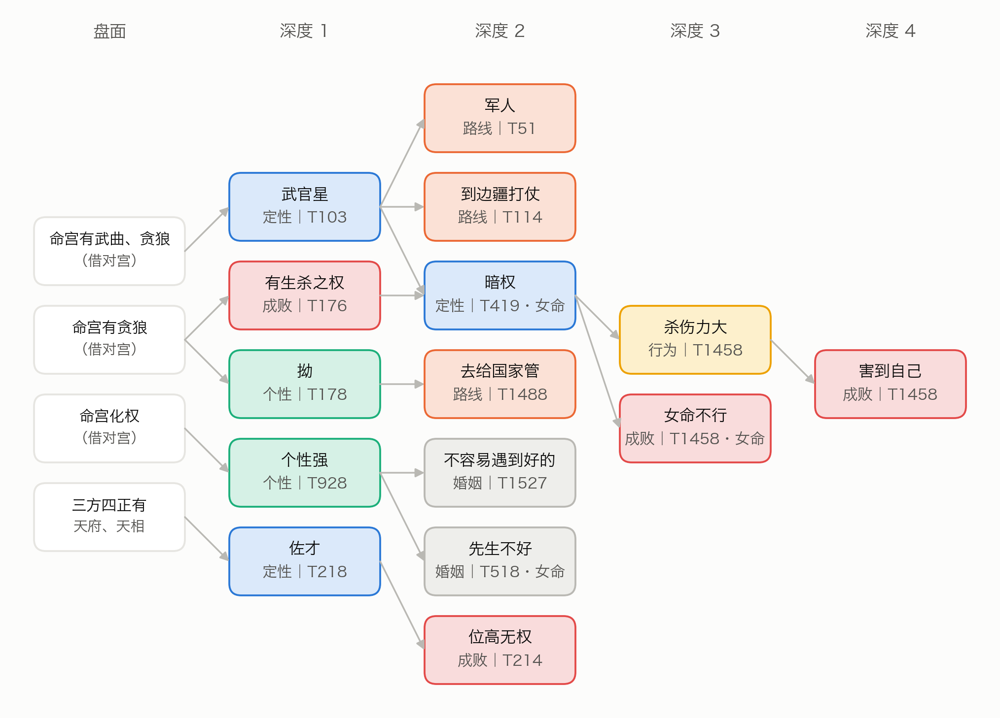

### 6.3 与第三版对照

同一张盘，第三版的命宫一节是一条条并列的命中：武曲贪狼是武官星（T97），贪狼入命的人一般有生杀之权（T176），一定会做主管（T934）……每条都对得回原话，但条与条之间没有关系。第四版把其中一部分接成了链：有生杀之权不再是孤立的一条，它和武官星一起推出暗权，再推出后面的行为和成败（图11）。

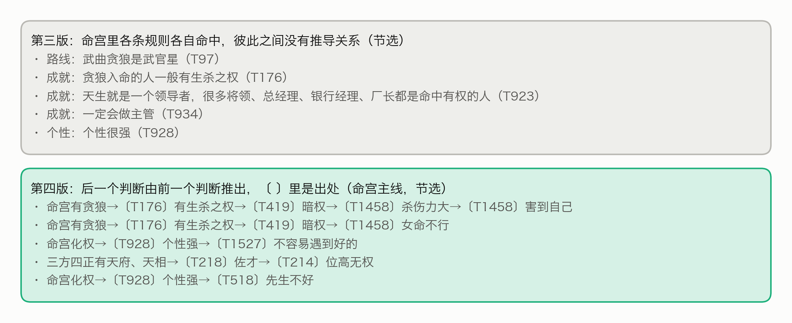

## 七、检验

检验方案、脚本与判据都在运行之前登记了数字指纹（SHA-256），结果不论好坏都报。四项结果汇总在表3。

**表3　四项检验的结果**

| 检验 | 做法 | 结果 |
|---|---|---|
| 忠实度 | 脚本核对原话摘录；独立核查者逐步判 | 摘录全部逐字合格；成立 1687 / 1826 步（92.4%） |
| 覆盖 | 600 张新随机盘，只作描述 | 98.2% 的盘命宫推到行为、路线或成败；90.3% 推到成败 |
| 主检验 | 复现倪海厦读过的命例，p < 0.05 算通过 | 24 人平均 u = 0.432，p = 0.066，未通过 |
| 可追溯 | 600 张盘上逐条核对推法与成稿 | 150360 条推法、119075 个判断，100% 合格 |

### 7.1 忠实度

见 5.2：脚本核对全部合格；独立核查判成立的，定性步 93.9%，推理步 87.4%。不成立的 139 步不进引擎。核查者与抽取者是同一种模型，核查结果没有人工复核。

### 7.2 覆盖

在 600 张新随机盘上各推一次，看命宫（图12）：
- 经推理步推到行为、路线、成败任一层的盘有 589 张（98.2%）；推到成败的有 542 张（90.3%）。按层看，推到路线的 93.7%，行为 72.0%，个性 66.2%，长相只有 1.3%。
- 每张盘命宫用上的推理步，中位数 18 条（四分位 10 至 23 条），最多 43 条。
- 命宫最长一条链的步数：中位数 2 步（四分位 2 至 4 步），最多 5 步。2 步的盘占 55.2%，5 步的占 20.0%。
- 命宫推出的判断里，30.9% 至少要经过一步推理步才得出；其余直接由定性步得出。
- 命宫有两说的盘有 560 张（93.3%），每张盘中位数 3 处。

推理链推得动，也推得到成败；但链大多很短，多数盘是「定性步 + 一步推理步」。

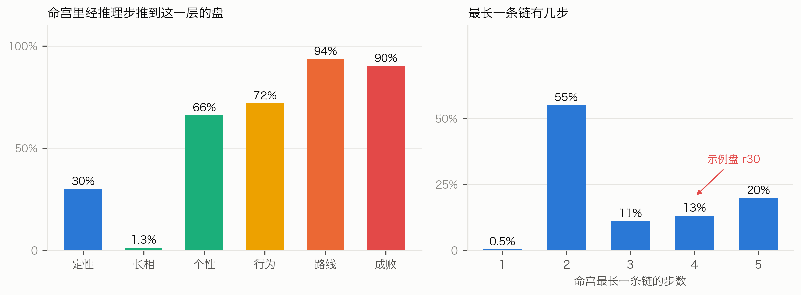

### 7.3 主检验：复现倪海厦读过的命例

**设计**（图13）。人就是前作的 28 位命例，用同一批候选盘。
1. **倪师判断集**：这个人讲述时段内、标了命例特指、适用先天、宫为命宫或身宫的步，它们的结论（归一后的结点），记作 $G$。没有这类步的人不计入，人数照报。
2. **剔除**：这个人时段内的全部步，不论是不是命例特指，一律剔除，引擎只用其余的步推。
3. **得分**：引擎在本人盘 $X$ 的命宫推出的判断，加上身宫所在之宫里经「身宫」途径推出的判断，记作 $N(X)$；得分 $s(X) = |G \cap N(X)| / |G|$。
4. **排位**：同一套剔除后的步，在 600 张留出盘 $H$ 上各算一个得分。

$$u = \frac{\#\{H: s(H) > s(X)\} + 0.5 \times \#\{H: s(H) = s(X)\}}{600}$$

$u = 0$ 表示本人盘比所有随机盘都好，$u = 0.5$ 表示和随机盘一样。

5. **统计**：主统计量是各人 $u$ 的平均数。p 值这样算：每人改从 600 张留出盘里随机抽一张当作「本人盘」，算出平均 $u$；重复 10000 次（种子 METIS-V4-复现检验-20261007），看有多少次不大于实测值。单侧，p < 0.05 算通过。

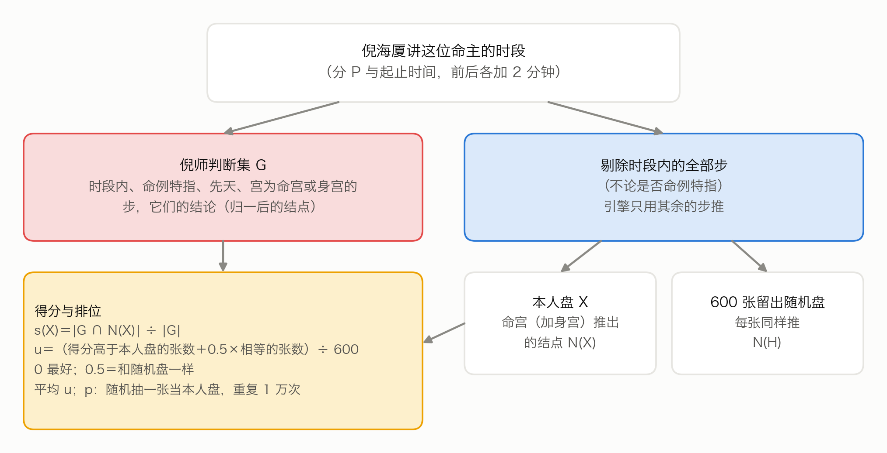

**结果**（图14）。28 人里，4 人在讲述时段内没有命例特指、先天、命宫或身宫的步，不计入；计入 24 人，每人的判断集有 1 至 17 个结点，合计 156 个；每人剔除的引擎可用步在 4 至 136 步之间，中位数 22.5 步。
- 平均 u = 0.432，中位数 0.5。单侧 p = 0.066，**没有达到 p < 0.05，主检验未通过**。
- 24 人里 10 人的 u 小于 0.5；只有 1 人的 u 不大于 0.05。
- 只用定性步、不用推理步时，平均 u = 0.435，p = 0.071，与用全部步几乎一样。
- 倪师判断集里推理步的连线（前提 → 结论）共 42 条，引擎在本人盘上用同样的推法复现的只有 1 条（2.4%）；在随机盘上平均复现 1.0%。

方向是对的（平均 u 小于 0.5），但不显著；推理步也没有让结果变好。

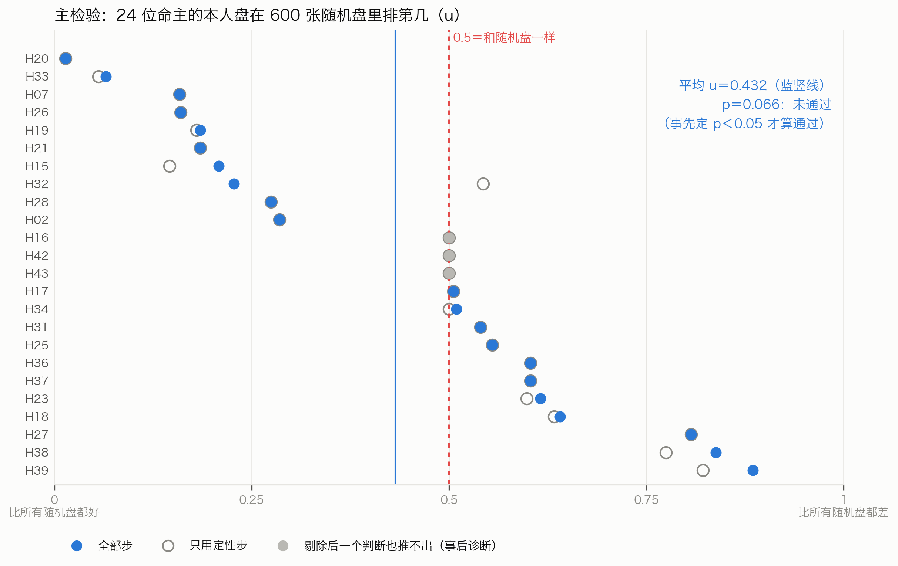

### 7.4 可追溯

在 600 张随机盘上逐张推理、逐条核对：
- 每个判断的每一种推法，用到的步都有 T 编号，T 编号在讲稿里，原话摘录逐字出自那一条；
- 推理步的每个前提，在同一宫里确实已经推出；
- 推理链成稿里每个判断都出现，并带着出处。

共 119075 个判断、150360 种推法，全部合格（100%）。

### 7.5 事后诊断：主检验为什么没通过

主检验没通过之后，先写下要看什么、登记，再跑诊断。诊断只作描述，不报 p 值，不据此改知识库或引擎，也不改「未通过」的结论（图15）。

**一、六成判断剔除后推不出来。** 24 人的 156 个判断里，剔除各人时段内的步之后：
- 知识库里还有能推出它的步的，只有 63 个（40.4%）；
- 在 600 张随机盘的任何一张上真推出来过的，50 个（32.1%）；
- 其余 93 个，已没有任何一步能推出。

也就是说，倪海厦对这些人说的话，多数只在讲这个人时说过一次，他讲通则时没有说过同样的推法。3 个人的判断一个也推不出，他们的 u 都正好是 0.5。只看另外 21 人，平均 u 为 0.422，与全体相近。

**二、近三分之一的命例步说不出盘面。** 156 个判断来自 160 步：
- 98 步的条件都能求值；
- 11 步靠「格」；
- 51 步原话没说出盘面，只说「这种命」「这样子」。

后两类即使不剔除，引擎也用不上。

**三、不剔除时的机制核对。** 不剔除这个人时段内的步，本人盘平均推出判断集的 27.1%，随机盘平均 10.0%，平均 u 为 0.301。这一项是循环的：命例步本来就是照这张盘说的，得分高不说明任何事。它只说明管道是通的：条件写法、归一、身宫途径能把判断推回本人盘。但即使这样，也只推回四分之一。

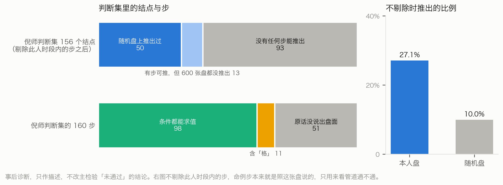

## 八、讨论

### 8.1 推理链让什么看得见了

**倪海厦说出来的推法很短。** 知识库 1685 步里推理步只有 371 步（22%）。在随机盘上，命宫最长的链多半只有两步：先由盘面定性，再推一步。最长的也只有五步。T409 说的「从个性上面可以知道这个人的行为模式」，讲稿里明说出来的个性 → 行为推导只有 11 条连线，长相几乎不往后推。他口头上讲的是一条长链；整理出来，多是从「定性」出发的一层扇形。

**定性是枢纽。** 推导集中在「武官星」「佐才」「文官带」「财星」这类定性判断上：先认出这个人是哪一类，再由此推出路线和成败（图7）。这与他讲课的次序一致。

**两说很普遍。** 93.3% 的盘命宫有两说。推理链把两说的来历摆了出来：同一颗星既被说成财星，又被说成杀星；两条判断各自往后推，推出的成败也一吉一凶。引擎不替他取舍，只照实列出。

**每一步都对得回原话。** 读者看到「害到自己」，可以顺着链往回查：它从「杀伤力大」推出，「杀伤力大」从「暗权」推出，「暗权」又从「武官星」和「有生杀之权」推出，每一步都有 T 编号和原话。前作的规则也有出处，但只到「这条规则从哪句话来」；推理链多了一层：这个结论是由哪个结论、按哪句话推出来的。

### 8.2 为什么复现不出命例

主检验没通过。事后诊断指向两个原因：
1. **他讲命例时说的判断，多数在别处没有通则。** 剔除之后，六成的判断已没有任何一步能推出。他看具体的人，说出的往往是这个人特有的判断，而不是先前教过的推法的组合。
2. **他讲命例时常不说盘面。** 近三分之一的命例步只说「这种命」「这样子」，没说是什么星、哪一宫，引擎无从求值。

另外两点也说明推理步没帮上忙：只用定性步时结果几乎一样；倪海厦在命例上说的推导共 42 条连线，引擎只在本人盘上复现了 1 条。

这与前作的配对检验并不矛盾。配对检验让 AI 审者读全文论断，看能不能从四份里认出本人；论断涵盖十二宫、大限和流年，审者可以综合判断。本文的主检验要求判断结点逐个对上，只看命宫与身宫，只用先天，而且剔除的范围很宽，是严得多的检验。

### 8.3 局限

- **全部由 AI 完成。** 抽取、裁定、核查、归一都由同一种模型完成，没有人类专家复核。核查与抽取用同一种模型，可能有相同的偏差。
- **归一的粗细。** 合得太粗，会接出倪海厦没说过的链；分得太细，链会断。路线、成败一组两名归类者的合并一致率只有 63.6%。
- **两类步用不上。** 引擎不求「格」与「其他」条件，393 步不可操作，照样存档但不推。
- **命例步被当通则用。** 引擎可用的步里有 339 步是讲具体命例时说的，条件成立就推。示例盘那条「暗权」链里，有三步出自他讲一位女命的话。这样做可以多接上一些链，也可能把就事论事的话推广了。主检验对每个人都剔除了本人时段内的步，所以检验本身不受影响。
- **只做先天。** 大限、流年、小限的 108 条推理步只存档，这一版不用。
- **设计者不盲。** 设计主检验之前，设计者读过部分命例原话。主检验是事先登记的，但设计者不盲，照实写出。
- **功效有限。** 只有 24 人，每人的判断集 1 至 17 个结点。剔除的范围很宽：28 人的讲述时段覆盖 1374 条原话里的 816 条，知识库 1685 步里有 1077 步落在某人的时段内。所以主检验偏保守。

### 8.4 对数字人文的意义

把一位老师的口授写成推理链，得到的不只是一个能跑的程序，也是一份可以检查的「推理清单」。它让人看清：哪些推法他讲出来了，哪些只停在结论；哪些推法在通则里，哪些只在命例里。本研究里，模型对不上的地方（主检验没过、链很短、命例判断别处没有通则），正是对倪海厦方法最有信息量的发现（McCarty，2005）。

## 九、结论

只用倪海厦《天纪》讲稿，可以把他「后一个判断由前一个判断推出」的推法逐步抽出来：1685 步、1028 个判断，每一步都对得回原话，独立核查判成立 92.4%。照这些步，引擎在随机盘上能从命宫一路推到行为、路线和成败，每个判断都追得到原话。

但是，事先登记的主检验没有通过：只用他讲通则时说出来的步，复现不出他对具体命例的判断。事后诊断显示，他对命例的判断多数在别处没有通则，近三分之一的命例步没说出盘面。

推理链把倪海厦的推法写成了可运行、可检查的形式，也把它的边界照了出来：他教给学生的推法很短，以「定性」为枢纽；他看具体的人时说的话，大部分不在这些推法里。

## 声明

**AI 使用。** 本研究的推理链抽取、裁定、逐步核查、判断归一与裁定，都由 Anthropic 的 Claude Opus 5.5 的独立实例完成（推理档位 high），共 157 份存档；试抽另用了若干实例，结果不进知识库。每个实例只读本批材料，不联网，不运行程序，工具记录逐一审计。程序编写、统计与论文写作也由 Claude 完成。上游的转写语料由 xAI 的 Grok 整理、Claude 核验；命盘读数与排盘程序快照的来历见第六稿声明。研究发起人即作者，提出问题、提供资料、确定目标与范围，审阅分析与文字，对全文内容负责。因为没有人类专家可用，研究发起人要求全部工作由 AI 完成。

**版权。** 《天纪》讲课内容的著作权归倪海厦先生及其权利继承人。转写语料由研究发起人整理开源，用 CC BY-NC-SA 4.0 许可（非商业使用），权利方提出异议即下架。推理链知识库每一步附原话摘录，公开时按语料的许可处理。排盘程序里的亮度表、四化表等，据程序注释是反编译文墨天机得来的，权利状况未经法律意见确认。

**数据与代码。** 推理链知识库、归一表、引擎代码、检验脚本与结果、全部存档与审计记录、登记文件及其数字指纹，将公开于〔仓库地址待定〕；含原话摘录的部分沿用语料的 CC BY-NC-SA 4.0 许可，其余许可证〔待定〕。命例只用编号，出生参数不公开。

**登记。** 方案、说明、脚本与中间结果都在运行前登记数字指纹，之后不改；改动另出新版本并写明理由。登记表随数据公开；登记表是本地文件，登记时间只能依登记表自身的记录。

**伦理。** 命例取自公开的讲课视频，文中只用编号。涉及生死的断语，在成稿中照原话列出出处，不作预测。本文不主张紫微斗数有预测效力；用于网站时，应向用户说明这一点。

**基金。** 无。

**利益冲突。** 研究发起人运营 Metis 排盘网站，计划以本文的知识库与引擎作为断语层；本文所用的转写语料也由研究发起人整理开源。

**作者贡献。** 〔作者姓名〕（研究发起人）提出问题，确定材料、目标与范围，审定方案与结论。AI 不列为作者。

## 附录 A　推理步样例

按事先写定的规则挑选：知识库里连接词含「所以」、前提与结论都在主链六层的推理步共 24 条，按 T 编号顺序取前 10 条（表5）。

**表5　推理步样例**

| 出处 | 前提 | 结论 | 原话摘录 |
|---|---|---|---|
| T3 | 定性「官带」 | 路线「当官」 | 「紫微星主的是官，官带。所以有紫微星出现的时候，它代表的是官印，官的命」 |
| T14 | 定性「孤帝」 | 路线「僧道」 | 「孤帝，孤独的皇帝。所以是僧道」 |
| T97 | 定性「发阴」；附加条件：女命 | 定性「正将星」 | 「发阴因为阴冷啊，晚上晚夜丑时是夜半嘛，所以你如果算到男人这个，和女人这个不一样，女人呢晚上出的武官星的时候，是正科正将星」 |
| T141 | 定性「教星」＋定性「文官带」 | 路线「当公务员」、路线「当老师」 | 「天府星的人它是个文官星。也是一个教星。所以很多天府坐命的人去当公务人员当教员」 |
| T196 | 成败「声名远播」 | 成败「不见得不好」 | 「哇声名远播名气很大，大家大家都喜欢啊，所以桃花命坐命不见得不好」 |
| T214 | 定性「佐才」 | 成败「位高无权」 | 「是非常好的良佐，辅佐的人才，所以天相呢，一定是位高无权」 |
| T224 | 定性「文武双全」 | 路线「文官武官都能干」 | 「我们星斗里面就这颗星是允文允武的星。所以很多人武官天梁星。文官也有天梁星。所以一般来说天梁星坐命的人文官也干干武官也干干」 |
| T234 | 成败「官威官权大」；附加条件：其他（原话没说禄在哪颗星、哪一宫） | 路线「走财经界」 | 「是这个有官威官权很大，那她先生的官权又带禄，所以很可能是走财经界」 |
| T234 | 路线「走财经界」 | 路线「在银行界」 | 「所以很可能是走财经界，不然你这个权是掌掌财禄的嘛，所以她先生在银行界」 |
| T234 | 路线「在银行界」＋成败「官威官权大」 | 成败「很高的主管」 | 「是这个有官威官权很大，那她先生的官权又带禄，所以很可能是走财经界，不然你这个权是掌掌财禄的嘛，所以她先生在银行界，是一个很高的一个主管」 |

T234 的三步是讲一位命主的先生时说的（命例特指）；第一步的附加条件原话没说清，标为不可操作。

## 附录 B　归一样例

成员最多的 6 个结点（表6）；括号里是这个判断名在定稿步里出现的次数。

**表6　成员最多的 6 个结点**

| 层 | 结点 | 归进来的判断名 |
|---|---|---|
| 官非 | 官司 | 官司是非（5）、吵架打官司（3）、官司牢狱之灾（3）、官司纠纷（2）、官司（1）、官司口舌（1）、必打官司（1）、打官司（1）、是非口舌官司（1）、是非官司刑克（1）、法院互告（1） |
| 路线 | 做生意 | 做生意（8）、做生意当老板（3）、自己做生意当老板（3）、从商（2）、生意商人（2）、会做生意（1）、做生意当大老板（1）、自己做生意（1）、自己当老板好（1） |
| 路线 | 专业技术专长 | 专科技术专长（3）、有专业技术专长（3）、专业技术特长（2）、靠专业专长（2）、走专业技术专长（1）、靠专业技术专长赚钱（1）、靠专科技术专长（1）、靠技术专长谋生（1） |
| 路线 | 帮人做事领薪水 | 帮人领固定薪水（2）、公家单位或学校吃固定薪水（1）、只能帮人做事（1）、帮人做领薪水（1）、帮人家工作（1）、当公务人员领薪水（1）、领固定薪水的命（1）、领薪水当助理（1） |
| 官非 | 是非 | 官司是非（5）、口舌是非（2）、是非很多（2）、惹是非犯法打架（1）、是非口舌官司（1）、是非官司刑克（1）、是非纠纷（1）、是非口舌（2） |
| 路线 | 私人企业做事 | 私人企业做事（7）、到私人公司做事（2）、走私人企业（2）、到私人企业做事（1）、只能私人企业做事（1）、在私人公司上班（1）、私人企业当主管（1） |

「官司是非」「是非口舌官司」这类并列的说法，按归一说明拆进了「官司」和「是非」两个结点。

## 附录 C　过程与审计

- **登记**：方案在抽取之前登记；试抽之后改定的说明、改用写入型交卷、收取脚本更正等改动，都另写补记并登记，原文件不改。三项检验的脚本在跑真数据之前登记；主检验未通过后的事后诊断，先写补记与脚本、登记，再运行。论文的写作提纲、示例盘的选法、插图与本文用到的数字，都在写正文之前登记。
- **存档与审计**：抽取 70 份、裁定 35 份、核查 34 份（有一批没有可核的步）、归一 12 份、归一裁定 6 份，共 157 份。每份存档时自动审计：工具调用只许读本批文件夹、写指定的一个文件；材料文件每一行都要读到；交卷文件与子任务记录里最后一次写入的内容一致。157 份全部合格。
- **一次认领更正**：收取脚本第一次按任务描述认领结果时，把第 10 批两份抽取认到了另一套材料目录，审计误报越界。误认的存档挪到单独的文件夹保留，脚本改为先核对材料目录再认领，重新收取后两份都合格。
- **本文的数字与引文**：正文与附录里的数字，都从一个只读登记过的结果文件的脚本抄出，再用核数脚本逐条对回；凡标 T 编号的原话引文，都用脚本核对为讲稿原话的连续片段。

## 参考文献

李零. 中国方术正考[M]. 北京: 中华书局, 2006.

倪海厦.《天纪》讲座（紫微斗数部分）[Z/OL]. 视频 BV1KJsLekEfA; 转写语料 nihai-tianji-corpus, 定版提交 c900061.

Anthropic. Claude Opus 5.5[CP/OL]. https://www.anthropic.com/claude, 2026.

Buchanan B G, Shortliffe E H. Rule-Based Expert Systems: The MYCIN Experiments of the Stanford Heuristic Programming Project[M]. Reading, MA: Addison-Wesley, 1984.

Feigenbaum E A. The art of artificial intelligence: themes and case studies of knowledge engineering[C]//Proceedings of the Fifth International Joint Conference on Artificial Intelligence. 1977: 1014–1029.

Hogan A, Blomqvist E, Cochez M, et al. Knowledge graphs[J]. ACM Computing Surveys, 2021, 54(4): 71.

Kalinowski M (ed.). Divination et société dans la Chine médiévale[M]. Paris: Bibliothèque nationale de France, 2003.

Lawrence J, Reed C. Argument mining: a survey[J]. Computational Linguistics, 2019, 45(4): 765–818.

McCarty W. Humanities Computing[M]. Basingstoke: Palgrave Macmillan, 2005.

Moreau L, Missier P (eds.). PROV-DM: The PROV Data Model[S]. W3C Recommendation, 2013.

Panickssery A, Bowman S R, Feng S. LLM evaluators recognize and favor their own generations[C]//Advances in Neural Information Processing Systems 37 (NeurIPS 2024). 2024.

Russell S, Norvig P. Artificial Intelligence: A Modern Approach[M]. 4th ed. Hoboken, NJ: Pearson, 2020.

Smith R J. Fortune-tellers and Philosophers: Divination in Traditional Chinese Society[M]. Boulder: Westview, 1991.

Toulmin S. The Uses of Argument[M]. Cambridge: Cambridge University Press, 1958.

Zheng L, Chiang W-L, Sheng Y, et al. Judging LLM-as-a-judge with MT-Bench and Chatbot Arena[C]//Advances in Neural Information Processing Systems 36 (NeurIPS 2023), Datasets and Benchmarks Track. 2023.
