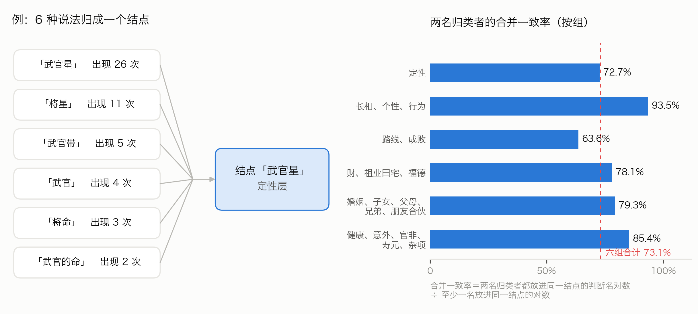
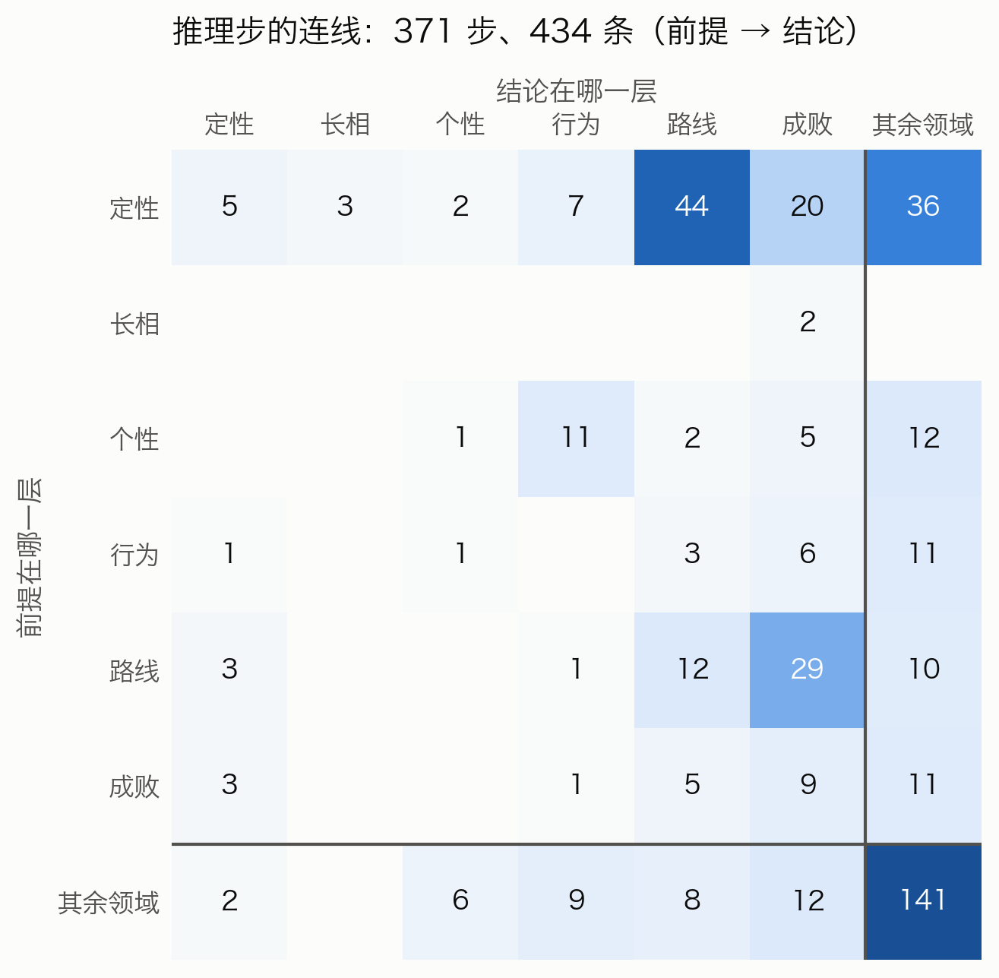
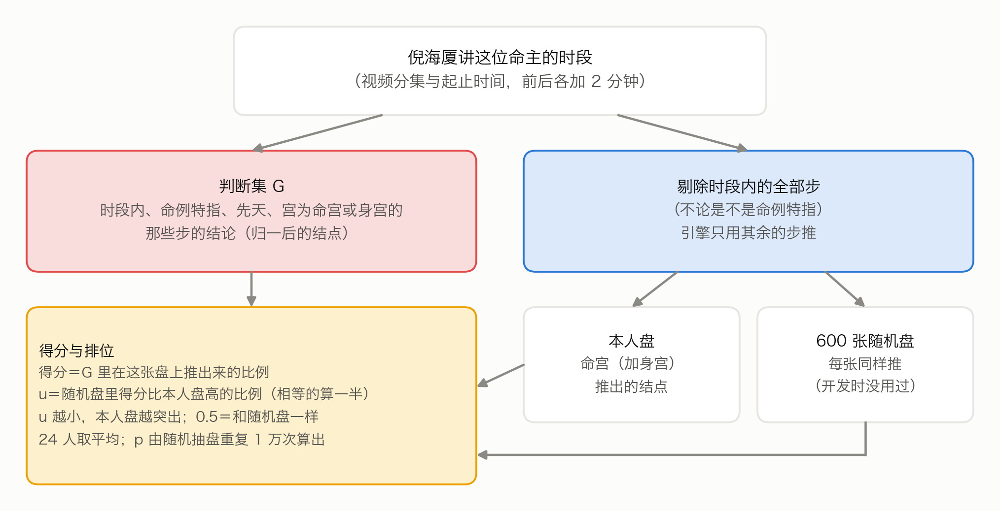
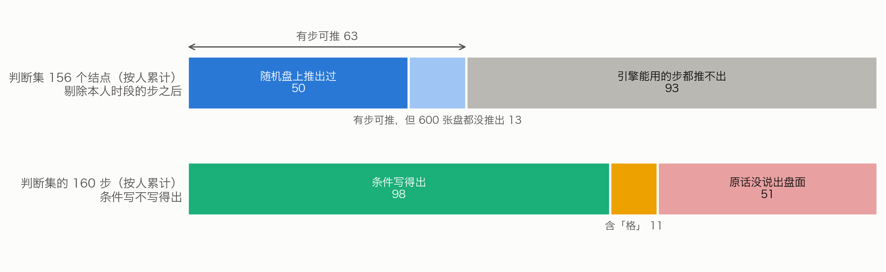
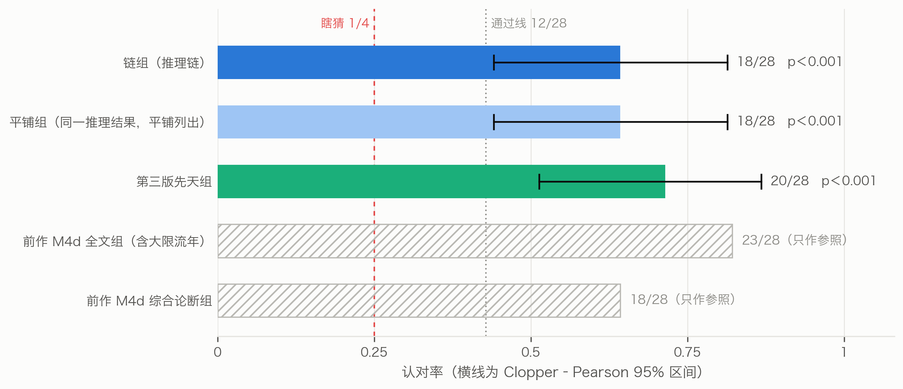

# 从讲述到推理链：补充材料

本补充材料随第十七稿一同发布。凡标「S」的节、图、表都在本文件里；「正文」指第十七稿正文。数字都取自登记过的结果文件；第十三稿移来的段落只改了图号、表号与交叉引用。

## S1　名词白话（全表）

不熟悉紫微斗数或编程的读者，可先看这几条。

- **命盘与十二宫**：按出生时间排出的一张图，分十二格，叫十二宫，每宫管一类人或事。命宫管本人，夫妻宫管配偶，官禄宫管事业，财帛宫管钱财。十二格的位置用地支（子、丑、寅……亥）称呼，例如「命宫在未」。
- **星、亮度、四化**：宫里落的星。十四颗大星叫主星，其余是辅星；擎羊、陀罗、火星、铃星、地空、地劫叫煞星（前作的条件词表里叫杀星），左辅、右弼、文昌、文曲、天魁、天钺等叫吉星。同一颗星落在不同的宫有强弱之分，叫亮度，由强到弱是庙、旺、平、闲、陷。出生年让四颗星分别带上化禄、化权、化科、化忌，叫四化。
- **三方四正、空宫借对宫**：看一宫时，连同对面一宫和隔四宫的两宫一起看，叫三方四正。一宫没有主星，叫空宫，就借对面那一宫的主星来看。
- **身宫**：命盘上另定的一宫，倪海厦用它看后天的发展。
- **先天、大限、流年、小限**：先天看一生（本命盘）；大限是每十年一段的运；流年是某一年的运；小限是另一种逐年的看法。本文的引擎只推先天。
- **格**：几颗星按特定位置组合成的固定名目，例如「府相朝垣」。
- **人宫与事宫**：管人的宫（命宫、兄弟、夫妻、子女、仆役、父母）叫人宫；管事的宫（财帛、官禄、田宅、疾厄、迁移、福德）叫事宫。
- **视频分集**：讲座视频在 B 站分成好几集，B 站叫「分P」；讲稿每条都记着出自第几集、第几分钟。
- **判断、结点**：倪海厦说的一个判断，例如「佐才」「位高无权」。不同讲次的不同说法归并之后叫一个结点。下文计数的「判断」都指归并后的结点。
- **步、链、推导路径**：倪海厦说的每一个「由什么得出什么」叫一步。一步接一步连起来，叫链。引擎得出一个判断所经过的那几步，叫这个判断的一条推导路径。
- **起步、推理步**：起步由盘面（星、四化等）直接得出一个判断；推理步由前面已经得出的判断推出后一个判断。数据文件里，起步叫「定性步」。
- **层、主链六层**：判断属于哪一类，叫层（正文第四节）。定性、长相、个性、行为、路线、成败六层合称主链六层，与财、婚姻等「其余领域」相对。
- **深度**：从盘面出发，到得出这个判断经过了几步。起步得出的判断，深度是 1。
- **两说**：同一宫、同一层里，既有吉的判断，又有凶的判断。
- **命例、命主**：命主是倪海厦在课上讲过命盘的人；命例是他讲某位命主的那一段话。
- **命例特指、通则步**：命例特指的步，是讲某位命主时说的；不是命例特指的步，叫通则步。
- **可操作**：条件里没有用「其他:」（原话没说出盘面）的步，叫可操作。其中条件含「格」的步也算可操作，但程序不判断格，实际推不出来。
- **候选盘**：出生时辰不能唯一确定时，几张可能的命盘。有的命主连性别也不能从讲课画面确定，候选盘里男女都有。
- **随机盘**：用公开的随机数起点（种子）生成的命盘，不对应真人，任何人都能照种子重算出同一批。本文的检验用另外生成、开发时没用过的 600 张，叫留出随机盘。
- **按人累计**：把各人的数直接相加。同一个判断出现在几个人的判断集里，就算几次。
- **单侧检验、检验功效**：单侧检验只问本人盘是否更好，不问是否更差。检验功效指效果真的存在时能把它测出来的把握；人数少，功效就低。
- **认本人检验**：给 AI 审者一份陈述（倪海厦讲某个人时说的话，改写成白话）和四份论断，其中一份由这个人自己的命盘推出，另三份由别的命盘推出（下称陪衬；第一次是另三位命主的真盘，第二次是随机生成的盘），让审者挑出与陈述最贴近的一份。瞎猜认对的机会是四分之一。比的是倪海厦对这个人的描述，不是这个人的真实生平。
- **配对差**：两组用同一批题时，逐题比较：只有前一组认出的题数减去只有后一组认出的题数，再除以题数。
- **旧五类（第十三稿的推理类型）**：用五个问题给推理步归类。取象：原话明说借一个形象或名称的字面意思来说理；术数机理：援引星曜、四化、运限、格局本身的作用；类属展开：结论是前提那一类人的成员、别名或本来的特征；性情因果：性情与做法之间的因果；处境常理：由身份、处境按人情世理推出得失。
- **召回率**：本该抽出来的步里，实际抽到了多少。
- **一致程度 α**：两名归类者各自归类，结果有多一致（Krippendorff α）；1 是完全一致，0 相当于随手乱归。
- **AI 实例**：同一种大语言模型开出的、互相独立的一次会话或一次调用。第十三稿及以前的抽取、核查、归一、第一次认本人与旧五类归类用 Claude Opus 5.5；第十四稿新增的检验、切分与归类用 Claude Fable 5.1（S4.2）。
- **定名、断事**（正文 7.4）：定名是结论给星、组合或格局定名目（「紫微是帝星」）；断事是结论说的是人或事。
- **象、义、位、时、情、直断**（正文 7.4）：断事的依据。象，借形象、比喻、人物或名称字面说理；义，以性质、类别为理由；位，宫位、亮度、四化、格局等位置关系；时，运限、某年某岁；情，人情事理；五者都没有，记直断。
- **换陈述组、换论断组、焦点论断**（正文 7.3）：第二次认本人检验的两种对照。换陈述组的四份论断与正题相同、陈述换成另一位命主的；换论断组的陈述与正题相同、本人盘换成另一位命主的真盘。焦点论断：正题与换陈述组是本人盘那份，换论断组是那份他人真盘。
- **条件精确检验、符号翻转检验**（S8）：前者以每题四份论断各自的得票为条件，假定焦点是四份里任一份的机会各 1/4；后者假定两组之差的正负号各题等可能。
- **p 值**：假设引擎（或审者）其实认不出本人，结果碰巧好到这个程度或更好的机会有多大，就是 p；p 越小，越不像碰巧。本文事先定 p < 0.05 算通过。
- **95% 区间**：照手头的数据，这个数大致落在哪一段；区间越宽，数据越少、越拿不准。
- **M4d、M4e、M4f**：认本人检验的方案编号。M4d 是前作的同类检验（论断含大限流年，本文只作参照）；M4e、M4f 是本文的第一次（S7）与第二次（S8）。正文只说「第一次」「第二次」。
- **正题检验**（正文 7.3、S8）：认本人检验自己的主判据，即正题里选中焦点论断的卷数是否多于瞎猜。方案里也叫主检验，与正文 7.2 的主检验（复现命例）不是一回事。

## S2　抽取、核查与推理步样例

知识库里起步与推理步的原样记录各举一例，见 S图1。

### S2.1 抽取与裁定

35 批原话，每批由抽取者甲、乙各自独立抽取，互不知道对方的结果。甲抽出 1798 步，乙抽出 1825 步。裁定者对照原话和两份抽取逐步定稿：甲乙都抽到的，核对后收；只甲或只乙抽到的，决定收不收，写明理由；层、宫、条件写错的改正。

正式抽取之前，先拿 2 批试抽，看说明写得清不清楚。改定的说明登记之后，35 批全部重抽，试抽结果不进知识库。

定稿 1826 步：起步 1399 步，推理步 427 步，分布在 838 条原话里；定稿后含推理步的原话有 291 条。甲乙的一致程度见正文图 3：
- **按条**：1374 条原话里，甲乙对「这条有没有推理步」判断一致的有 1306 条（95.1%）。这个数主要由甲乙都说「没有」的 1032 条撑起来；在至少一个说「有」的 342 条里，甲乙都说有的是 274 条（80.1%）。这里的 274 条看的是两份抽取，上面的 291 条看的是定稿，口径不同。
- **按步**：定稿步里甲乙都抽到的有 1678 步（91.9%）；分开看，起步 91.9%，推理步 91.8%。其余是只甲抽到的 70 步、只乙抽到的 77 步，以及裁定者补入的 1 步。甲抽出的步里，裁定者没收的有 45 步，乙有 63 步；收下的步有几处被合并成一步，所以收下的步数与定稿里来自甲、乙的步数略有出入。

另有 161 条原话讲的是看盘的方法（例如先看格、再批流年），单独记下，不进推理链。

### S2.2 脚本核对与逐步核查

**脚本核对。** 每一步的原话摘录，必须是该条原话里逐字连续的一段（去掉空白后比较）；条件必须合乎条件词表；推理步的前提必须写成某一层的判断；前提与结论的原话说法，也必须出自原话。1826 步全部合格。另有 3 步的判断名里含星名（「看不到太阳」），只记警告，不影响收录。

**逐步核查。** 全部步再交给没参与抽取和裁定的核查者，一批一个，逐步判「成立」或「不成立」并写理由：
- 起步问：原话是不是由这些盘面条件得出这个判断；
- 推理步问：原话是不是明说了由前提推出结论。

结果（正文图 3）：起步 1399 步判成立 1314 步（93.9%），推理步 427 步判成立 373 步（87.4%），合计成立 1687 步（92.4%）。判不成立的 139 步不进知识库。不成立的理由各不相同，例如把并列当成了推导、漏了原话里的限定（表S1）。核查只判「抽出来的对不对」，没有估计「漏了多少」。

**表S1　核查判「不成立」的推理步（按 T 编号顺序的前 5 条）**

| 出处 | 抽成的结论 | 核查理由（节录） |
|---|---|---|
| T6 | 先生当老板 | 两句同在「而且代表」之下，是并列列举紫微七杀的含义，没有承接词 |
| T86 | 宜嫁大 7 岁以上 | 「所以」承接的是另一句；这一步还漏了太阳不亮这个限定 |
| T109 | 成事 | 「有的事情一定要人和才能成事」是泛论，且是必要条件，不是推导 |
| T143 | 不见得是好人 | 原话是在否定「温和就是好人」这个推论，不是推出新结论 |
| T146 | 夫妻有名无实 | 中间隔着「跑掉」，「然后」只是叙事顺序 |

### S2.3 推理步样例

按事先写定的规则挑选：知识库里连接词含「所以」、前提与结论都在主链六层判断里的推理步共 24 条，按 T 编号顺序取前 10 条（表S2）。其中 T234 的三步是讲一位命主的先生时说的，第一步的附加条件原话没说清，记为不可操作。

**表S2　推理步样例**

| 出处 | 前提 | 结论 | 命例特指／可操作 | 原话摘录 |
|---|---|---|---|---|
| T3 | 定性「官带」 | 路线「当官」 | 否／是 | 「紫微星主的是官，官带。所以有紫微星出现的时候，它代表的是官印，官的命」 |
| T14 | 定性「孤帝」 | 路线「僧道」 | 否／是 | 「孤帝，孤独的皇帝。所以是僧道」 |
| T97 | 定性「发阴」；附加条件：女命 | 定性「正将星」 | 否／是 | 「发阴因为阴冷啊，晚上晚夜丑时是夜半嘛，所以你如果算到男人这个，和女人这个不一样，女人呢晚上出的武官星的时候，是正科正将星」 |
| T141 | 定性「教星」＋定性「文官带」 | 路线「当公务员」、路线「当老师」 | 否／是 | 「天府星的人它是个文官星。也是一个教星。所以很多天府坐命的人去当公务人员当教员」 |
| T196 | 成败「声名远播」 | 成败「不见得不好」 | 否／是 | 「哇声名远播名气很大，大家大家都喜欢啊，所以桃花命坐命不见得不好」 |
| T214 | 定性「佐才」 | 成败「位高无权」 | 否／是 | 「是非常好的良佐，辅佐的人才，所以天相呢，一定是位高无权」 |
| T224 | 定性「文武双全」 | 路线「文官武官都能干」 | 否／是 | 「我们星斗里面就这颗星是允文允武的星。所以很多人武官天梁星。文官也有天梁星。所以一般来说天梁星坐命的人文官也干干武官也干干」 |
| T234 | 成败「官威官权大」；附加条件：其他（原话没说禄在哪颗星、哪一宫） | 路线「走财经界」 | 是／否 | 「是这个有官威官权很大，那她先生的官权又带禄，所以很可能是走财经界」 |
| T234 | 路线「走财经界」 | 路线「在银行界」 | 是／是 | 「所以很可能是走财经界，不然你这个权是掌掌财禄的嘛，所以她先生在银行界」 |
| T234 | 路线「在银行界」＋成败「官威官权大」 | 成败「很高的主管」 | 是／是 | 「是这个有官威官权很大，那她先生的官权又带禄，所以很可能是走财经界，不然你这个权是掌掌财禄的嘛，所以她先生在银行界，是一个很高的一个主管」 |

T97 里的「正将星」是倪海厦对女命夜生武官星的专门说法，归类者没有把它并进「武官星」。

## S3　判断归一与知识库的结构

### S3.1 判断归一

不同讲次说同一个判断，用词不一样：「武官星」「将星」「武官带」「武官」「将命」「武官的命」说的是同一件事。不归一，链就接不上。

做法也是两名归类者各自归类，再由裁定者定稿：
1. 把定稿步里出现的所有判断名（前提和结论都算）按层列出，共 1347 个，每个附出现次数和一两例原话说法。按层分成六组：定性；长相、个性、行为；路线、成败；财、祖业田宅、福德；婚姻、子女、父母、兄弟、朋友合伙；健康、意外、官非、寿元、其他。
2. 两名归类者各自独立归类：同义的归成一个结点；一个说法里并列两个判断的，拆成两个结点；拿不准的不合并；层分错的可以改层，但只能改成本组的层。
3. 裁定者定稿。

1347 个判断名归成 1084 个结点，其中 52 个判断名拆进了两个以上的结点，裁定者改层 7 处。

两名归类者的一致程度用「合并一致率」衡量（S图2）。例如有三个说法甲、乙、丙：归类者一把三个都合在一起，归类者二只合了甲和乙。两两配对共三对，至少一名归类者合并的有三对，两名都合并的只有一对（甲乙），合并一致率是 1/3。六组合计的合并一致率是 73.1%；最低的是路线、成败一组（63.6%），最高的是长相、个性、行为一组（93.5%）。路线、成败一组里，两名归类者给出的「同结点伙伴」完全相同的判断名只占 75.8%，是这一步最不稳的地方。成员最多的几个结点见表S3。

### S3.2 推理链知识库

把核查成立的 1687 步，按归一表换成结点。换算后有 2 步变成「自己推自己」（前提与结论归成了同一个结点），不收。知识库定为 1685 步、1028 个结点；归一表里另有 56 个结点只出现在核查不成立的步里，不进知识库。

规模表见正文表 2。

引擎这一版只推先天，只用可操作的步，共 1098 步（正文表 2 第一列）。其中有 28 步的条件含「格」，程序不判断，实际上用不上。不可操作的步共 393 步（先天 272 步，大限流年小限 121 步）。1685 步里，命例特指的有 676 步；引擎可用的 1098 步里有 339 步，其中推理步 103 步。这些步是倪海厦讲某位命主时说的，条件一旦成立，引擎就当通则用（影响见正文 8.4）。

371 条推理步共有 434 条连线（前提结点 → 结论结点，S图3）。主链六层之内的 176 条连线里，往后推的 134 条，同层的 27 条，往回推的 15 条；其余 258 条涉及其余领域。主链上最多的是定性 → 路线（44 条）、路线 → 成败（29 条）、定性 → 成败（20 条）；个性 → 行为只有 11 条，长相往后推的只有 2 条。推导集中在少数「枢纽」判断上，例如「武官星」一个判断就推出 18 个后续判断（S图4）。

### S3.3 归一样例

成员最多的 6 个结点（表S3）；括号里是这个判断名在定稿步里出现的次数。

**表S3　成员最多的 6 个结点**

| 层或领域 | 结点 | 归进来的判断名 |
|---|---|---|
| 官非 | 官司 | 官司是非（5）、吵架打官司（3）、官司牢狱之灾（3）、官司纠纷（2）、官司（1）、官司口舌（1）、必打官司（1）、打官司（1）、是非口舌官司（1）、是非官司刑克（1）、法院互告（1） |
| 路线 | 做生意 | 做生意（8）、做生意当老板（3）、自己做生意当老板（3）、从商（2）、生意商人（2）、会做生意（1）、做生意当大老板（1）、自己做生意（1）、自己当老板好（1） |
| 路线 | 专业技术专长 | 专科技术专长（3）、有专业技术专长（3）、专业技术特长（2）、靠专业专长（2）、走专业技术专长（1）、靠专业技术专长赚钱（1）、靠专科技术专长（1）、靠技术专长谋生（1） |
| 路线 | 帮人做事领薪水 | 帮人领固定薪水（2）、公家单位或学校吃固定薪水（1）、只能帮人做事（1）、帮人做领薪水（1）、帮人家工作（1）、当公务人员领薪水（1）、领固定薪水的命（1）、领薪水当助理（1） |
| 官非 | 是非 | 官司是非（5）、口舌是非（2）、是非很多（2）、惹是非犯法打架（1）、是非口舌官司（1）、是非官司刑克（1）、是非纠纷（1）、是非口舌（2） |
| 路线 | 私人企业做事 | 私人企业做事（7）、到私人公司做事（2）、走私人企业（2）、到私人企业做事（1）、只能私人企业做事（1）、在私人公司上班（1）、私人企业当主管（1） |

「官司是非」「是非口舌官司」这类并列的说法，按归一说明拆进了「官司」和「是非」两个结点。

## S4　过程与审计

### S4.1 第十三稿及以前

知识库的抽取、裁定、核查、归一与主检验（S2–S6）完成之后，第十三稿又做了三项补充研究（S7、S9、S11）：第一次认本人检验、旧五类推理类型、召回率。它们是在主检验未通过之后设计的。三项的方案在运行之前先交给一名独立的 AI 审稿人专门找茬：审稿意见共 32 条，其中 25 条全部或部分标为必须改，最要紧的 9 条列在开头（例如泄露只按时段核、论断里写什么没有说死、召回率的分子分母口径不一）。按意见改定之后才登记，再建材料、派子代理；交卷先审计、登记，再读答案或跑统计。

- **登记**：方案在抽取之前登记；试抽之后改定的说明、改用写入文件交卷、收取脚本的更正，都另写补记并登记，原文件不改。三项检验的脚本在跑真数据之前登记。主检验未通过后的诊断（S6.2），以及两轮内审之后的补充分析（S6.3），都先写补记与脚本、登记，再运行。论文的写作提纲、示例盘的选法、插图与本文用到的数字，都在写正文之前登记。
- **存档与审计**：抽取 70 份、裁定 35 份、核查 34 份（有一批没有可核的步）、归一 12 份、归一裁定 6 份，共 157 份。每份存档时自动审计：工具调用只许读本批文件夹、写指定的一个文件；材料文件每一行都要读到；交卷文件与子任务记录里最后一次写入的内容一致；模型是 Claude Opus 5.5。157 份全部合格。
- **一次认领更正**：收取脚本第一次按任务描述认领结果时，把第 10 批两份抽取认到了另一套材料目录，审计误报越界。误认的存档挪到单独的文件夹保留，脚本改为先核对材料目录再认领，重新收取后两份都合格。
- **几处更正**：诊断补记里「本人盘得分为 0 的有 12 人」实为 14 人；论文初稿对「不剔除时」的解读与事先写下的解读规则相反；第一批补充分析把推理步「前提没推出」也算成了「条件不成立」，第二批已拆开。各处都写了更正补记，正文以更正为准。
- **输出排版的修正**：引擎的输出在身宫恰好落在财帛、官禄、迁移之一时会把那一宫写两遍，某宫没有判断时序号也会跳。这不影响推理结果和检验数字（可追溯核对只查每个判断出现且带出处）。引擎文件不改，另写了修正版的输出程序，示例盘的输出用它重出，判断行与原版逐行相同。
- **三项补充研究**：方案初稿先请独立审稿人在运行前找茬，改定后与程序、审者说明、陈述的源 T 表、样张一起登记；正式材料与抽样结果在派子代理之前登记；交卷先审计、登记，再读答案表或跑统计。审者 84 份、试编 2 份、归类 17 份（含一份不合格及其重跑）、归类裁定 8 份、找漏 24 份、找漏裁定 12 份，共 147 份。不合格的那一份，是归类者把自己刚写好的交卷文件又读了一遍；按事先定的规矩，不看原因，另开实例重跑一次，合格。其余全部一次合格。
- **第四轮内审后的更正与补算**：结果补记把链长分析写成「与方案没有出入」，实际把起步也纳入了；又把「审者选中最长一份」与「真论断本身最长」两个量混写了；还有两可主张连接词的计数出自一次未存档的临时计数，正文改用登记后补算的结果。三处都另写更正补记，正文以更正为准。第五轮内审又发现，「审者选中与本人性别不同的论断」一项在本人性别不定的 6 题里口径不成立，另写更正补记，不作依据。为回应审稿意见补算的几项描述，都先登记再运行，只作描述：
  - 标为不像推导的步、主要靠附加条件的步，各归哪一类；
  - 陪衬不按性别的 6 题；
  - 选中最长的题里有几题是真论断；
  - 共用论断的题组；
  - 两可主张的连接词。
- **本文的数字与引文**：正文与补充材料里的数字，都从登记过的结果文件用脚本取出，再用核数脚本逐条对回：检验结果、补充分析与补查的数字在各自的结果文件里；链长各档的比例、枢纽判断的后继数取自登记过的插图数字文件；T419、T1458 的时间码取自讲稿语料；存档份数取自审计记录。凡标 T 编号的原话引文，都用脚本核对为讲稿原话的连续片段。前作的规则数（1064 条）取自前作登记过的知识库文件。另有 3 步的判断名里含星名（「看不到太阳」），整理时只记警告。

### S4.2 第十四稿的三项深化研究

方案 v1 先交一名独立审稿人（Claude Opus 5.5）在运行前找茬，意见 33 条（必须改 14 条、建议改 19 条），逐条改定为 v2 后登记（`00l_三项深化方案_v2.md`）。三个决策点只依据花费，在相应任务提交之前写成补记登记（`00m_决策点补记_v1.md`）：每组每题 3 名审者；归类者推理档位保持 high；第一次认本人用 Fable 重审。

全部任务经 Claude API 批量接口交给 Claude Fable 5.1（effort high），每个任务一次独立调用，材料全文在提示里；请求文件在提交之前登记。收卷审计只看格式（结果类型、停止原因、能否解析、编号与取值是否合规），不读答案键。全部 531 份一次合格，没有重跑。调用程序在提交第二次认本人之前补过一次断线重试（只改网络重试，见补记），请求与审计逻辑不变。

**表S4　第十四稿各批次与花费**（按批量接口价格由用量算出，以控制台账单为准）

| 批次 | 份数 | 花费（美元） |
|---|---|---|
| 《全书》切分 | 20 | 5.33 |
| 切分裁定 | 9 | 1.32 |
| 归类试编 | 2 | 0.94 |
| 正式归类 | 110 | 46.10 |
| 归类裁定 | 54 | 13.74 |
| 第二次认本人 | 252 | 33.47 |
| 第一次认本人用 Fable 重审 | 84 | 10.43 |
| 合计 | 531 | 111.33 |

**内审。** 第十四稿写成后，经同一接口请 6 名 Claude Fable 5.1 审稿人，各从一个角度（期刊外审总评、统计与检验设计、易学与思想史、认本人题目是否干净、前后一致与交叉引用、白话可读性）读一遍正文与补充材料的 PDF，花费 7.03 美元（不计入上表）。审稿说明、6 份意见与逐条处理见 `22_倪师断法论文_20261007/review_v14/`；据此改出第十五稿，凡新增的分析都先登记、只作描述。第十五稿又经同一接口请 3 名审稿人（逐条核对第一轮意见是否改到、严格外审只找新问题、技术编辑）各读一遍，花费 5.24 美元；意见与处理见 `22_倪师断法论文_20261007/review_v15/`，据此改出第十六稿。第十六稿最后再请 2 名审稿人（逐条核对第二轮意见、期刊终审只报硬伤）各读一遍，花费 3.24 美元；意见与处理见 `22_倪师断法论文_20261007/review_v16/`，据此改出第十七稿定稿，此后不再送审。

## S5　引擎细节

### S5.1 算法

引擎对一张盘的十二宫各推一遍，命宫在前（S图5）。每一宫里：

1. **起步**：条件全部成立 → 得出判断；深度 = 1。
2. **推理步**：前提全部已得出，附加条件全部成立 → 得出判断；深度 = 1 + 前提里最大的深度。
3. 一轮推完再来一轮，直到推不出新的判断为止，最多 8 轮。
4. **两说**：同一层里既有吉的判断又有凶的判断 → 都列出，标「两说」，不投票，也不按条数取舍。

一个判断有几条推导路径时都记下，输出深度最小的那一条；深度相同时，按步的编号的字面先后取第一条。

**沿用前作的部分。** 读盘、条件判断、空宫借对宫，完全沿用前作的第一版引擎。前作的五种修正也照用，但只用于起步，只改方向与强度（这一点在引擎代码登记时已写明）。五种修正是：条件写的是对宫化忌的，强度升为「断」；凶断由本宫煞星引出、同宫有紫微的，方向改「中」、强度改「倾向」；引出凶断的煞星都庙旺的，方向改「中」；同宫有吉星的，强度降为「倾向」；引出凶断的煞星有落陷的，强度升为「断」。前作第一至三版的文件一个不改。

**一步用在哪一宫。** 步写某宫的，只用在那一宫；写身宫的，用在身宫所在之宫；写「任一宫」的（讲星的通义，没限定在哪一宫），人宫都用，事宫只收与该宫所管之事相符的结论，例如官禄宫只收路线、成败，财帛宫只收财。

**候选盘。** 有几张候选盘的，每张各推一次，只留各张在同一宫都推出来的判断。

**输出。** 引擎写出「推理链」一节：先写命宫里最长的几条链（输出里叫「主线」），再写身宫和财帛、官禄、迁移，最后写其余各宫。每个判断写明由哪个判断（或哪些盘面条件）推出、出处的 T 编号和原话摘录。

### S5.2 示例盘

示例盘沿用前作的随机盘 r30，是写作之前就定下的，不是看了结果再挑的（S图6）。这是一张女命，命宫在未，是空宫，借对宫（丑）的武曲、贪狼；身宫在卯，落在财帛宫。

命宫一共推出 69 个判断，其中 25 个至少要经过一步推理步才得出。正文图 4 画出命宫的几条主线。最长的一条有 4 步：

> 命宫有贪狼（借对宫）→ 有生杀之权（T176）→ 暗权（T419；另需武官星，限女命）→ 杀伤力大（T1458）→ 害到自己（T1458）

每一步都对得上原话：「一般呢贪狼入命的人他有生杀之权」（T176）；「将军的命有生杀之权，那你又是阴……就是说她是暗权」（T419）；「那这种暗权的人她杀伤力会很大」（T1458）；「只有杀到自己就害到自己」（T1458）。T419 在视频分集 13 的 00:18:05，T1458 在同一集的 00:19:16，两条相隔一分多钟，讲的是同一位女命。第四版把它们当通则用，条件成立就推（正文 8.4）。

层和深度是两回事：「有生杀之权」属成败层，却在第 1 步就由盘面得出；「暗权」属定性层，在第 2 步才得出。

另一条短链就是引言里的天相例：三方四正有天府、天相 → 佐才（T218）→ 位高无权（T214）。

这张盘推得比多数盘长：命宫用上的推理步有 30 条，而 600 张随机盘里四分之三的盘不超过 23 条；最长链 4 步，约三分之二的盘不到 4 步，另有两成的盘达到 5 步（正文 7.1）。命宫有 5 处两说，例如定性层同时有吉的「大财星」与凶的判断「杀星」（指七杀、破军、贪狼这类星，与煞星不同）。

### S5.3 与第三版对照

同一张盘，第三版的命宫一节是一条条并列的命中：武曲贪狼是武官星（T97），贪狼入命的人一般有生杀之权（T176），一定会做主管（T934）……每条都对得回原话，但条与条之间没有关系（S图7）。第四版把其中一部分接成了链：「有生杀之权」不再是孤立的一条，它和「武官星」一起推出「暗权」，再推出后面的行为和成败。

第三版写「武官星」出自 T97，第四版的正文图 4 写出自 T103：这张盘的命宫里，「武官星」有 11 条推导路径，倪海厦在好几处都这样说过；深度都是 1，按步的编号的字面先后，T103 排在 T97 前面，所以输出的是它。第三版的「路线」「成就」是前作自己的类别名，与本文的层不同。

### S5.4 600 张留出随机盘上的覆盖

在 600 张留出随机盘上各推一次，看命宫（正文图 5）：
- 经推理步推到行为、路线、成败任一层的盘有 589 张（98.2%），推到成败的有 542 张（90.3%）。按层看，推到路线的 93.7%，行为 72.0%，个性 66.2%，长相 1.3%。还有 30.0% 的盘经推理步推到了定性层，那是由别的判断推回定性，例如「暗权」。
- 每张盘命宫用上的推理步，中位数 18 条，中间一半的盘在 10 至 23 条之间，最多 43 条。
- 命宫最长一条链的步数（含第一步起步）：中位数 2 步，最多 5 步。2 步的盘占 55.2%，3 步 11.2%，4 步 13.2%，5 步 20.0%，只有 1 步（没用上推理步）的 0.5%。
- 命宫推出的判断里，30.9% 至少要经过一步推理步才得出；其余直接由起步得出。
- 命宫有两说的盘有 560 张（93.3%），每张盘中位数 3 处。

5 步的那 120 张盘，最长链的终点全是「害到自己」；最常见的三条（31、30、28 张）只差在第一步：命宫有太阳、破军或七杀 → 武官星 → 有生杀之权 → 暗权 → 杀伤力大 → 害到自己。后四步都出自 S5 说的那一段女命命例（T419、T1458），其中「暗权」一步限女命（这一项是写正文时补查的，见 S4.1）。只用通则步时，最长链最多 3 步（S6.3）；由此可知，全部步时最长链 4 步以上的盘（约三分之一），最长链上都至少用到了一条命例步。

所以，推理链推得动，多数盘也能推到行为、路线、成败；但这是经一两步推理推到的，多数盘只是「起步 + 一步推理步」，更长的链都用到了命例步。

**两说很普遍。** 93.3% 的盘命宫有两说。按层看，两说最常落在成败层（600 张盘里有 398 张）和定性层（384 张），例如同一颗星既被说成财星，又被归为判断「杀星」。引擎不替他取舍，只照实列出。

### S5.5 候选盘的闭合取交集

第二次认本人检验的随机陪衬盘有多张候选时，已登记的取交集函数取第一张候选的推法，可能引用一个没保留下来的前提。本轮另写闭合规则（`cand_closure_v1.py`）：保留集里的结点，要在每一张候选上都能只用保留集里的结点、从起步往上重推得出，反复剔除直到不再变。第二次认本人的全部论断（本人、陪衬与他人真盘）都按这条规则生成（`m4f_build_v1.py`）。对第一次认本人的 112 份论断（41 份多候选）复核，新旧两种做法结果完全相同，说明换规则不影响第一次的结果；主检验逐张盘求结点，不经过这一步。

## S6　主检验：设计、诊断与补充分析

**命例。** 前作按讲课画面上的命盘反推出生资料，合并同一人后，纳入检验的命主有 28 人（前作第三节）；编号沿用前作，所以不连续。每人记有倪海厦讲他的时段：视频分集与起止时间，前后各加 2 分钟。有的人出生时辰不能唯一确定，有几张候选盘；其中计入主检验的有 5 人，连性别也不能从画面确定，候选盘一男一女。

### S6.1 设计与结果

**设计**（S图8）。命主就是前作的 28 人，用同一批候选盘。

1. **判断集**：同时满足下面四条的步，它们的结论（归一后的结点）合成这个人的判断集，记作 G：
   - 落在倪海厦讲这个人的时段内；
   - 标了命例特指；
   - 适用先天；
   - 宫是命宫或身宫。

   没有这类步的人不计入，人数照报。
2. **剔除**：这个人时段内的全部步，不论是不是命例特指，一律剔除，引擎只用其余的步推。
3. **得分**：引擎在本人盘的命宫推出的判断，加上身宫所在之宫里、由写明用在身宫的步推出的判断（口径见登记的检验脚本），算这张盘推出的判断。得分 = G 里在这张盘上推出来的个数 ÷ G 的个数。有几张候选盘的，只算各张都推出来的。
4. **排位**：同一套剔除后的步，在 600 张留出随机盘上各算一个得分。

   u =（随机盘里得分比本人盘高的张数 + 0.5 × 得分相同的张数）÷ 600

   也就是说，u 是随机盘里得分比本人盘还高的比例（相等的算一半）。u 越小，本人盘越突出；u = 0.5 表示和随机盘一样。1 − u 就是本人盘胜过的随机盘比例（相等的同样算一半）。
5. **统计**：主统计量是各人 u 的平均数。p 值这样算：假设引擎完全认不出本人，就每人改从 600 张留出盘里随机抽一张当作「本人盘」算平均 u，重复 10000 次（种子 METIS-V4-复现检验-20261007）；平均 u 碰巧不大于实测值的比例就是 p。这是单侧检验，p < 0.05 算通过。

**结果**（正文图 6）。28 人里，4 人的判断集是空的，不计入；计入 24 人，每人的判断集有 1 至 17 个结点，按人累计 156 个，不重复的 109 个；每人剔除的引擎可用步在 4 至 136 步之间，中位数 22.5 步（约占 1098 步的 2%）。
- 平均 u = 0.432，即本人盘平均胜过 56.8% 的随机盘；中位数 0.5。单侧 p = 0.066：如果引擎完全认不出本人，平均 u 碰巧低到这么低的机会约为 6.6%。**没有达到事先定的 p < 0.05，主检验未通过**，未能证明引擎能复现倪海厦对命例的判断。
- 平均 u 的 95% 区间（事后按人重抽估计）约为 0.33 至 0.53，既容得下「没有效果」，也容得下中等程度的效果；24 人的检验功效有限。这个区间假定各人互相独立；各人的判断集有重叠（S6.3），实际区间可能更宽。
- 14 人的本人盘一个判断也没推出来，他们的 u 都不小于 0.5；u 小于 0.5 的 10 人，正好就是本人盘推出了至少一个判断的人。只有 1 人的 u 不大于 0.05。
- H27、H38、H39 三人的 u 在 0.8 以上：本人盘一个也没推出，随机盘却有不少推出了其中较常见的判断（例如「武官星」「刚强」「桃花」）。H38、H39 都是候选盘一男一女的人。
- 只用起步、不用推理步时，平均 u = 0.435，p = 0.071，与用全部步几乎一样。判断集里推理步的连线共 42 条，引擎在本人盘上用同样的推法只复现了 1 条（2.4%），随机盘上平均复现 1.0%。这两项与下面的诊断一致：判断集里的推导大多已随剔除一起拿掉，不能把它们当作另外的证据。

### S6.2 主检验未通过后的诊断（运行前登记）

这一批诊断只作描述，不报 p 值，不据此改知识库或引擎，也不改「未通过」的结论（S图9）。下面的数都按人累计。

**一、多数判断剔除后，引擎能用的步都推不出。** 24 人的 156 个判断里，剔除各人时段内的步之后：
- 引擎可用的步里还有能推出它的，只有 63 个（40.4%）；
- 在 600 张随机盘的任何一张上真推出来过的，50 个（32.1%）；
- 其余 93 个，引擎可用的步里已没有一条以它为结论。

3 个人的判断一个也推不出，他们的 u 都正好是 0.5。只看另外 21 人，平均 u 为 0.422，与全体相近。推不出的判断，在本人盘和随机盘上都推不出，不改变同一个人本人盘与随机盘之间的高低次序（判断集全都推不出的 3 人除外）；它们主要是让检验能用的信息变少。

**二、判断集的步，近三分之一说不出盘面。** 156 个判断来自 160 步：98 步的条件都能写成程序判断的形式；11 步靠「格」；51 步原话没说出盘面，只说「这种命」「这样子」。后两类在主检验里本来就随本人时段一起剔除了，不影响主检验的得分；它们只影响下面「不剔除」时能推回多少。

**三、不剔除时也只推回约四分之一。** 不剔除这个人时段内的步，本人盘平均推出判断集的 27.1%，随机盘平均 10.0%，平均 u 为 0.301；24 人里有 9 人一个也推不回。命例步本来就是照这张盘说的，所以这一项的得分高不说明任何事；照事先写下的解读规则，得分仍然低，指向条件的写法、归一，或重建的本人命盘与倪海厦当时所看的盘对不上。S6.3 把这几种情形进一步分开。

**表S5　两位命主的具体例子**（按事先定的规则挑：u 最小的一位，与判断集一个也推不出的人里编号最小的一位）

| 命主 | 判断集里的判断（层） | 出处 | 剔除后还有别的步能推出 | 本人盘推出 |
|---|---|---|---|---|
| H20（u = 0.014，两张候选盘一男一女，剔除 36 步） | 个性强（个性） | T929 | 有 | 是 |
| | 主见强（个性） | T929 | 有 | 否 |
| | 命很好（成败） | T929 | 有 | 是 |
| | 读书很棒（成败） | T929 | 无 | 否 |
| | 考试没问题（成败） | T929 | 无 | 否 |
| | 住西北角（行为） | T487 | 无 | 否 |
| H16（u = 0.5，一张候选盘，剔除 66 步） | 自己往坑里跳（行为） | T1471 | 无 | 否 |
| | 命中有灾（杂项） | T1471 | 无 | 否 |

H20 的 6 个判断里，有 3 个在剔除之后还有别的步能推出，本人盘推出了其中 2 个，600 张随机盘平均只推出 6.1%，所以 u 很小。H16 的两个判断，剔除之后引擎能用的步都推不出，本人盘和随机盘都是 0，u 正好是 0.5。

### S6.3 内审后的补充分析（运行前登记）

第一轮、第二轮内审之后，为回答审稿意见，各补做了一批分析，都先写成补记登记、再运行。这些分析只作描述，不报 p 值，都不改主检验「未通过」的结论（S图10）。下面的数，凡涉及判断集的都按人累计。

**推得出的判断，本人盘推出了多少。** 剔除之后，判断集里至少还有一个判断推得出的有 21 人；这 21 人里，11 人的本人盘一个也没推出。这些推得出的判断共 63 个，本人盘只推出 16 个。与「没通过」真正有关的是这一点：本该推得出的判断，本人盘多数也没推出来。

**判断集的步在本人盘上推不推得出（不剔除）。** 条件写得出的 98 步里：
- 起步 61 步：条件在本人盘对应的宫里成立的 32 步，不成立的 29 步；
- 推理步 37 步：都成立的 7 步，附加条件成立但前提没推出来的 28 步，附加条件不成立的 2 步；
- 没有一步落在「有的候选盘成立、有的不成立」这一类（统计程序里这一类的计数为 0，结果文件里因此没有列出）。

也就是说，判断集里说得出盘面的起步，约一半在重建的本人命盘上对不上；推理步推不出来，多半是卡在前提上。对不上的原因有几种可能，正文 8.3 再谈。

**推不出的判断，在整个知识库里有没有别的出处。** S6.2 那 93 个推不出的判断，只查了引擎可用的步。把整个知识库 1685 步都查一遍：本人时段以外，有 84 个连一步以它为结论的都没有；6 个只有先天但不可操作的步，3 个只有大限流年小限的步。另外，93 个里只有 3 个在本人时段内另有通则步以它为结论，其中引擎能用的只有 2 个，也就是说，因通则被一起剔掉而推不出的，最多只有 2 个。

**去重。** 24 人的 156 个判断，不重复的是 109 个，其中 34 个出现在两人以上的判断集里；160 步不重复的是 126 步；93 个推不出的判断，不重复的是 74 个。

**讲述时段的重叠。** 28 人里有 21 对两人的时段互相重叠，多数是前后各加 2 分钟造成的，最多的一对重叠 842 秒；知识库里有 206 步同时落在两人以上的时段内。判断集的 160 步里，有 68 步同时落在别人的时段内，涉及 17 人；计入的人里有 17 对时段重叠，其中 12 对的判断集有共同的判断，合计 36 个。这样的步可能被算进不止一个人的判断集；把别人的判断算到本人名下，可能稀释本人盘与随机盘的差别，偏向「未通过」。把各人时段的前后 2 分钟都去掉再算一次，计入 22 人，平均 u 为 0.392；这 22 人原来的平均 u 为 0.421。

**候选盘。** 每张候选盘各算一个 u 再取平均，24 人里只有 H39 一人的 u 变了（0.885 → 0.735），平均 u 为 0.426（原为 0.432）。只有一张候选盘的 12 人平均 u 为 0.399，有几张候选盘的 12 人为 0.465；换成每张各算，后者也只到 0.452，两组的差距多半另有原因。候选盘一男一女的 5 人，平均 u 为 0.589：只认交集时，凡限男命或限女命的步，在他们身上都推不出来；这 5 人里有 4 人的 u 在 0.6 以上。

**同性别对照。** 候选盘性别一致的 19 人，只和同性别的随机盘比，平均 u 为 0.395；这 19 人原为 0.391。随机盘的性别对结果几乎没有影响。

**只用通则步。** 把命例特指的步全部拿掉，只用 759 步通则步（其中推理步 138 步）：600 张随机盘里 95.2% 的盘命宫仍能推到行为、路线或成败，81.0% 推到成败；最长链最多 3 步，2 步的占 87.7%。照主检验的办法再算一次，平均 u = 0.417。这与「别的命主的命例步留在引擎里，没有帮上忙」相容，变化集中在少数几人身上。本节一共换了四种算法（只用通则步、每张候选盘各算、只和同性别比、不加前后 2 分钟），都只作描述；其中只用通则步一项，补记里另算过一个事后 p 值（0.029），其余三种没有算，也没有做多重比较的校正，本文不以它为据，更不能当作通过。

### S6.4 第十三稿对主检验未通过的讨论

本节沿用第十三稿的讨论；结论性的措辞以正文 8.3 为准。

主检验没通过。诊断只能说明数据与哪些解释相容，不能确定原因。逐条看：

- **能用的信息少。** 剔除之后，判断集里六成的判断，引擎能用的步都推不出，其中绝大多数在整个知识库里也没有别的出处（S6.2、S6.3）。这些判断在本人盘和随机盘上都推不出，不改变同一个人本人盘与随机盘之间的高低次序，但让检验能用的信息变少，并让判断集全都推不出的 3 人 u 恰为 0.5。
- **推得出的，本人盘多数也没推出。** 这一点与「没通过」最直接有关：仍推得出的 63 个判断，本人盘只推出 16 个；21 人里有 11 人一个也没推出（S6.3）。
- **条件对不上重建的本人命盘。** 即使不剔除，判断集里说得出盘面的起步，约一半在本人盘上不成立；推理步多半卡在前提上（S6.3）。原因有几种可能：本人命盘重建不准（出生资料是从讲课画面反推的）；条件写法、宫位没整理对；这一步讲的其实是相邻的命主（判断集的步有四成同时落在别人的时段内）；或者是讲命例时顺口作的对比，被标成了命例特指。前两种属于事先写下的解读规则所指的「条件写法、归一或命盘」一类；本文无法把这几种分开。
- **候选盘男女都有的人。** 只认候选盘的交集，凡限男命或限女命的步，在这 5 人身上都推不出来；他们的平均 u 是 0.589，最差的两个人都在其中（S6.3）。
- **讲述时段重叠。** 判断集的步有四成同时落在别人的时段内，检验对象可能混入了邻近命主的判断，各人也不完全独立；这可能稀释本人盘与随机盘的差别。去掉前后 2 分钟再算，这 22 人的平均 u 从 0.421 变为 0.392，只作描述（S6.3）。
- **别的命主的命例步留在引擎里。** 只用通则步时平均 u 略好（0.417），与「这些步没有帮上忙」相容；但这是事后分析，仅供参考。
- **归一的粗细。** 意思相近的说法若分在不同的结点（例如路线层的「私人企业做事」与成败层的「在私人公司好」是两个结点），按结点逐个对就会算不上。本文没有量化这一点。
- **功效不够。** 只有 24 人，平均 u 的区间从 0.33 到 0.53，而且各人并不完全独立。

认本人检验（S7）说明了主检验没通过意味着什么、不意味着什么。认本人检验剔得比主检验更严：四位当事人的讲述，以及陈述可能出自的原话，全都剔掉。在这样的条件下，同一个引擎推出的先天论断，审者从四份里认出本人 18/28。两项检验的靶子不同：
- 主检验要推出判断集里倪海厦说过的那几个结点，每人 1 至 17 个，只看命宫与身宫，逐个结点对上；
- 认本人只要求本人那份论断，整体上比另三份更贴近他对这个人的全部描述。28 题共 600 条陈述，讲配偶、子女与事件的都在内，审者按意思比。

引擎推出的论断，多数题里比别人的论断更贴近倪海厦对这个人的描述，但没有证明能推回他说过的那几个具体判断（主检验 p = 0.066）。

## S7　第一次认本人检验（M4e）

### S7.1 做法与结果

主检验问的是：引擎能不能推出倪海厦对某个人说过的那几个具体判断。这一节换一个问法：引擎推出的先天论断，整体上是否比别人的论断更贴近倪海厦对这个人的描述。这一项是在主检验未通过之后设计的，做法沿用前作的「四选一认本人」检验。

**做法。** 沿用前作的 28 题，题目、陈述、陪衬人选与 A–D 次序都逐字节照搬。每题给审者一份陈述和四份论断：
- 陈述是倪海厦讲到这个人时说过的话，改写成白话，不含命盘术语；
- 四份论断里，一份由本人的命盘推出，另三份由别人的命盘推出，下称陪衬。

四份论断都用同一套剔除后的步推出。剔除的是：
- 四位当事人讲述时段内的全部步；
- 陈述可能出自的原话，按时间重叠或 8 字以上的相同片段找出。

这比主检验剔得更严。剔除之后，每题引擎可用的 1098 步里少了 65 至 236 步。

论断分三组，每组 28 题：
- **链组**：推理链写法，每个判断写明「由盘面得出」或「由某某推出」；
- **平铺组**：同一份推理结果，按宫、按层平铺列出，只差写法；
- **第三版先天组**：前作第三版的先天四节，换了知识库与引擎。

论断只写判断，不写盘面条件、原话与出处，因此没有「限女命」一类的条件，也没有透出生年天干的四化；但判断名本身（如「旺夫」「女命不行」）仍可能带出性别。涉及生死的判断，照前作的做法一律改写成提醒。

审者是 Claude Opus 5.5 的独立实例，每题每组一名，共 84 名。审者只读本题的文件，选出最符合的一份，并给出四份的完整排序。审计全部合格，没有重跑。

**结果（S图11）。**
- **链组**：28 题认对 18 题（瞎猜期望 7 题），单侧 p < 0.001，认对率 0.64（95% 区间 0.44–0.81）。认本人检验事先定的判据（至少认对 12 题）达到。事先写明的名次检验也通过：真论断平均排在第 1.71 位（瞎猜是 2.5 位），p < 0.001。
- **平铺组**：同样认对 18 题。
- **第三版先天组**：认对 20 题。

三组之间没有看出明确的差别：
- 链组与平铺组各有 2 题只有一组认出，配对差为 0，95% 区间 −0.12 至 0.12；
- 平铺组与第三版先天组是 3 题对 5 题，配对差 −0.07，95% 区间 −0.24 至 0.15。这个区间既容得下没有差别，也容得下第三版明显更好。

其余描述（事先登记要报的全部描述量见 S7.2；标「事后补算」的是第四轮内审之后补算的，只作描述，S4）：
- **性别线索**：
  - 陪衬与本人同性别的 22 题里，链组仍认对 13 题（p = 0.0007），所以认出本人不全靠性别。
  - 另 6 题本人的性别不能从画面确定（候选盘男女都有），论断只取各候选盘都推出的判断，陪衬也没有按性别挑。这 6 题链组认对 5 题（事后补算），比例更高：可能是性别线索帮了忙，也可能是本人论断因只取交集而少了带性别的判断，本文没有分开这两种可能。
  - 方案原想报「审者选中与本人性别不同的论断」的题数，但这 6 题本人的性别本来就定不下，程序数出来的其实是「选中了性别已定的陪衬」，说明不了性别矛盾，不作依据（S7.2）。
- **篇幅**：审者选中四份里最长一份的有 8 题（瞎猜期望 7 题），其中 4 题恰是真论断（事后补算）；28 题里真论断本身最长的有 5 题。
- **措辞相近**：每份论断里，与陈述有 4 字以上相同片段的陈述平均只有一条多，链组真论断 1.32 条，陪衬 1.25 条。
- **年龄**：按陈述里不带年龄的条数分两半，不带年龄的陈述较多的一半反而认对得少（链组 6/14 对 12/14，另两组方向相同），原因本文没有分析。
- **题目不完全独立**（事后补算）：28 题里有 10 题分成 3 组，组内四位当事人相同，用的是同一组四份论断，区间可能偏窄。

S图11 里前作 M4d 的两组只作参照。逐题对照，链组与 M4d 全文组都认出的 15 题，只 M4d 认出的 8 题，只链组认出的 3 题，不作比较。

**怎么读。**
- 链组与平铺组都认对 18 题，配对差为 0，没有看出写成推理链带来增减。
- 平铺组与第三版先天组的配对差区间较宽，看不出换一版知识库与引擎带来增减。
- 这些比较只作描述，只是提示：认出本人主要靠论断里的判断内容，不能据此说写法或知识库无关。

它和主检验并不矛盾。主检验要求推出倪海厦说过的那几个判断，逐个结点对上；认本人只要求本人那一份整体上比别人的更贴近他对这个人的描述（正文 8.3）。

### S7.2 全部登记量

事先登记要报的量，三组并列（数字取自认本人检验的结果文件与补充描述；另有两行为第四轮内审后补算，已标出）。除事先定的两项检验（认对题数的二项检验、名次检验）外，都只作描述。

**表S6　认本人检验的登记量**

| 项目 | 链组 | 平铺组 | 第三版先天组 |
|------------------|----|----|----|
| 认对题数（28 题；瞎猜期望 7） | 18 | 18 | 20 |
| 二项检验单侧 p | 0.000013 | 0.000013 | 0.00000032 |
| 认对率的 95% 区间 | 0.44–0.81 | 0.44–0.81 | 0.51–0.87 |
| 真论断名次之和（瞎猜期望 70） | 48 | 47 | 40 |
| 名次检验单侧 p | 0.000098 | 0.000046 | 0.000000066 |
| 真论断平均名次 | 1.71 | 1.68 | 1.43 |
| 陪衬同性别的 22 题，认对 | 13 | 14 | 15 |
| 陪衬不限性别的 6 题，认对（事后补算） | 5 | 4 | 5 |
| 上述 6 题里选中性别已定的陪衬（原想看性别矛盾，本人性别不定，口径不成立） | 0 | 1 | 0 |
| 剔除身份存疑的 24 题，认对 | 15 | 15 | 17 |
| 只看第 0 档的 8 题，认对 | 6 | 7 | 6 |
| 剔除陈述含干支或生肖纪年的 24 题，认对 | 17 | 16 | 19 |
| 不带年龄的陈述较多的 14 题，认对 | 6 | 8 | 8 |
| 不带年龄的陈述较少的 14 题，认对 | 12 | 10 | 12 |
| 选中最长一份的题数（括号内为其中恰是真论断的，事后补算） | 8（4） | 7（3） | 8（4） |
| 真论断本身最长的题数 | 5 | 3 | 4 |
| 所选字母 A／B／C／D（真论断为 6／9／6／7） | 9／6／7／6 | 8／6／8／6 | 8／9／7／4 |
| 四份论断两两 Jaccard 均值（认对的题／没认对的题） | 0.169／0.146 | 0.166／0.151 | 0.097／0.081 |
| 与 M4d 全文组逐题：都认出／只本组／只 M4d／都没认出 | 15／3／8／2 | 15／3／8／2 | 19／1／4／4 |
| 与 M4d 综合论断组逐题：同上 | 12／6／6／4 | 12／6／6／4 | 16／4／2／6 |

配对比较的精确 McNemar 双侧 p：链组对平铺组 1.0，平铺组对第三版先天组 0.73，链组对第三版先天组 0.73。

四位当事人完全相同、用同一组四份论断的题组：题01、题10、题12、题26；题02、题18；题11、题13、题19、题27。

### S7.3 用 Claude Fable 5.1 重审（事先登记，只作描述）

84 份题包逐字节原样，只把审者说明换成接口版（只差材料与纪律几行），交给 Claude Fable 5.1，每包一次独立调用。

**表S7　第一次认本人：两种审者模型**

| 组 | Opus 5.5 认对 | Fable 5.1 认对 | Fable 单侧 p | Fable 95% 区间 | 只 Fable 认出／只 Opus 认出 | 配对差（95% 区间） |
|---|---|---|---|---|---|---|
| 链组 | 18/28 | 17/28 | < 0.001 | 0.41–0.79 | 2／3 | −0.04（−0.16 至 +0.13） |
| 平铺组 | 18/28 | 16/28 | < 0.001 | 0.37–0.76 | 1／3 | −0.07（−0.14 至 +0.09） |
| 第三版先天组 | 20/28 | 18/28 | < 0.001 | 0.44–0.81 | 1／3 | −0.07（−0.14 至 +0.09） |

### S7.4 按题组成团重算（事后补算，只作描述）

28 题里有 10 题分成 3 组（题01、题10、题12、题26；题02、题18；题11、题13、题19、题27），组内四位当事人相同、用的是同一组四份论断。每组只取一题，与其余 18 题合成 21 个互不共用论断的单位，做单侧精确二项检验（瞎猜 1/4）；组内取哪一题共有 32 种取法，全部算出。链组：21 个单位认对 11 至 13 个，单侧 p 最小 0.0004、最大 0.0064（每组取编号最小一题时认对 12 个，p = 0.0017）。平铺组：21 个单位认对 11 至 12 个，单侧 p 最小 0.0017、最大 0.0064（每组取编号最小一题时认对 11 个，p = 0.0064）。第三版先天组：21 个单位认对 13 至 16 个，单侧 p 最小不到 0.0001、最大 0.0004（每组取编号最小一题时认对 14 个，p < 0.0001）。不论组内取哪一题，三组都仍显著。脚本 `m4e_cluster_v1.py` 与结果在运行前后各自登记。

## S8　第二次认本人检验（M4f）的全部登记量

方案见 `00l_三项深化方案_v2.md` 第二节。下表各量都在审者开跑之前登记；除正题检验（正题选中焦点的卷数，条件精确检验单尾；方案里叫主检验）与对比甲（符号翻转单尾）外，都只作描述。

**陈述的取法**：从前作 28 题的白话陈述（类别不是「其他」、性质不是「无法判断」的）里，先取不带年龄的，不够再取带年龄的；每一轮按个性、长相、行为、路线、成就、婚姻、财、健康、意外、官非、迁移、父母、兄弟、子女、朋友的次序各取一条，类内对象为「本人」的在前；取满 6 条为止。不足 6 条的 3 题用全部。

**两组对照借来的人**：方案只要求两人性别都定得下时同性别。换陈述组的陈述所借之人，与本人性别相同的 18 题、有一方性别不定的 10 题；换论断组的他人真盘，与本人性别相同的 16 题、有一方性别不定的 12 题，五行局相同的 8 题，候选结构完全相同的 8 题。三张陪衬则都按本人的性别、五行局与候选结构生成，所以换论断组焦点与陪衬的匹配并不对称（逐题见表S11 末列）。

**表S8　三组的登记量**

| 项目 | 正题 | 换陈述组 | 换论断组 |
|---|---|---|---|
| 选中焦点的卷数／有效卷数 | 47/84 | 27/84 | 32/84 |
| 比例（95% 区间） | 0.56（0.39–0.73） | 0.32（0.19–0.46） | 0.38（0.23–0.55） |
| 上单尾 p／下单尾 p | < 0.001／1.000 | 0.177／0.861 | 0.054／0.960 |
| 焦点名次和（下单尾 p） | 150.0（< 0.001） | 184.0（0.060） | 194.0（0.176） |
| 焦点平均名次 | 1.79 | 2.19 | 2.31 |
| 多数票认对题数（上单尾 p） | 16（< 0.001） | 8（0.400） | 10（0.113） |
| 审者一致（自由边际 κ） | 0.73 | 0.62 | 0.76 |
| 理由里「都对不上」类说法的卷数 | 3 | 6 | 2 |

无效卷 0 份；「最符合」与排序第一位不一致的 0 份。

**表S9　两种对比**

| 对比 | 按比例：平均差（95% 区间），单尾 p | 按名次：平均差（95% 区间），单尾 p |
|---|---|---|
| 对比甲：正题−换陈述 | +0.24（+0.04 至 +0.43），0.015 | +0.40（−0.06 至 +0.88），0.055 |
| 对比乙：正题−换论断 | +0.18（−0.05 至 +0.40），0.071 | +0.52（+0.00 至 +1.05），0.038 |

**表S10　子集（只作描述）**

| 子集 | 正题 X/有效卷（上单尾 p） | 换陈述组 | 换论断组 | 对比甲：题数，平均差，p | 对比乙：平均差，p |
|---|---|---|---|---|---|
| 陈述满 6 条 | 42/75（< 0.001） | 27/75（0.088） | 29/75（0.055） | 22，+0.18，0.074 | +0.15，0.131 |
| 去掉涉及身份存疑者 | 44/72（< 0.001） | 20/63（0.233） | 27/60（0.022） | 18，+0.15，0.132 | +0.11，0.285 |
| 去掉涉及同八字两对 | 38/72（< 0.001） | 20/60（0.187） | 25/60（0.048） | 16，+0.27，0.037 | +0.17，0.119 |
| 去掉含十四主星排布相同陪衬的题 | 47/81（< 0.001） | 27/81（0.143） | 29/81（0.096） | 27，+0.25，0.015 | +0.22，0.031 |
| 去掉本人4字片段超过陪衬最大值2倍的题 | 42/78（< 0.001） | 23/78（0.293） | 26/78（0.161） | 26，+0.24，0.019 | +0.21，0.063 |
| 本人论断不是严格最长 | 31/54（0.001） | 15/54（0.401） | 20/54（0.115） | 18，+0.30，0.018 | +0.20，0.097 |

**表S11　逐题**（焦点得票为三名审者里选中焦点的人数）

| 题 | 本人 | 陈述条数 | 换陈述用的陈述来自 | 换论断用的盘来自 | 正题 | 换陈述 | 换论断 | 本人论断字数 | 陪衬字数均值 | 补剔 T 数 | 换论断盘与本人：性别／局／候选 |
|---|---|---|---|---|---|---|---|---|---|---|---|
| 题01 | H02 | 6 | 题27 | 题28 | 0 | 0 | 0 | 1860 | 2349 | 2 | 同／异／同 |
| 题02 | H07 | 6 | 题20 | 题04 | 1 | 0 | 0 | 2196 | 1982 | 1 | 同／同／同 |
| 题03 | H08 | 3 | 题07 | 题12 | 3 | 3 | 3 | 1877 | 2343 | 0 | 不定／同／异 |
| 题04 | H15 | 6 | 题06 | 题25 | 3 | 0 | 0 | 2364 | 2350 | 0 | 不定／异／异 |
| 题05 | H16 | 6 | 题08 | 题03 | 3 | 1 | 0 | 3059 | 2219 | 0 | 不定／异／异 |
| 题06 | H17 | 4 | 题23 | 题22 | 2 | 0 | 0 | 1535 | 2175 | 0 | 不定／同／异 |
| 题07 | H18 | 6 | 题18 | 题17 | 3 | 0 | 1 | 2097 | 2232 | 0 | 同／异／同 |
| 题08 | H19 | 6 | 题16 | 题01 | 0 | 0 | 3 | 2243 | 2038 | 0 | 同／异／同 |
| 题09 | H20 | 6 | 题10 | 题16 | 1 | 0 | 0 | 2336 | 2238 | 2 | 不定／异／异 |
| 题10 | H21 | 6 | 题05 | 题21 | 3 | 0 | 0 | 3147 | 2213 | 5 | 同／异／同 |
| 题11 | H23 | 6 | 题21 | 题10 | 0 | 0 | 3 | 2025 | 1802 | 2 | 同／异／异 |
| 题12 | H25 | 6 | 题14 | 题09 | 3 | 2 | 0 | 2097 | 2415 | 4 | 不定／异／异 |
| 题13 | H26 | 6 | 题25 | 题26 | 3 | 0 | 3 | 2510 | 1570 | 4 | 同／异／异 |
| 题14 | H27 | 6 | 题26 | 题11 | 2 | 3 | 2 | 2178 | 2318 | 2 | 同／异／异 |
| 题15 | H28 | 6 | 题02 | 题20 | 0 | 3 | 0 | 2596 | 1796 | 0 | 同／同／异 |
| 题16 | H30 | 5 | 题11 | 题05 | 0 | 0 | 0 | 2361 | 2019 | 3 | 同／同／同 |
| 题17 | H31 | 6 | 题24 | 题15 | 3 | 3 | 3 | 2588 | 2166 | 0 | 同／异／异 |
| 题18 | H32 | 6 | 题17 | 题07 | 3 | 2 | 0 | 2715 | 2379 | 0 | 同／异／同 |
| 题19 | H33 | 6 | 题01 | 题23 | 3 | 1 | 0 | 1760 | 1387 | 2 | 不定／异／异 |
| 题20 | H34 | 6 | 题03 | 题24 | 3 | 0 | 0 | 1771 | 1489 | 0 | 不定／异／异 |
| 题21 | H35 | 6 | 题13 | 题27 | 0 | 0 | 0 | 2108 | 2283 | 2 | 同／异／异 |
| 题22 | H36 | 6 | 题09 | 题06 | 0 | 2 | 1 | 2074 | 2377 | 1 | 不定／同／异 |
| 题23 | H37 | 6 | 题22 | 题02 | 0 | 0 | 1 | 2041 | 2046 | 1 | 不定／异／异 |
| 题24 | H38 | 6 | 题15 | 题14 | 0 | 1 | 0 | 2362 | 1913 | 0 | 不定／异／异 |
| 题25 | H39 | 6 | 题04 | 题18 | 3 | 1 | 3 | 2270 | 2002 | 0 | 不定／同／异 |
| 题26 | H41 | 6 | 题12 | 题08 | 2 | 1 | 3 | 2256 | 2555 | 3 | 同／异／同 |
| 题27 | H42 | 6 | 题28 | 题19 | 3 | 3 | 3 | 2349 | 1361 | 0 | 同／同／异 |
| 题28 | H43 | 6 | 题19 | 题13 | 0 | 1 | 3 | 2327 | 2325 | 0 | 同／异／异 |

**描述量**：陈述共 162 条，带年龄的 11 条；陪衬抽签最多用到第 21 次；本人论断严格最长的题 10 道；含命宫主星组合与本人相同陪衬的题 4 道，含十四主星排布相同陪衬的题 1 道；每份论断字数中位：本人 2249.5，陪衬 2124.5，他人真盘 2229.0。

**表S12　功效模拟（每格 300 次；正题检验／对比甲／对比乙的通过把握）**

| 每组每题审者 | s | δ = 0 | δ = 0.2 | δ = 0.3 | δ = 0.4 | δ = 0.5 |
|---|---|---|---|---|---|---|
| 2 | 0.0 | 0.03／0.03／0.04 | 0.43／0.24／0.23 | 0.61／0.33／0.36 | 0.85／0.55／0.55 | 0.96／0.72／0.71 |
| 2 | 0.2 | 0.32／0.04／0.04 | 0.78／0.12／0.12 | 0.90／0.28／0.26 | 0.97／0.36／0.32 | 0.99／0.60／0.46 |
| 3 | 0.0 | 0.05／0.02／0.05 | 0.44／0.26／0.24 | 0.69／0.41／0.42 | 0.90／0.56／0.60 | 0.97／0.83／0.80 |
| 3 | 0.2 | 0.47／0.05／0.06 | 0.80／0.18／0.13 | 0.96／0.31／0.28 | 0.98／0.46／0.44 | 1.00／0.64／0.58 |
| 5 | 0.0 | 0.07／0.03／0.05 | 0.53／0.27／0.28 | 0.72／0.43／0.45 | 0.92／0.69／0.63 | 0.98／0.85／0.79 |
| 5 | 0.2 | 0.46／0.04／0.05 | 0.85／0.23／0.19 | 0.94／0.33／0.29 | 0.98／0.51／0.43 | 1.00／0.72／0.65 |

表S12 每格只模拟 300 次，有抽样误差（δ = 0、s = 0、每组 5 名那一格的 0.07 即在误差之内）；另做的零假设校准（每组每题 2、3、5 名，各 2000 次）的拒绝率见 `m4f_sim_v1/calib_n2000.log`，都不超过 0.05。

## S9　旧五类推理类型（第十三稿）

知识库的 371 条推理步，各是靠什么道理由前提推出结论的？本文没有让 AI 直接给每步定类，而是定了五个只答「是」或「否」的问题（表S13）：
- 归类者对每一步五问都要答；
- 程序取第一个答「是」的问定类，五问都答「否」的记为「其他」。

归类者看得到原话全文和抽取时的判断说法，看不到「命例特指」等标记。每步由两名归类者各自作答，两人答案不同的项由第三名裁定，两人一致的不许改。试编 30 步时类型的一致率就有 0.80，达到事先定的停止规则，说明没有改过。

**表S13　推理类型：五个问题与结果**

| 问 | 类型 | 问的是什么 | 条数 | 比例 | 95% 区间 |
|--|------|----------------------------|---|----|------|
| 1 | 取象 | 原话在这一环里，是否明说借用一个形象、比喻或名称的字面意思 | 25 | 6.7% | 4.0–9.8% |
| 2 | 术数机理 | 是否援引星曜、四化、亮度、宫位、运限或格局本身的作用 | 132 | 35.6% | 29.9–41.2% |
| 3 | 类属展开 | 结论是不是前提那一类的成员、实例、名称或本来的特征 | 101 | 27.2% | 21.9–33.0% |
| 4 | 性情因果 | 是不是性情与做法或后果之间的因果，两个方向都算 | 47 | 12.7% | 8.9–17.0% |
| 5 | 处境常理 | 是不是由身份、地位、处境按人情世理推出得失 | 61 | 16.4% | 12.2–21.0% |
| — | 其他 | 五问都答「否」 | — | — | 0.3–3.0% |

（95% 区间按出处成团重抽：一条原话可抽出几步，彼此不独立。「其他」一类两名归类者从未一致，最后归进这一类的 5 步都是两人有分歧、由裁定定下的；照事先写好的规则，只报区间。）

**一致程度。**
- 两名归类者定的类型，原始一致率 0.90，α = 0.87（95% 区间 0.81–0.91）。剔除试编步与审稿时看过的 25 步之后，α 为 0.86。
- 除「其他」外，各类的特定一致率都在 0.89 以上。
- 两人答案不同、由裁定者定下的共 119 个问或标记。

**例子**（每类按 T 编号次序取第一条，前两条见表S14）：
- 取象：「孤帝，孤独的皇帝。所以是僧道」（T14）；
- 术数机理：「都能够解厄制化，出了什么问题都有人能给你，帮你逢凶化吉」（T13）；
- 类属展开：「紫微星主的是官，官带。所以有紫微星出现的时候，它代表的是官印，官的命」（T3）；
- 性情因果：「唠叨比较唠叨了，那个男人受不了」（T48）；
- 处境常理：「做事业当老板，那她先生走掉以后，她应该当公司负责人她去继承」（T6）。

其中术数机理与类属展开的这两例，归类者也标了「不像推导」（见下）。

**分开看（S图12）。**
- 先天的 263 步：术数机理 30.8%，类属展开 31.6%。
- 运限的 108 步：术数机理 47.2%。
- 通则的 188 步与命例特指的 183 步：
  - 取象 9.0% 对 4.4%；
  - 性情因果 9.0% 对 16.4%；
  - 处境常理 14.4% 对 18.6%。
- 不受定类次序影响的看法：五问里答「是」的比例，问1 6.7%，问2 37.2%，问3 31.8%，问4 14.6%，问5 20.5%。

**另外三个标记。**
- **附加条件**：带附加条件的 107 步里，92 步主要靠附加条件推出，其中 69 步归为术数机理（事后补算）。按说明，这类步是照附加条件那一环的道理作答的，归进术数机理在相当程度上由归类规则决定。只看不带附加条件的 264 步（事后补算），类属展开 35.6%，术数机理 22.0%，处境常理 21.2%，性情因果 15.5%，取象 5.7%。
- **离开这个人**：知识库标为命例特指的 183 步，归类者认为其中 140 步离开那个人也说得通，这是归类者的判断。标记之间也有出入：17 步知识库标为命例特指，归类者却判原话不是在讲具体的人；10 步知识库标为通则，归类者判在讲具体的人。
- **不像推导**：30 步（8.1%）归类者认为前提和结论意思几乎相同，或原话其实没有说由前提推出结论。这 30 步里 28 步是类属展开，占类属展开的约四分之一（事后补算）。

### 样例

照事先写定的规则：每类按 T 编号次序取最终类型为该类的前两条。「不像推导」一列是归类者标的，指前提和结论意思几乎相同，或原话其实没有说由前提推出结论。

**表S14　各类推理步的前两条**

| 类型 | 步 | 前提 → 结论 | 连接 | 不像推导 |
|---|---|---|---|---|
| 取象 | T14-c2 | 孤帝 → 僧道 | 所以 | 否 |
| 取象 | T63-c2 | 看不到日月 → 昏迷 | 的话 | 否 |
| 术数机理 | T13-c2 | 能解厄制化 → 有人帮逢凶化吉 | 紧接承上 | 是 |
| 术数机理 | T75-c2 | 看不到太阳 → 事发在33岁前 | 紧接承上 | 否 |
| 类属展开 | T3-c2 | 官带 → 官的命 | 所以 | 是 |
| 类属展开 | T15-c5 | 性本孤 → 喜欢一个人 | 紧接承上 | 是 |
| 性情因果 | T48-c2 | 唠叨 → 男人受不了 | 紧接承上 | 否 |
| 性情因果 | T96-c2 | 将星 → 女命最忌 | 紧接承上 | 否 |
| 处境常理 | T6-c4 | 先生当老板 → 继承当公司负责人 | 那 | 否 |
| 处境常理 | T12-c2 | 生意太好 → 诸事皆吉 | 太好了以后 | 否 |
| 其他 | T96-c1 | 将星 → 男命最好 | 紧接承上 | 否 |
| 其他 | T153-c1 | 当武官 → 前途黯淡 | 的话 | 否 |

术数机理与类属展开的第一例，归类者也标了「不像推导」。性情因果的第二例「将星 → 女命最忌」，两名归类者答问4 时摘的依据都是「权力欲望啊非常重的人」（T96），即原话说这类女命权力欲很重，所以归为由性情推出的后果。「其他」一类两名归类者从未一致，按事先的规则正文只报区间，这里照规则列出样例。

## S10　传统框架归类的全部结果

**表S15　一致程度（裁定之前，两名归类者）**：原始一致率／Krippendorff α（95% 区间）

| 项 | 起步 | 推理步 | 《全书》断语 | 倪海厦合计 |
|---|---|---|---|---|
| 问A | 0.98／0.93（0.89–0.95） | 1.00／0.89（0.50–1.00） | 0.99／0.97（0.93–0.99） | 0.98／0.93（0.89–0.96） |
| 问B | 1.00／1.00（1.00–1.00） | 1.00／1.00（1.00–1.00） | 0.95／0.88（0.74–0.97） | 1.00／1.00（1.00–1.00） |
| C1 象 | 0.95／0.77（0.70–0.84） | 0.95／0.80（0.66–0.90） | 0.99／0.76（0.50–0.93） | 0.95／0.78（0.72–0.84） |
| C2 义 | 0.96／0.82（0.76–0.88） | 0.93／0.83（0.75–0.90） | 0.97／0.81（0.67–0.90） | 0.95／0.84（0.79–0.88） |
| C3 位 | 0.92／0.85（0.80–0.89） | 0.96／0.87（0.78–0.94） | 0.93／0.87（0.81–0.92） | 0.93／0.86（0.83–0.89） |
| C4 时 | 0.98／0.92（0.88–0.96） | 0.98／0.91（0.83–0.97） | 0.99／0.97（0.93–0.99） | 0.98／0.92（0.89–0.95） |
| C5 情 | 0.98／0.78（0.64–0.89） | 0.93／0.87（0.80–0.93） | 0.99／0.87（0.72–0.96） | 0.97／0.89（0.85–0.93） |
| 问D | 0.98／0.84（0.77–0.90） | 0.96／0.85（0.76–0.92） | 1.00／0.84（0.33–1.00） | 0.97／0.84（0.78–0.89） |
| 类型 | 0.87／0.83（0.80–0.86） | 0.89／0.85（0.80–0.90） | 0.91／0.87（0.83–0.91） | 0.87／0.84（0.82–0.87） |

剔除试编条目、第十三稿的 25 条审稿样例与设计者看过的 12 条起步之后，类型 α：起步 0.83，推理步 0.85，全书 0.87。

**表S16　每类的特定一致率**

| 类 | 起步 | 推理步 | 《全书》断语 |
|---|---|---|---|
| 定名·象名 | 0.97 | 1.00 | 0.91 |
| 定名·义名 | 0.91 | 0.80 | 0.93 |
| 象 | 0.79 | 0.82 | 0.76 |
| 位 | 0.88 | 0.86 | 0.93 |
| 时 | 0.74 | 0.86 | 0.94 |
| 义 | 0.72 | 0.85 | 0.71 |
| 情 | 0.61 | 0.96 | 0.87 |
| 直断 | 0.88 | 0.50 | 0.89 |

**表S17　按适用分开**（断事里各类的比例；定名比例另列）

| 组 | 条数 | 定名 | 象 | 位 | 时 | 义 | 情 | 直断 | 断事里明说道理 |
|---|---|---|---|---|---|---|---|---|---|
| 起步·先天 | 1107 | 22.9% | 11.8% | 43.3% | 0.5% | 5.4% | 1.8% | 37.2% | 6.8% |
| 起步·运限 | 207 | 4.8% | 7.1% | 45.7% | 35.5% | 1.0% | 0.0% | 10.7% | 15.2% |
| 推理步·先天 | 263 | 1.5% | 13.1% | 15.1% | 0.0% | 27.8% | 42.1% | 1.9% | 15.1% |
| 推理步·运限 | 108 | 0.9% | 14.9% | 11.2% | 29.0% | 11.2% | 32.7% | 0.9% | 14.9% |

**表S18　第二种定类次序（象 → 义 → 位 → 时 → 情）下断事里各类的条数**

| 组 | 象 | 义 | 位 | 时 | 情 | 直断 |
|---|---|---|---|---|---|---|
| 起步 | 115 | 123 | 398 | 61 | 15 | 339 |
| 推理步 | 50 | 117 | 31 | 18 | 144 | 6 |
| 全书 | 9 | 43 | 280 | 45 | 14 | 209 |

**起步的问A 与结论层**：结论层为定性的起步，定名 177、断事 28；其余层，定名 86、断事 1023。

**起步断事的盘面条件与依据**（盘面条件里有没有位置、时机要素由程序判，只作描述）：条件含位置要素的，C3 答是 363、否 40；不含的，C3 答是 167、否 481。含时机要素的，C4 答是 161、否 43；不含的，C4 答是 2、否 845。

**「以此类推」类说法**（程序检索原话摘录或全书句子）：起步 2 条（T211-c1、T78-c3）；推理步 0 条（无）；全书 2 条（qs-1-48-2:s001#1、qs-1-48-2:s001#2）。

**表S19　推理步：旧五类 × 新类型**（n = 371；按对应的一致率 0.67，相容率 0.72）

| 旧＼新 | 定名·象名 | 定名·义名 | 象 | 位 | 时 | 义 | 情 | 直断 |
|---|---|---|---|---|---|---|---|---|
| 取象 | 1 | 1 | 17 | 1 | 0 | 2 | 2 | 1 |
| 术数机理 | 0 | 2 | 21 | 47 | 20 | 17 | 23 | 2 |
| 类属展开 | 1 | 0 | 10 | 2 | 7 | 63 | 16 | 2 |
| 性情因果 | 0 | 0 | 1 | 1 | 0 | 1 | 44 | 0 |
| 处境常理 | 0 | 0 | 1 | 0 | 2 | 0 | 58 | 0 |
| 其他 | 0 | 0 | 0 | 0 | 2 | 1 | 1 | 1 |

**《全书》切分**：400 句里两人切法相同的 361 句，经裁定的 39 句；共切出 725 条断语，无断语的 102 句。

**没有断语的 102 句**出自：卷二·安身命例 70 句；卷二·一 命宫 10 句；卷三·论诸星同垣各司所宜分别富贵贫贱夭寿 5 句；卷一·罗序 3 句；卷一·斗数骨髓赋 2 句；卷一·女命骨髓赋 2 句；卷三·谈星要论 2 句；卷三·论立命行限宫歌 2 句；卷一·太微赋 1 句；卷一·形性赋 1 句；卷一·星垣论 1 句；卷一·增补太微赋 1 句；卷三·论人命入格 1 句；卷三·论格星数高下 1 句。卷二《安身命例》的 70 句是安星口诀与盘式表格的残行；其余散在序文、赋文与卷三各篇，其中也有少数说理句（如《星垣论》论水火既济），所以《全书》「明说道理」的比例可能略被低估。

**试编**（40 条，含富集层 10 条）：起步（17 条）类型原始一致率 1.00；推理步（11 条）类型原始一致率 1.00；全书（12 条）类型原始一致率 0.92；照停止规则达标，说明没有改过。

**表S20　各类按编号次序的前两例（只列编号）**

| 类 | 起步 | 推理步 | 《全书》断语 |
|---|---|---|---|
| 定名·象名 | T2-c1、T14-c1 | T97-c3、T844-c1 | qs-1-10-23:s001#3、qs-1-10-9:s001#1 |
| 定名·义名 | T3-c1、T10-c1 | T126-c2、T177-c1 | qs-1-10-11:s001#1、qs-1-10-11:s001#2 |
| 象 | T8-c1、T8-c2 | T14-c2、T63-c2 | qs-1-16-2:s008#3、qs-1-2-16:s001#2 |
| 位 | T15-c2、T15-c3 | T75-c6、T94-c3 | qs-1-10-12:s002#1、qs-1-10-13:s001#1 |
| 时 | T75-c1、T108-c1 | T75-c2、T147-c3 | qs-1-20-5:s001#3、qs-1-22-2:s004#2 |
| 义 | T13-c1、T105-c2 | T3-c2、T13-c2 | qs-1-11-1:s004#1、qs-1-11-1:s004#2 |
| 情 | T99-c1、T99-c2 | T6-c4、T12-c2 | qs-1-14-2:s008#3、qs-1-16-2:s012#5 |
| 直断 | T6-c1、T6-c2 | T153-c1、T327-c1 | qs-1-10-18:s002#1、qs-1-11-1:s006#1 |

## S11　召回率：分层细节

**做法。**
- **分层抽样**：1374 条原话按知识库分三层，含推理步的 260 条（核查之后；定稿时为 291 条），只有起步的 540 条，一步都没有的 574 条。按事先定的样本量与分配，依次随机抽 104、124、72 条，共 300 条，分成 12 包。
- **找漏**：每包两名找漏者各自照当初的抽取说明，找原话里明说了、却没收进知识库的步。
- **裁定**：第三名裁定者对每条主张判一档：「明确漏」「两可」「不合规矩」或「已有」，标准与当初的核查相同，看原话是不是明说了。
- **计算**：召回率等于知识库收下的步 ÷（收下的步 ＋ 估计漏掉的步）。漏掉的步按各层每条原话的平均乘以层的大小来估，区间用每层的 Gamma 后验合成。

**结果（正文图 9）。**
- 两名找漏者共报 193 条主张，裁定为明确漏 87 条、两可 92 条、不合规矩 11 条、已有 3 条。合并两人重复报的之后，样本里确认明确漏掉的推理步 12 条、起步 34 条。
- 只算明确漏（事先定的主口径）：
  - 推理步的召回率估计为 0.90（95% 区间 0.82–0.94），单侧 95% 下界 0.83。事先定的规则是：这个下界不低于 0.8，就写「抽取漏得不多」，所以照规则这样写。方案原把下界写作「至少 x」，第十六稿改称单侧下界，因为它只算了抽样误差，没有算同一种模型找漏可能造成的偏高。
  - 起步的召回率为 0.90（0.86–0.93）。
- 若把「两可」也算作漏，推理步召回率降到 0.68（0.61–0.74），起步为 0.86。裁定为两可的推理步主张（合并两人之前）66 条里，找漏者写的连接是「紧接承上」的 33 条，其余 33 条有承接词（事后补算）。

**链长。** 46 条明确漏掉的步里，能照知识库的写法接进去的有 10 条，其中推理步只有 2 条、起步 8 条。12 条明确漏掉的推理步里，有 10 条没能接进去：5 条不是先天，5 条的判断对不上唯一的结点（事后补算）。方案原来只要求看推理步，这里把起步也接了进去，是对方案的扩充。

把这 10 条加进知识库的副本，600 张留出盘的命宫最长链分布与原来完全相同（中位数 2 步，4 步以上占 33.2%），没有一张盘的链变长。所以只能说：样本里确认、能接进知识库的漏步，不改变「明说出来的推导很短」。对不上结点的漏步、两可的推导，会不会把链接长，本文没有检验。

**同一种模型的「两次抽取」不宜用来估漏了多少。**
- 两名找漏者找到的明确漏步高度重合（推理步：一人 10 条、一人 12 条，两人都找到 10 条），据此推算「两人都漏」的是 0 条。
- 原抽取甲、乙的重合推算出来，「两人都漏」的推理步也只有 0.8 条。
- 可这次找漏实际找回了 12 条明确漏的推理步，推到全部原话约 41 条。

两边数的不全是同一样东西：「漏」相对的是知识库，抽到了却被裁定或核查拿掉的也算漏；有 4 条明确漏的推理步，与本条原话核查判不成立的步结论相同。但方向是清楚的：同一种模型的几次抽取彼此相关，拿它们的重合来估漏了多少，会偏低。

## S12　原话与视频的对照

每个 T 编号对应的视频（BV1KJsLekEfA）、分P 与时间码，列在随本补充材料发布的 `T对照表.csv`（共 1593 条，取自转写语料定版提交 c900061）。视频是第三方上传到 B 站的，可能下架；时间码以转写语料为准。正文与补充材料凡标 T 编号的引文，都可以按此表回到原视频核对倪海厦有没有这样说。

## S13　检索记录

### S13.1 倪海厦讲方法的原话

用下列词在原话库（1593 条）里检索，列出全部命中的 T 编号。正文 8.2 引的 T63、T1133、T1246 都在其中；命中只说明原话含这个词，不说明讲的都是方法。

| 检索词 | 命中条数 | T 编号 |
|---|---|---|
| 取象 | 1 | T1223 |
| 象数 | 2 | T1133、T1246 |
| 类推 | 16 | T78、T156、T211、T279、T406、T537、T693、T745、T772、T878、T1264、T1266、T1297、T1316、T1331、T1422 |
| 以此类推 | 13 | T78、T156、T211、T279、T406、T537、T693、T745、T1264、T1266、T1316、T1331、T1422 |
| 象是 | 5 | T63、T463、T603、T1202、T1488 |
| 就是象 | 1 | T1287 |
| 道理 | 6 | T334、T1285、T1286、T1812、T1869、T1870 |
| 推理 | 5 | T16、T879、T898、T1222、T1870 |
| 逻辑 | 3 | T1302、T1306、T1402 |
| 阴阳 | 2 | T45、T190 |
| 五行 | 0 | — |
| 口诀 | 0 | — |
| 死记 | 0 | — |
| 背 | 31 | T22、T23、T62、T161、T375、T529、T698、T745、T746、T747、T749、T750、T751、T753、T754、T755、T756、T760、T827、T848、T973、T1105、T1231、T1232、T1265、T1348、T1378、T1431、T1474、T1819、T1875 |

表里只检索原话正文。

### S13.2 文献检索

文献核查与检索途径、检索词、核实范围，见 `11_文献/推理类型_中国传统文献核查_v1.md`、`推理类型_西方与方法文献核查_v1.md` 与 `推理类型_补核古籍_v1.md`。古籍原文在维基文库逐字核对；ctext.org 拒绝自动抓取，没有绕过。「取象、取义、爻位」的概括，正文引刘玉平（2002）的原句（「此二传既讲取义，又讲取象，还讲爻位，体例不尽一致」，据爱思想网转载核对；原刊为《周易研究》2002 年第 3 期，期号据作者在山东大学历史学院的成果列表，页码未核）；第十四稿写的「朱伯崑说，转引自刘玉平」不成立（刘文正文里没有把三说归于朱伯崑，朱书只列在参考文献），第十五稿改正。朱伯崑《易学哲学史》原书没有核到，不引。

第十五稿新引的古籍原文都在维基文库逐字核对（其中《系辞下》「吉凶以情迁」第十五稿曾列为「情」类的出处；第二轮内审指出该句下文接「情伪相感而利害生」，其「情」可解作情实、情伪，未必指人情事理，第十六稿不再作出处）：《系辞上》「引而伸之，触类而长之」；《系辞下》「变动以利言，吉凶以情迁……情伪相感而利害生」；《豫·彖》「豫之时义大矣哉」；《四库全书总目》经部易类小序「《易》之为书，推天道以明人事者也」与「王弼尽黜象数，说以老庄。一变而胡瑗、程子，始阐明儒理」。Granet（1934）与 Hall、Ames（1987）的书目据图书馆目录核对。内审有一条建议引何丙郁（Ho Peng Yoke，2003）说明紫微斗数属星命一系；查书目，该书讲的是太乙、奇门、六壬三式，不涉及紫微斗数，没有采用。

专门分析紫微斗数论断推理结构的学术研究，在这些检索途径里未见。第十五稿另用网页检索（中英文，检索词含「紫微斗数」加「专家系统」「知识库」「推理规则」「推论」「碩士論文」，以及 Zi Wei Dou Shu／Ziwei Doushu 加 expert system、rule-based、knowledge base），间接查了中国知网、台湾博硕士论文系统与专利库的公开条目：所见学位论文讲效度检验、生涯辅导与易学源流，专利讲把星曜强弱量化成数值，都不分析论断的推理结构；这些条目只看了检索摘要，没有打开全文。中国知网、万方、维普与台湾博硕士论文系统的站内检索没有做。
