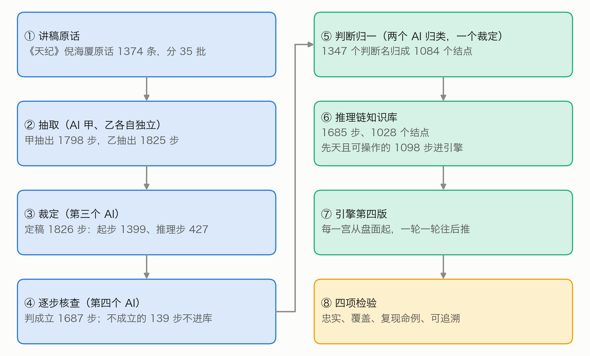
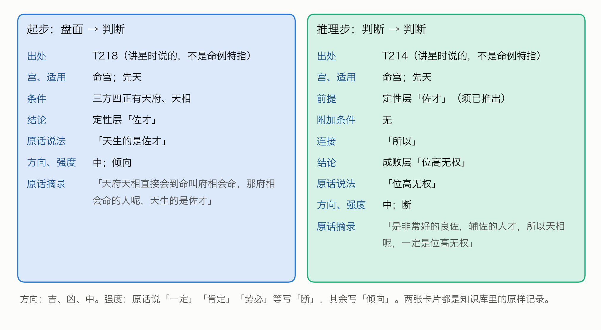
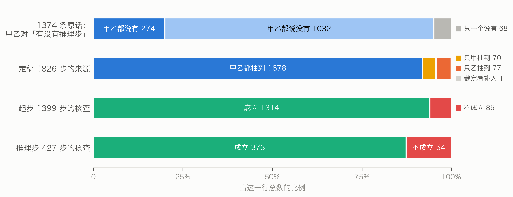
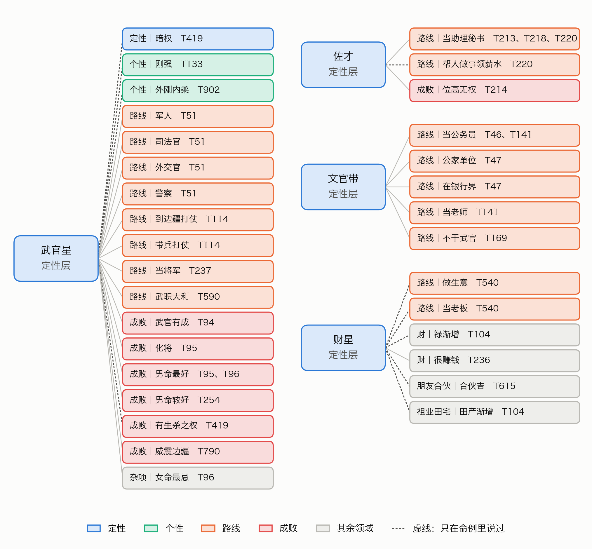
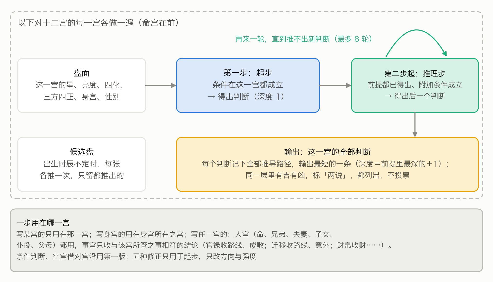
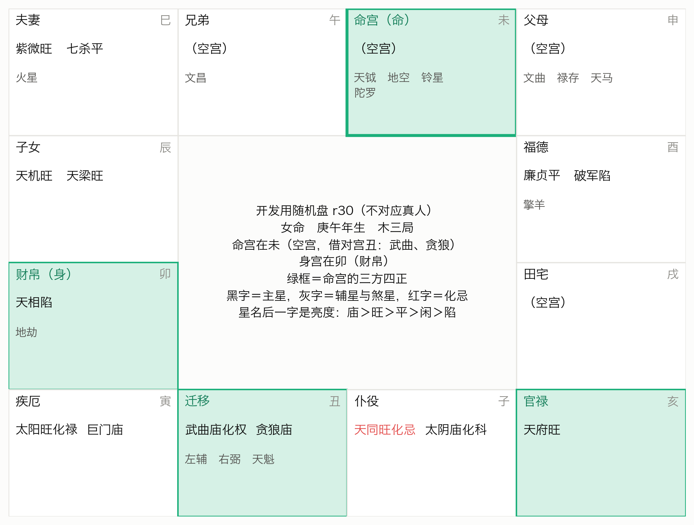
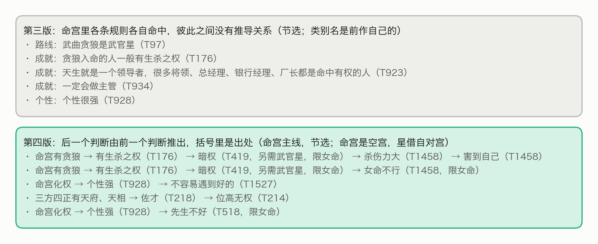
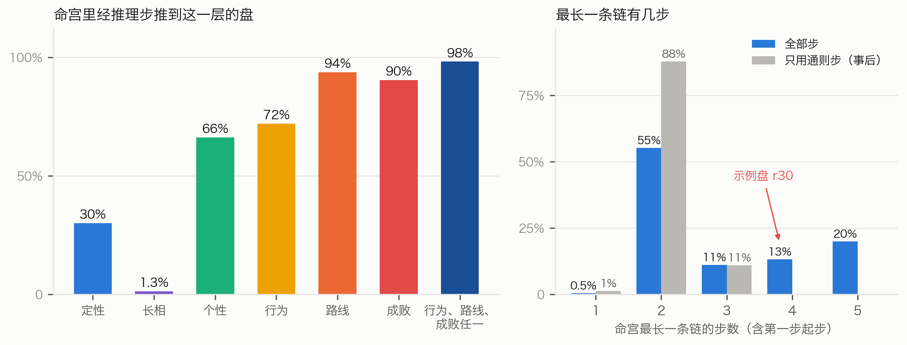
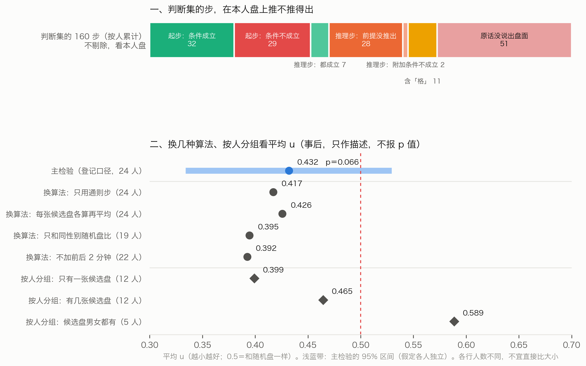
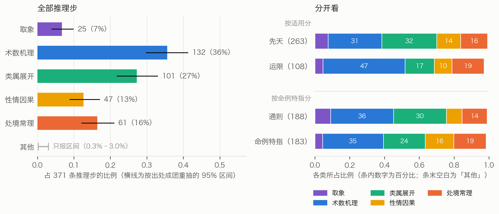

# 从讲述到推理链：倪海厦紫微斗数断法的逐步推理引擎

——以倪海厦《天纪》讲稿为唯一规则来源

## 摘要

倪海厦看命盘是一步接一步的：先看出这个人属于哪一类，再由个性推到行为，最后推到成败。前作把他的《天纪》讲稿整理成「盘面条件 → 结论」的规则，各条规则各自命中，结论之间没有推导关系。本文把讲稿里「后一个判断由前一个判断推出」的推导逐条抽出来，做成推理链知识库和第四版引擎。

推理链只有两种步：起步，由盘面直接得出一个判断；推理步，由前面的判断推出后一个判断。抽取、裁定、核查、归一都由相互独立的 AI 实例完成，没有人工复核。定稿 1826 步，独立核查判为忠实的 1687 步（92.4%）收进知识库，归一后为 1685 步、1028 个判断结点，每一步都附原话。引擎在每一宫里一轮一轮往后推，每个判断都追得到原话。在 600 张随机盘上，98.2% 的盘命宫能经推理步推到行为、路线或成败；最长的链多数只有两步。

事先登记的主检验问：剔除倪海厦讲某位命主那几分钟里的全部步之后，本人的命盘是否比随机盘更容易推出他对这个人的判断？24 人的结果是：本人盘平均胜过约 57% 的随机盘（得分相同的算一半，随机水平是 50%），单侧 p = 0.066，没有达到事先定的 p < 0.05，未能证明引擎能复现他对命例的判断。事后诊断（只作描述）显示：他对这些人的判断，剔除之后过半（按人累计）在知识库里找不到别的出处；仍推得出的那些，本人盘也只推出约四分之一；判断集里条件写得出的起步，约一半的条件在重建的本人命盘上不成立。

主检验未通过之后，另做了三项补充研究；方案在运行前先请独立审稿人找茬，改定后登记。
- **认本人检验**：剔除本人与另三位命主的讲述以及陈述可能的出处之后（比主检验剔得更严），引擎推出的先天论断，AI 审者能从四份里认出倪海厦讲的是谁，28 题认对 18 题，认对率 0.64（95% 区间 0.44–0.81；瞎猜期望 7 题，p < 0.001）。同一份论断平铺列出也认对 18 题，第三版的先天论断认对 20 题；看不出推理链的写法带来增减。
- **推理类型**：371 条推理步里，靠星曜、四化、运限等术数规则推出的占 36%，把一类人展开成成员与特征的占 27%，原话明说借象说理的只占 7%。两名归类者的一致程度 α = 0.87。
- **召回率**：照本文的抽取口径、只算明确漏掉的，推理步约九成抽到了（至少 0.83），算上拿不准的则明显更低。样本里能接进知识库的少数几条漏步补回去，最长链的分布不变。

推理链把倪海厦明说出来的推导写成了能运行、能逐步核对的程序。引擎推出的先天论断，多数题里比别人的论断更贴近倪海厦对这个人的描述（不写成推理链的第三版同样做得到），却推不回他对具体的人说过的那几个判断。

**关键词**：紫微斗数；倪海厦；推理链；前向推理；知识形式化；数字人文

**英文题目**：From Lectures to Reasoning Chains: A Step-by-Step Inference Engine for Ni Haixia's Zi Wei Dou Shu Chart Reading

**Abstract**: Ni Haixia reads a Zi Wei Dou Shu chart step by step: from the life palace he classifies the person, then infers temperament, behaviour, career route and success. Our earlier engine fired if–then rules independently, with no inferential links between conclusions. Here we extract, from Ni's Tian Ji lectures alone, every step in which one judgment is derived from another, and build a chained knowledge base and a fourth engine version. Extraction, adjudication, step-by-step checking and label merging were all done by independent large-language-model instances, without human review. Of 1,826 final steps, the 1,687 (92.4%) judged faithful by an independent checker entered the knowledge base, which after merging holds 1,685 steps and 1,028 judgment nodes, each step tied to Ni's words. The engine forward-chains palace by palace and keeps the derivation of every judgment. On 600 random charts, 98.2% reach behaviour, route or success through at least one inference step, but most longest chains have only two steps. The preregistered main test asked whether, after removing every step from the minutes in which Ni discussed a person, the person's own chart yields Ni's judgments about that person more readily than random charts do. Across 24 persons the own chart beat on average about 57% of random charts (ties counted as half; chance 50%), one-sided p = 0.066, which misses the preregistered threshold of p < 0.05; we could not show that the engine reproduces Ni's case readings. Descriptive diagnostics show that after removal over half of Ni's case judgments (counted per person) have no other source in the knowledge base, that the own charts recovered only about a quarter of those still derivable, and that about half of the start steps with stated chart conditions in the judgment sets (29 of 61) do not hold on the reconstructed charts. Three supplementary studies, designed after the main test had failed and preregistered after an independent reviewer had scrutinised their plans, add another side. In a four-way identification test with a stricter removal, AI judges picked the person's own natal reading in 18 of 28 items (rate 0.64, 95% CI 0.44–0.81; chance 7; one-sided p < 0.001); the same readings listed flat also scored 18 and the third-version natal readings 20, so the chain format added no visible advantage. Coding the 371 inference steps showed that 36% rest on the workings of stars, transformations and periods, 27% unfold a category into its members or traits, and only 7% argue explicitly from an image (inter-coder α = 0.87). A stratified recall study estimated that, counting only clear omissions under our rules, about 90% of the stated inference steps were extracted (one-sided lower bound 0.83), clearly less if borderline cases are counted; adding the few confirmed omissions that could be linked into the knowledge base left chain lengths unchanged. Reasoning chains make Ni's stated inferences runnable and checkable step by step; in most items the engine's natal readings were closer to Ni's description of the person than other people's readings were (as were the third version's), yet they do not recover the specific judgments he made about that person.

**Keywords**: Zi Wei Dou Shu; Ni Haixia; reasoning chain; forward chaining; knowledge formalization; digital humanities

## 名词白话

不熟悉紫微斗数或编程的读者，可先看这几条。

- **命盘与十二宫**：按出生时间排出的一张图，分十二格，叫十二宫，每宫管一类人或事。命宫管本人，夫妻宫管配偶，官禄宫管事业，财帛宫管钱财。十二格的位置用地支（子、丑、寅……亥）称呼，例如「命宫在未」。
- **星、亮度、四化**：宫里落的星。十四颗大星叫主星，其余是辅星；擎羊、陀罗、火星、铃星、地空、地劫叫煞星（前作的条件词表里叫杀星），左辅、右弼、文昌、文曲、天魁、天钺等叫吉星。同一颗星落在不同的宫有强弱之分，叫亮度，由强到弱是庙、旺、平、闲、陷。出生年让四颗星分别带上化禄、化权、化科、化忌，叫四化。
- **三方四正、空宫借对宫**：看一宫时，连同对面一宫和隔四宫的两宫一起看，叫三方四正。一宫没有主星，叫空宫，就借对面那一宫的主星来看。
- **身宫**：命盘上另定的一宫，倪海厦用它看后天的发展。
- **先天、大限、流年、小限**：先天看一生（本命盘）；大限是每十年一段的运；流年是某一年的运；小限是另一种逐年的看法。本文的引擎只推先天。
- **格**：几颗星按特定位置组合成的固定名目，例如「府相朝垣」。
- **人宫与事宫**：管人的宫（命宫、兄弟、夫妻、子女、仆役、父母）叫人宫；管事的宫（财帛、官禄、田宅、疾厄、迁移、福德）叫事宫。
- **视频分集**：讲座视频在 B 站分成好几集，B 站叫「分P」；讲稿每条都记着出自第几集、第几分钟。
- **判断、结点**：倪海厦说的一个判断，例如「佐才」「位高无权」。不同讲次的不同说法归并之后叫一个结点。下文计数的「判断」都指归并后的结点。
- **步、链、推导路径**：倪海厦说的每一个「由什么得出什么」叫一步。一步接一步连起来，叫链。引擎得出一个判断所经过的那几步，叫这个判断的一条推导路径。
- **起步、推理步**：起步由盘面（星、四化等）直接得出一个判断；推理步由前面已经得出的判断推出后一个判断。数据文件里，起步叫「定性步」。
- **层、主链六层**：判断属于哪一类，叫层（4.1）。定性、长相、个性、行为、路线、成败六层合称主链六层，与财、婚姻等「其余领域」相对。
- **深度**：从盘面出发，到得出这个判断经过了几步。起步得出的判断，深度是 1。
- **两说**：同一宫、同一层里，既有吉的判断，又有凶的判断。
- **命例、命主**：命主是倪海厦在课上讲过命盘的人；命例是他讲某位命主的那一段话。
- **命例特指、通则步**：命例特指的步，是讲某位命主时说的；不是命例特指的步，叫通则步。
- **可操作**：条件里没有用「其他:」（原话没说出盘面）的步，叫可操作。其中条件含「格」的步也算可操作，但程序不判断格，实际推不出来。
- **候选盘**：出生时辰不能唯一确定时，几张可能的命盘。有的命主连性别也不能从讲课画面确定，候选盘里男女都有。
- **随机盘**：用公开的随机数起点（种子）生成的命盘，不对应真人，任何人都能照种子重算出同一批。本文的检验用另外生成、开发时没用过的 600 张，叫留出随机盘。
- **按人累计**：把各人的数直接相加。同一个判断出现在几个人的判断集里，就算几次。
- **单侧检验、检验功效**：单侧检验只问本人盘是否更好，不问是否更差。检验功效指效果真的存在时能把它测出来的把握；人数少，功效就低。
- **认本人检验**：给 AI 审者一份陈述（倪海厦讲某个人时说的话，改写成白话）和四份论断，其中一份由这个人自己的命盘推出，另三份由别人的命盘推出（下称陪衬），让审者挑出与陈述最贴近的一份。瞎猜认对的机会是四分之一。比的是倪海厦对这个人的描述，不是这个人的真实生平。
- **配对差**：两组用同一批题时，逐题比较：只有前一组认出的题数减去只有后一组认出的题数，再除以题数。
- **推理类型**：本文用五个问题给推理步归类。取象：原话明说借一个形象或名称的字面意思来说理；术数机理：援引星曜、四化、运限、格局本身的作用；类属展开：结论是前提那一类人的成员、别名或本来的特征；性情因果：性情与做法之间的因果；处境常理：由身份、处境按人情世理推出得失。
- **召回率**：本该抽出来的步里，实际抽到了多少。
- **一致程度 α**：两名归类者各自归类，结果有多一致（Krippendorff α）；1 是完全一致，0 相当于随手乱归。
- **AI 实例**：同一种大语言模型（Claude Opus 5.5）开出的互相独立的会话。下文的抽取者甲、乙，裁定者，核查者，归类者，审者，找漏者，都是 AI 实例。

## 一、引言

倪海厦（学生多称倪师）《天纪》讲座的紫微斗数部分流传很广。他讲看命宫的顺序是这样的：

> 「介绍命宫的时候，我们可以看到这个人的长相，这个人的个性。从个性上面可以知道这个人的行为模式。其实开始从命宫一看就已经知道成败」（T409）

他讲星的时候也常一步接一步。讲天相，先说它是什么样的星，再说这样的人能做到什么程度：

> 「是非常好的良佐，辅佐的人才，所以天相呢，一定是位高无权」（T214）

「位高无权」不是从星直接读出来的，是用「所以」从「佐才」推出来的。另一处他紧接着「佐才」说下去：

> 「所以天相星是一个佐才星。你如果是天相入命的人你适合去当人家的助理当人家的秘书去当师爷」（T213）

这里没有「所以」，但后一句紧接着讲前一个判断的后果（4.3 把这种情形记作「紧接承上」）。三个判断「佐才」「当助理秘书」「位高无权」之间，有由此及彼的关系。

作者的前一篇论文《从讲述到算法：倪海厦紫微斗数断法的形式化与推理引擎》（未刊稿，第六稿，下称前作）把同一份讲稿整理成 1064 条「如果……就……」的规则，做了引擎的第一至三版：各条规则各自命中，再按属性取舍。这样整理，上面的话会变成三条并列的规则：天相坐命 → 佐才；天相坐命 → 当助理；天相坐命 → 位高无权。三个结论都对，但它们之间的推导关系不见了。读者看不出一个结论是由哪个判断推出来的。

本文做第四版：把这种推导关系做出来。要回答四个问题：
1. 倪海厦「后一个判断由前一个判断推出」的推导，能不能从原话里忠实地抽出来？抽漏了多少？
2. 照这些推导，引擎在随机盘上推得动推不动，能不能从命宫推到行为、路线、成败？
3. 引擎能不能复现倪海厦自己读过的命例？这是事先登记的主检验；另用「四选一认本人」的检验，看引擎推出的论断整体上是否贴近倪海厦对这个人的描述。
4. 他明说出来的推导，靠的是什么道理？

本文的贡献有四：
1. 一个推理链知识库：1685 步、1028 个判断结点，每一步都附原话、标明出处；
2. 第四版引擎：从盘面出发一轮一轮往后推，每个判断都带着推出它的完整路径（图1）；
3. 一组事先登记的检验，以及主检验没有通过之后的诊断。结果照登记的口径报告；
4. 三项事先登记的补充研究：认本人检验、推理类型与召回率（7.7–7.9）。

本文只问引擎像不像倪海厦，不问紫微斗数准不准。

## 二、相关研究

**把专家知识写成规则。** 把专家的条件式知识写成可执行规则，是专家系统的经典路线（Buchanan 与 Shortliffe，1984）。规则可以串起来：一条规则的结论成为另一条规则的条件，从已知事实一路往后推，就是前向推理（Russell 与 Norvig，2020）。Feigenbaum（1977）指出，这类系统的难处主要在获取与表示专家知识，而不在推理本身。本文的推理也很简单；与专家系统不同的是，规则不是请专家口述的，而是从一位已故老师的讲课录音里逐句认出来的，每一步都要对得回原话。

**论证的结构。** Toulmin（1958）把一个论证拆成依据、结论和二者之间的「担保」。倪海厦说「所以天相呢，一定是位高无权」，「佐才」是依据，「位高无权」是结论，「所以」把二者连起来。从文本里自动找出前提与结论，是论证挖掘研究的课题（Lawrence 与 Reed，2019）。本文借用这一思路，但不训练模型，而是让 AI 实例照一份写明规矩的说明逐条整理，再由另外的实例裁定和核查；抽出来的推导还要能在命盘上运行。

**数字人文与出处。** McCarty（2005）把建模看作人文计算的核心：把研究对象写成形式模型，模型对不上的地方往往最有启发。把结论、推导与出处连起来，可以借鉴知识图谱（Hogan 等，2021）与出处数据模型（Moreau 与 Missier，2013）。中国术数长期是社会史与思想史的研究对象（Smith，1991；Kalinowski，2003；李零，2006），这些研究关心文本的来历与社会功能；本文关心的是一位老师的断法能不能写成逐步可查的推理。

**AI 作整理者与审者。** 强模型作评审与人类的一致率可以很高（Zheng 等，2023），但模型也可能偏好与自己相似的文字（Panickssery 等，2024）。本文的抽取者与核查者属于同一种模型，这一点列入局限。

## 三、材料与前作

**讲稿。** 来自倪海厦《天纪》讲座的紫微斗数部分（B 站视频 BV1KJsLekEfA），转写为开源语料 nihai-tianji-corpus。每条都带视频分集序号与时间码，可回原视频核对。转写语料里，按整理主题归在紫微斗数各类之下的有 1593 条（相法、阳宅两类事先已除外）；其中 177 条讲的其实是易经、医理等，42 条讲排盘，去掉这两部分，余下 1374 条，就是本文用的全部原话。前作已按主题把它们分成 35 批，每批附前后文。下文用 T 编号引用原话（如 T409）；T 编号按整理主题排，不按讲课时间先后。

**命例。** 前作按讲课画面上的命盘反推出生资料，合并同一人后，纳入检验的命主有 28 人（前作第三节）；编号沿用前作，所以不连续。每人记有倪海厦讲他的时段：视频分集与起止时间，前后各加 2 分钟。有的人出生时辰不能唯一确定，有几张候选盘；其中计入主检验的有 5 人，连性别也不能从画面确定，候选盘一男一女。

**随机盘。** 检验用一批新的 600 张留出随机盘（男命 313 张、女命 287 张），由公开的种子（METIS-V4-留出随机盘-20261007）逐项算出，生成办法与前作的留出盘相同。全部命盘都用前作的同一个定版排盘程序排出。

**前作。** 前作的引擎有三版：第一版逐条推；第二版加一层综合取舍；第三版把流年改成倪海厦教的起法。在「四选一认本人」的检验里，第三版的全文论断 28 题认对 23 题（前作 7.4）。第三版不变，作为本文的对照（6.3）。推理链知识库是从同一批原话重新抽取的，不是在前作的规则上加连线。

**AI 的分工。** 抽取、裁定、核查、归一，每一道都由独立的 AI 实例完成（Claude Opus 5.5，推理档位 high）。每个实例只读本批的材料，把结果写进指定的一个文件。存档时逐份审计，全部合格（附录 C）。没有人类专家复核。

## 四、推理链的写法

### 4.1 七层

照 T409 的顺序，把判断分成七层（表1，图2）：盘面、定性、长相、个性、行为、路线、成败。盘面是起点，其余六层是判断。

**表1　判断的分层**

| 层 | 管什么 | 知识库里的例子 |
|---|---|---|
| 盘面 | 星、亮度、四化、三方四正 | 命宫有天相；三方四正有天府、天相 |
| 定性 | 这颗星让这个人属于哪一类 | 佐才、武官星、文官带、财星、暗权 |
| 长相 | 外貌、体型 | 五短、魁梧高大 |
| 个性 | 性情 | 刚强、个性强、拗 |
| 行为 | 做事的方式、容易做出的事 | 意气用事、大怒之下犯大错 |
| 路线 | 走哪条路、做哪一行 | 当助理秘书、军人、做生意、当老师 |
| 成败 | 成就高低、得失贵贱 | 位高无权、有生杀之权、做主管 |

层是判断的类别，不是推导必须走的先后。主链六层之内的推导多数是往后推的，也有同层推导和往回推的（5.4）。

六层以外，另有财、婚姻、子女、父母、兄弟、朋友合伙、健康、祖业田宅、福德、官非、意外、寿元、其他十三个领域，与前作相同，下文统称「其余领域」。领域「其他」与条件写法里的「其他:」无关，图里显示为「杂项」。

### 4.2 两种步

推理链只有两种步（图3）：
- **起步**：盘面条件 → 一个判断。条件全部成立，就在这一宫得出这个判断。起步的结论可以落在任何一层。
- **推理步**：一个或几个判断 → 后一个判断，可以再加盘面条件（附加条件）。前提都已推出、附加条件也成立，才得出后一个判断。

每一步都写明：出处（T 编号）；宫；适用（先天、大限、流年、小限）；条件或前提；结论的层、判断名和原话里的说法；方向与强度；原话摘录；是不是命例特指。推理步另写原话里承接前后的那几个字（连接），例如「所以」「代表」「就会」。

方向分吉、凶、中。强度分两档：原话说「一定」「肯定」「势必」的写「断」，其余写「倾向」。

### 4.3 什么算推理步

推理步必须是倪海厦自己说出来的推导。下面两种情形有其一才算：
- 有承接的话，例如所以、因为、代表、就是说、那就、就会、难怪、「……的人就……」。其中「代表」「就是」接在盘面后面的，算起步；接在一个判断后面的，才算推理步；
- 没有承接词，但紧接着的下一句明显在讲前一个判断的后果，连接写「紧接承上」。引言里的 T213 就是这种。

只是并列几个特征（如「聪明、好动、爱漂亮」），或前后两句讲的是不同的星、不同的宫，都不算。先说结论、后说原因的倒装句，按因果方向记。原话没说出来的推导，不许为了连贯补上。

### 4.4 条件的写法

条件的写法与前作完全相同（前作附录 A 的条件词表）。有两类条件程序不判断，与前作相同：
- 原话只给了格名、没给组合条件的，写「格:格名」；
- 原话没说出盘面、只说「这种命」「这样子」的，写「其他:」并加说明，这一步记为不可操作。

这两类步照样整理、照样存档，只是引擎用不上。

## 五、从原话到推理链

### 5.1 抽取与裁定

35 批原话，每批由抽取者甲、乙各自独立抽取，互不知道对方的结果。甲抽出 1798 步，乙抽出 1825 步。裁定者对照原话和两份抽取逐步定稿：甲乙都抽到的，核对后收；只甲或只乙抽到的，决定收不收，写明理由；层、宫、条件写错的改正。

正式抽取之前，先拿 2 批试抽，看说明写得清不清楚。改定的说明登记之后，35 批全部重抽，试抽结果不进知识库。

定稿 1826 步：起步 1399 步，推理步 427 步，分布在 838 条原话里；定稿后含推理步的原话有 291 条。甲乙的一致程度见图4：
- **按条**：1374 条原话里，甲乙对「这条有没有推理步」判断一致的有 1306 条（95.1%）。这个数主要由甲乙都说「没有」的 1032 条撑起来；在至少一个说「有」的 342 条里，甲乙都说有的是 274 条（80.1%）。这里的 274 条看的是两份抽取，上面的 291 条看的是定稿，口径不同。
- **按步**：定稿步里甲乙都抽到的有 1678 步（91.9%）；分开看，起步 91.9%，推理步 91.8%。其余是只甲抽到的 70 步、只乙抽到的 77 步，以及裁定者补入的 1 步。甲抽出的步里，裁定者没收的有 45 步，乙有 63 步；收下的步有几处被合并成一步，所以收下的步数与定稿里来自甲、乙的步数略有出入。

另有 161 条原话讲的是看盘的方法（例如先看格、再批流年），单独记下，不进推理链。

### 5.2 脚本核对与逐步核查

**脚本核对。** 每一步的原话摘录，必须是该条原话里逐字连续的一段（去掉空白后比较）；条件必须合乎条件词表；推理步的前提必须写成某一层的判断；前提与结论的原话说法，也必须出自原话。1826 步全部合格。另有 3 步的判断名里含星名（「看不到太阳」），只记警告，不影响收录。

**逐步核查。** 全部步再交给没参与抽取和裁定的核查者，一批一个，逐步判「成立」或「不成立」并写理由：
- 起步问：原话是不是由这些盘面条件得出这个判断；
- 推理步问：原话是不是明说了由前提推出结论。

结果（图4）：起步 1399 步判成立 1314 步（93.9%），推理步 427 步判成立 373 步（87.4%），合计成立 1687 步（92.4%）。判不成立的 139 步不进知识库。不成立的理由各不相同，例如把并列当成了推导、漏了原话里的限定（表2）。核查只判「抽出来的对不对」，没有估计「漏了多少」。

**表2　核查判「不成立」的推理步（按 T 编号顺序的前 5 条）**

| 出处 | 抽成的结论 | 核查理由（节录） |
|---|---|---|
| T6 | 先生当老板 | 两句同在「而且代表」之下，是并列列举紫微七杀的含义，没有承接词 |
| T86 | 宜嫁大 7 岁以上 | 「所以」承接的是另一句；这一步还漏了太阳不亮这个限定 |
| T109 | 成事 | 「有的事情一定要人和才能成事」是泛论，且是必要条件，不是推导 |
| T143 | 不见得是好人 | 原话是在否定「温和就是好人」这个推论，不是推出新结论 |
| T146 | 夫妻有名无实 | 中间隔着「跑掉」，「然后」只是叙事顺序 |

### 5.3 判断归一

不同讲次说同一个判断，用词不一样：「武官星」「将星」「武官带」「武官」「将命」「武官的命」说的是同一件事。不归一，链就接不上。

做法也是两名归类者各自归类，再由裁定者定稿：
1. 把定稿步里出现的所有判断名（前提和结论都算）按层列出，共 1347 个，每个附出现次数和一两例原话说法。按层分成六组：定性；长相、个性、行为；路线、成败；财、祖业田宅、福德；婚姻、子女、父母、兄弟、朋友合伙；健康、意外、官非、寿元、其他。
2. 两名归类者各自独立归类：同义的归成一个结点；一个说法里并列两个判断的，拆成两个结点；拿不准的不合并；层分错的可以改层，但只能改成本组的层。
3. 裁定者定稿。

1347 个判断名归成 1084 个结点，其中 52 个判断名拆进了两个以上的结点，裁定者改层 7 处。

两名归类者的一致程度用「合并一致率」衡量（图5）。例如有三个说法甲、乙、丙：归类者一把三个都合在一起，归类者二只合了甲和乙。两两配对共三对，至少一名归类者合并的有三对，两名都合并的只有一对（甲乙），合并一致率是 1/3。六组合计的合并一致率是 73.1%；最低的是路线、成败一组（63.6%），最高的是长相、个性、行为一组（93.5%）。路线、成败一组里，两名归类者给出的「同结点伙伴」完全相同的判断名只占 75.8%，是这一步最不稳的地方。成员最多的几个结点见附录 B。

### 5.4 推理链知识库

把核查成立的 1687 步，按归一表换成结点。换算后有 2 步变成「自己推自己」（前提与结论归成了同一个结点），不收。知识库定为 1685 步、1028 个结点；归一表里另有 56 个结点只出现在核查不成立的步里，不进知识库。

**表3　推理链知识库的规模（步数）**

| | 先天，可操作 | 先天，不可操作 | 大限流年小限，可操作 | 大限流年小限，不可操作 | 合计 |
|---|---|---|---|---|---|
| 起步 | 857 | 250 | 100 | 107 | 1314 |
| 推理步 | 241 | 22 | 94 | 14 | 371 |
| 合计 | 1098 | 272 | 194 | 121 | 1685 |

引擎这一版只推先天，只用可操作的步，共 1098 步（表3 第一列）。其中有 28 步的条件含「格」，程序不判断，实际上用不上。不可操作的步共 393 步（先天 272 步，大限流年小限 121 步）。1685 步里，命例特指的有 676 步；引擎可用的 1098 步里有 339 步，其中推理步 103 步。这些步是倪海厦讲某位命主时说的，条件一旦成立，引擎就当通则用（影响见 8.3）。

371 条推理步共有 434 条连线（前提结点 → 结论结点，图6）。主链六层之内的 176 条连线里，往后推的 134 条，同层的 27 条，往回推的 15 条；其余 258 条涉及其余领域。主链上最多的是定性 → 路线（44 条）、路线 → 成败（29 条）、定性 → 成败（20 条）；个性 → 行为只有 11 条，长相往后推的只有 2 条。推导集中在少数「枢纽」判断上，例如「武官星」一个判断就推出 18 个后续判断（图7）。

## 六、引擎第四版怎样一步步推

### 6.1 算法

引擎对一张盘的十二宫各推一遍，命宫在前（图8）。每一宫里：

1. **起步**：条件全部成立 → 得出判断；深度 = 1。
2. **推理步**：前提全部已得出，附加条件全部成立 → 得出判断；深度 = 1 + 前提里最大的深度。
3. 一轮推完再来一轮，直到推不出新的判断为止，最多 8 轮。
4. **两说**：同一层里既有吉的判断又有凶的判断 → 都列出，标「两说」，不投票，也不按条数取舍。

一个判断有几条推导路径时都记下，输出深度最小的那一条；深度相同时，按步的编号的字面先后取第一条。

**沿用前作的部分。** 读盘、条件判断、空宫借对宫，完全沿用前作的第一版引擎。前作的五种修正也照用，但只用于起步，只改方向与强度（这一点在引擎代码登记时已写明）。五种修正是：条件写的是对宫化忌的，强度升为「断」；凶断由本宫煞星引出、同宫有紫微的，方向改「中」、强度改「倾向」；引出凶断的煞星都庙旺的，方向改「中」；同宫有吉星的，强度降为「倾向」；引出凶断的煞星有落陷的，强度升为「断」。前作第一至三版的文件一个不改。

**一步用在哪一宫。** 步写某宫的，只用在那一宫；写身宫的，用在身宫所在之宫；写「任一宫」的（讲星的通义，没限定在哪一宫），人宫都用，事宫只收与该宫所管之事相符的结论，例如官禄宫只收路线、成败，财帛宫只收财。

**候选盘。** 有几张候选盘的，每张各推一次，只留各张在同一宫都推出来的判断。

**输出。** 引擎写出「推理链」一节：先写命宫里最长的几条链（输出里叫「主线」），再写身宫和财帛、官禄、迁移，最后写其余各宫。每个判断写明由哪个判断（或哪些盘面条件）推出、出处的 T 编号和原话摘录。

### 6.2 一张盘的示例

示例盘沿用前作的随机盘 r30，是写作之前就定下的，不是看了结果再挑的（图9）。这是一张女命，命宫在未，是空宫，借对宫（丑）的武曲、贪狼；身宫在卯，落在财帛宫。

命宫一共推出 69 个判断，其中 25 个至少要经过一步推理步才得出。图10 画出命宫的几条主线。最长的一条有 4 步：

> 命宫有贪狼（借对宫）→ 有生杀之权（T176）→ 暗权（T419；另需武官星，限女命）→ 杀伤力大（T1458）→ 害到自己（T1458）

每一步都对得上原话：「一般呢贪狼入命的人他有生杀之权」（T176）；「将军的命有生杀之权，那你又是阴……就是说她是暗权」（T419）；「那这种暗权的人她杀伤力会很大」（T1458）；「只有杀到自己就害到自己」（T1458）。T419 在视频分集 13 的 00:18:05，T1458 在同一集的 00:19:16，两条相隔一分多钟，讲的是同一位女命。第四版把它们当通则用，条件成立就推（8.3）。

层和深度是两回事：「有生杀之权」属成败层，却在第 1 步就由盘面得出；「暗权」属定性层，在第 2 步才得出。

另一条短链就是引言里的天相例：三方四正有天府、天相 → 佐才（T218）→ 位高无权（T214）。

这张盘推得比多数盘长：命宫用上的推理步有 30 条，而 600 张随机盘里四分之三的盘不超过 23 条；最长链 4 步，约三分之二的盘不到 4 步，另有两成的盘达到 5 步（7.2）。命宫有 5 处两说，例如定性层同时有吉的「大财星」与凶的判断「杀星」（指七杀、破军、贪狼这类星，与煞星不同）。

### 6.3 与第三版对照

同一张盘，第三版的命宫一节是一条条并列的命中：武曲贪狼是武官星（T97），贪狼入命的人一般有生杀之权（T176），一定会做主管（T934）……每条都对得回原话，但条与条之间没有关系（图11）。第四版把其中一部分接成了链：「有生杀之权」不再是孤立的一条，它和「武官星」一起推出「暗权」，再推出后面的行为和成败。

第三版写「武官星」出自 T97，第四版的图10 写出自 T103：这张盘的命宫里，「武官星」有 11 条推导路径，倪海厦在好几处都这样说过；深度都是 1，按步的编号的字面先后，T103 排在 T97 前面，所以输出的是它。第三版的「路线」「成就」是前作自己的类别名，与本文的层不同。

## 七、检验

检验方案、脚本与判据都在运行之前登记了数字指纹（SHA-256），结果不论好坏都报，结果汇总在表4。主检验没通过之后，一共做了三批诊断，都是看到主检验结果之后做的，也都是先写下要看什么、登记，再运行：7.5 是内审之前的一批；7.6 是第一轮、第二轮内审之后各补的一批。

此后又做了三项补充研究（7.7–7.9）：认本人检验、推理类型、召回率。它们是在主检验未通过之后设计的。三项的方案在运行之前先交给一名独立的 AI 审稿人专门找茬：审稿意见共 32 条，其中 25 条全部或部分标为必须改，最要紧的 9 条列在开头（例如泄露只按时段核、论断里写什么没有说死、召回率的分子分母口径不一）。按意见改定之后才登记，再建材料、派子代理；交卷先审计、登记，再读答案或跑统计。

**表4　各项检验的结果**

| 检验 | 性质 | 做法 | 结果 |
|---|---|---|---|
| 忠实度 | 描述 | 脚本核对原话摘录；独立核查者逐步判 | 摘录全部逐字合格；成立 1687 / 1826 步（92.4%） |
| 覆盖 | 描述 | 600 张留出随机盘，只作描述 | 98.2% 的盘命宫推到行为、路线或成败；最长链中位数 2 步 |
| 主检验 | 事先登记的主检验 | 复现倪海厦读过的命例，p < 0.05 算通过 | 24 人平均 u = 0.432，p = 0.066，未通过 |
| 可追溯 | 程序核对 | 程序逐条核对推导路径与输出 | 150360 条推导路径、119075 个判断，全部合格 |
| 认本人 | 补充研究（主检验未通过后设计，事先登记） | 四选一，推理链先天论断，28 题，p < 0.05 算通过 | 认对 18 题（瞎猜 7 题），p < 0.001，通过 |
| 召回率 | 补充研究（事先定解读线：单侧下界 ≥ 0.8） | 300 条原话分层抽样，两人找漏、一人裁定 | 只算明确漏：推理步 0.90（95% 区间 0.82–0.94，至少 0.83），起步 0.90；算上两可：推理步 0.68 |

### 7.1 忠实度

见 5.2。脚本核对全部合格；独立核查判成立的，起步 93.9%，推理步 87.4%。核查者与抽取者是同一种模型，核查结果没有人工复核。

### 7.2 覆盖

在 600 张留出随机盘上各推一次，看命宫（图12）：
- 经推理步推到行为、路线、成败任一层的盘有 589 张（98.2%），推到成败的有 542 张（90.3%）。按层看，推到路线的 93.7%，行为 72.0%，个性 66.2%，长相 1.3%。还有 30.0% 的盘经推理步推到了定性层，那是由别的判断推回定性，例如「暗权」。
- 每张盘命宫用上的推理步，中位数 18 条，中间一半的盘在 10 至 23 条之间，最多 43 条。
- 命宫最长一条链的步数（含第一步起步）：中位数 2 步，最多 5 步。2 步的盘占 55.2%，3 步 11.2%，4 步 13.2%，5 步 20.0%，只有 1 步（没用上推理步）的 0.5%。
- 命宫推出的判断里，30.9% 至少要经过一步推理步才得出；其余直接由起步得出。
- 命宫有两说的盘有 560 张（93.3%），每张盘中位数 3 处。

5 步的那 120 张盘，最长链的终点全是「害到自己」；最常见的三条（31、30、28 张）只差在第一步：命宫有太阳、破军或七杀 → 武官星 → 有生杀之权 → 暗权 → 杀伤力大 → 害到自己。后四步都出自 6.2 说的那一段女命命例（T419、T1458），其中「暗权」一步限女命（这一项是写正文时补查的，见附录 C）。只用通则步时，最长链最多 3 步（7.6）；由此可知，全部步时最长链 4 步以上的盘（约三分之一），最长链上都至少用到了一条命例步。

所以，推理链推得动，多数盘也能推到行为、路线、成败；但这是经一两步推理推到的，多数盘只是「起步 + 一步推理步」，更长的链都用到了命例步。

### 7.3 主检验：复现倪海厦读过的命例

**设计**（图13）。命主就是前作的 28 人，用同一批候选盘。

1. **判断集**：同时满足下面四条的步，它们的结论（归一后的结点）合成这个人的判断集，记作 G：
   - 落在倪海厦讲这个人的时段内；
   - 标了命例特指；
   - 适用先天；
   - 宫是命宫或身宫。

   没有这类步的人不计入，人数照报。
2. **剔除**：这个人时段内的全部步，不论是不是命例特指，一律剔除，引擎只用其余的步推。
3. **得分**：引擎在本人盘的命宫推出的判断，加上身宫所在之宫里、由写明用在身宫的步推出的判断（口径见登记的检验脚本），算这张盘推出的判断。得分 = G 里在这张盘上推出来的个数 ÷ G 的个数。有几张候选盘的，只算各张都推出来的。
4. **排位**：同一套剔除后的步，在 600 张留出随机盘上各算一个得分。

   u =（随机盘里得分比本人盘高的张数 + 0.5 × 得分相同的张数）÷ 600

   也就是说，u 是随机盘里得分比本人盘还高的比例（相等的算一半）。u 越小，本人盘越突出；u = 0.5 表示和随机盘一样。1 − u 就是本人盘胜过的随机盘比例（相等的同样算一半）。
5. **统计**：主统计量是各人 u 的平均数。p 值这样算：假设引擎完全认不出本人，就每人改从 600 张留出盘里随机抽一张当作「本人盘」算平均 u，重复 10000 次（种子 METIS-V4-复现检验-20261007）；平均 u 碰巧不大于实测值的比例就是 p。这是单侧检验，p < 0.05 算通过。

**结果**（图14）。28 人里，4 人的判断集是空的，不计入；计入 24 人，每人的判断集有 1 至 17 个结点，按人累计 156 个，不重复的 109 个；每人剔除的引擎可用步在 4 至 136 步之间，中位数 22.5 步（约占 1098 步的 2%）。
- 平均 u = 0.432，即本人盘平均胜过 56.8% 的随机盘；中位数 0.5。单侧 p = 0.066：如果引擎完全认不出本人，平均 u 碰巧低到这么低的机会约为 6.6%。**没有达到事先定的 p < 0.05，主检验未通过**，未能证明引擎能复现倪海厦对命例的判断。
- 平均 u 的 95% 区间（事后按人重抽估计）约为 0.33 至 0.53，既容得下「没有效果」，也容得下中等程度的效果；24 人的检验功效有限。这个区间假定各人互相独立；各人的判断集有重叠（7.6），实际区间可能更宽。
- 14 人的本人盘一个判断也没推出来，他们的 u 都不小于 0.5；u 小于 0.5 的 10 人，正好就是本人盘推出了至少一个判断的人。只有 1 人的 u 不大于 0.05。
- H27、H38、H39 三人的 u 在 0.8 以上：本人盘一个也没推出，随机盘却有不少推出了其中较常见的判断（例如「武官星」「刚强」「桃花」）。H38、H39 都是候选盘一男一女的人。
- 只用起步、不用推理步时，平均 u = 0.435，p = 0.071，与用全部步几乎一样。判断集里推理步的连线共 42 条，引擎在本人盘上用同样的推法只复现了 1 条（2.4%），随机盘上平均复现 1.0%。这两项与下面的诊断一致：判断集里的推导大多已随剔除一起拿掉，不能把它们当作另外的证据。

### 7.4 可追溯

这一项是程序自查：在 600 张留出随机盘上逐张推理，核对每个判断的每条推导路径都有 T 编号、原话摘录逐字出自那一条讲稿、推理步的每个前提都在同一宫里已经推出，并且输出里每个判断都出现、带着出处。共 119075 个判断、150360 条推导路径，全部合格。它只核对出处与推导是否接得上，不检验结论对不对。

### 7.5 主检验未通过后的诊断（运行前登记）

这一批诊断只作描述，不报 p 值，不据此改知识库或引擎，也不改「未通过」的结论（图15）。下面的数都按人累计。

**一、多数判断剔除后，引擎能用的步都推不出。** 24 人的 156 个判断里，剔除各人时段内的步之后：
- 引擎可用的步里还有能推出它的，只有 63 个（40.4%）；
- 在 600 张随机盘的任何一张上真推出来过的，50 个（32.1%）；
- 其余 93 个，引擎可用的步里已没有一条以它为结论。

3 个人的判断一个也推不出，他们的 u 都正好是 0.5。只看另外 21 人，平均 u 为 0.422，与全体相近。推不出的判断，在本人盘和随机盘上都推不出，不改变同一个人本人盘与随机盘之间的高低次序（判断集全都推不出的 3 人除外）；它们主要是让检验能用的信息变少。

**二、判断集的步，近三分之一说不出盘面。** 156 个判断来自 160 步：98 步的条件都能写成程序判断的形式；11 步靠「格」；51 步原话没说出盘面，只说「这种命」「这样子」。后两类在主检验里本来就随本人时段一起剔除了，不影响主检验的得分；它们只影响下面「不剔除」时能推回多少。

**三、不剔除时也只推回约四分之一。** 不剔除这个人时段内的步，本人盘平均推出判断集的 27.1%，随机盘平均 10.0%，平均 u 为 0.301；24 人里有 9 人一个也推不回。命例步本来就是照这张盘说的，所以这一项的得分高不说明任何事；照事先写下的解读规则，得分仍然低，指向条件的写法、归一，或重建的本人命盘与倪海厦当时所看的盘对不上。7.6 把这几种情形进一步分开。

**表5　两位命主的具体例子**（按事先定的规则挑：u 最小的一位，与判断集一个也推不出的人里编号最小的一位）

| 命主 | 判断集里的判断（层） | 出处 | 剔除后还有别的步能推出 | 本人盘推出 |
|---|---|---|---|---|
| H20（u = 0.014，两张候选盘一男一女，剔除 36 步） | 个性强（个性） | T929 | 有 | 是 |
| | 主见强（个性） | T929 | 有 | 否 |
| | 命很好（成败） | T929 | 有 | 是 |
| | 读书很棒（成败） | T929 | 无 | 否 |
| | 考试没问题（成败） | T929 | 无 | 否 |
| | 住西北角（行为） | T487 | 无 | 否 |
| H16（u = 0.5，一张候选盘，剔除 66 步） | 自己往坑里跳（行为） | T1471 | 无 | 否 |
| | 命中有灾（杂项） | T1471 | 无 | 否 |

H20 的 6 个判断里，有 3 个在剔除之后还有别的步能推出，本人盘推出了其中 2 个，600 张随机盘平均只推出 6.1%，所以 u 很小。H16 的两个判断，剔除之后引擎能用的步都推不出，本人盘和随机盘都是 0，u 正好是 0.5。

### 7.6 内审后的补充分析（运行前登记）

第一轮、第二轮内审之后，为回答审稿意见，各补做了一批分析，都先写成补记登记、再运行。这些分析只作描述，不报 p 值，都不改主检验「未通过」的结论（图16）。下面的数，凡涉及判断集的都按人累计。

**推得出的判断，本人盘推出了多少。** 剔除之后，判断集里至少还有一个判断推得出的有 21 人；这 21 人里，11 人的本人盘一个也没推出。这些推得出的判断共 63 个，本人盘只推出 16 个。与「没通过」真正有关的是这一点：本该推得出的判断，本人盘多数也没推出来。

**判断集的步在本人盘上推不推得出（不剔除）。** 条件写得出的 98 步里：
- 起步 61 步：条件在本人盘对应的宫里成立的 32 步，不成立的 29 步；
- 推理步 37 步：都成立的 7 步，附加条件成立但前提没推出来的 28 步，附加条件不成立的 2 步；
- 没有一步落在「有的候选盘成立、有的不成立」这一类（统计程序里这一类的计数为 0，结果文件里因此没有列出）。

也就是说，判断集里说得出盘面的起步，约一半在重建的本人命盘上对不上；推理步推不出来，多半是卡在前提上。对不上的原因有几种可能，8.2 再谈。

**推不出的判断，在整个知识库里有没有别的出处。** 7.5 那 93 个推不出的判断，只查了引擎可用的步。把整个知识库 1685 步都查一遍：本人时段以外，有 84 个连一步以它为结论的都没有；6 个只有先天但不可操作的步，3 个只有大限流年小限的步。另外，93 个里只有 3 个在本人时段内另有通则步以它为结论，其中引擎能用的只有 2 个，也就是说，因通则被一起剔掉而推不出的，最多只有 2 个。

**去重。** 24 人的 156 个判断，不重复的是 109 个，其中 34 个出现在两人以上的判断集里；160 步不重复的是 126 步；93 个推不出的判断，不重复的是 74 个。

**讲述时段的重叠。** 28 人里有 21 对两人的时段互相重叠，多数是前后各加 2 分钟造成的，最多的一对重叠 842 秒；知识库里有 206 步同时落在两人以上的时段内。判断集的 160 步里，有 68 步同时落在别人的时段内，涉及 17 人；计入的人里有 17 对时段重叠，其中 12 对的判断集有共同的判断，合计 36 个。这样的步可能被算进不止一个人的判断集；把别人的判断算到本人名下，可能稀释本人盘与随机盘的差别，偏向「未通过」。把各人时段的前后 2 分钟都去掉再算一次，计入 22 人，平均 u 为 0.392；这 22 人原来的平均 u 为 0.421。

**候选盘。** 每张候选盘各算一个 u 再取平均，24 人里只有 H39 一人的 u 变了（0.885 → 0.735），平均 u 为 0.426（原为 0.432）。只有一张候选盘的 12 人平均 u 为 0.399，有几张候选盘的 12 人为 0.465；换成每张各算，后者也只到 0.452，两组的差距多半另有原因。候选盘一男一女的 5 人，平均 u 为 0.589：只认交集时，凡限男命或限女命的步，在他们身上都推不出来；这 5 人里有 4 人的 u 在 0.6 以上。

**同性别对照。** 候选盘性别一致的 19 人，只和同性别的随机盘比，平均 u 为 0.395；这 19 人原为 0.391。随机盘的性别对结果几乎没有影响。

**只用通则步。** 把命例特指的步全部拿掉，只用 759 步通则步（其中推理步 138 步）：600 张随机盘里 95.2% 的盘命宫仍能推到行为、路线或成败，81.0% 推到成败；最长链最多 3 步，2 步的占 87.7%。照主检验的办法再算一次，平均 u = 0.417。这与「别的命主的命例步留在引擎里，没有帮上忙」相容，变化集中在少数几人身上。本节一共换了四种算法（只用通则步、每张候选盘各算、只和同性别比、不加前后 2 分钟），都只作描述；其中只用通则步一项，补记里另算过一个事后 p 值（0.029），其余三种没有算，也没有做多重比较的校正，本文不以它为据，更不能当作通过。

### 7.7 认本人检验：推理链的先天论断能不能认出倪海厦讲的是谁（运行前登记）

主检验问的是：引擎能不能推出倪海厦对某个人说过的那几个具体判断。这一节换一个问法：引擎推出的先天论断，整体上是否比别人的论断更贴近倪海厦对这个人的描述。这一项是在主检验未通过之后设计的，做法沿用前作的「四选一认本人」检验。

**做法。** 沿用前作的 28 题，题目、陈述、陪衬人选与 A–D 次序都逐字节照搬。每题给审者一份陈述和四份论断：
- 陈述是倪海厦讲到这个人时说过的话，改写成白话，不含命盘术语；
- 四份论断里，一份由本人的命盘推出，另三份由别人的命盘推出，下称陪衬。

四份论断都用同一套剔除后的步推出。剔除的是：
- 四位当事人讲述时段内的全部步；
- 陈述可能出自的原话，按时间重叠或 8 字以上的相同片段找出。

这比主检验剔得更严。剔除之后，每题引擎可用的 1098 步里少了 65 至 236 步。

论断分三组，每组 28 题：
- **链组**：推理链写法，每个判断写明「由盘面得出」或「由某某推出」；
- **平铺组**：同一份推理结果，按宫、按层平铺列出，只差写法；
- **第三版先天组**：前作第三版的先天四节，换了知识库与引擎。

论断只写判断，不写盘面条件、原话与出处，因此没有「限女命」一类的条件，也没有透出生年天干的四化；但判断名本身（如「旺夫」「女命不行」）仍可能带出性别。涉及生死的判断，照前作的做法一律改写成提醒。

审者是 Claude Opus 5.5 的独立实例，每题每组一名，共 84 名。审者只读本题的文件，选出最符合的一份，并给出四份的完整排序。审计全部合格，没有重跑。

**结果（图17）。**
- **链组**：28 题认对 18 题（瞎猜期望 7 题），单侧 p < 0.001，认对率 0.64（95% 区间 0.44–0.81）。认本人检验事先定的判据（至少认对 12 题）达到。事先写明的名次检验也通过：真论断平均排在第 1.71 位（瞎猜是 2.5 位），p < 0.001。
- **平铺组**：同样认对 18 题。
- **第三版先天组**：认对 20 题。

三组之间没有看出明确的差别：
- 链组与平铺组各有 2 题只有一组认出，配对差为 0，95% 区间 −0.12 至 0.12；
- 平铺组与第三版先天组是 3 题对 5 题，配对差 −0.07，95% 区间 −0.24 至 0.15。这个区间既容得下没有差别，也容得下第三版明显更好。

其余描述（事先登记要报的全部描述量见附录 E；标「事后补算」的是第四轮内审之后补算的，只作描述，附录 C）：
- **性别线索**：
  - 陪衬与本人同性别的 22 题里，链组仍认对 13 题（p = 0.0007），所以认出本人不全靠性别。
  - 另 6 题本人的性别不能从画面确定（候选盘男女都有），论断只取各候选盘都推出的判断，陪衬也没有按性别挑。这 6 题链组认对 5 题（事后补算），比例更高：可能是性别线索帮了忙，也可能是本人论断因只取交集而少了带性别的判断，本文没有分开这两种可能。
  - 方案原想报「审者选中与本人性别不同的论断」的题数，但这 6 题本人的性别本来就定不下，程序数出来的其实是「选中了性别已定的陪衬」，说明不了性别矛盾，不作依据（附录 E）。
- **篇幅**：审者选中四份里最长一份的有 8 题（瞎猜期望 7 题），其中 4 题恰是真论断（事后补算）；28 题里真论断本身最长的有 5 题。
- **措辞相近**：每份论断里，与陈述有 4 字以上相同片段的陈述平均只有一条多，链组真论断 1.32 条，陪衬 1.25 条。
- **年龄**：按陈述里不带年龄的条数分两半，不带年龄的陈述较多的一半反而认对得少（链组 6/14 对 12/14，另两组方向相同），原因本文没有分析。
- **题目不完全独立**（事后补算）：28 题里有 10 题分成 3 组，组内四位当事人相同，用的是同一组四份论断，区间可能偏窄。

图17 里前作 M4d 的两组只作参照。逐题对照，链组与 M4d 全文组都认出的 15 题，只 M4d 认出的 8 题，只链组认出的 3 题，不作比较。

**怎么读。**
- 链组与平铺组都认对 18 题，配对差为 0，没有看出写成推理链带来增减。
- 平铺组与第三版先天组的配对差区间较宽，看不出换一版知识库与引擎带来增减。
- 这些比较只作描述，只是提示：认出本人主要靠论断里的判断内容，不能据此说写法或知识库无关。

它和主检验并不矛盾。主检验要求推出倪海厦说过的那几个判断，逐个结点对上；认本人只要求本人那一份整体上比别人的更贴近他对这个人的描述（8.2）。

### 7.8 推理类型：倪海厦怎样由一个判断推出下一个（运行前登记）

知识库的 371 条推理步，各是靠什么道理由前提推出结论的？本文没有让 AI 直接给每步定类，而是定了五个只答「是」或「否」的问题（表6）：
- 归类者对每一步五问都要答；
- 程序取第一个答「是」的问定类，五问都答「否」的记为「其他」。

归类者看得到原话全文和抽取时的判断说法，看不到「命例特指」等标记。每步由两名归类者各自作答，两人答案不同的项由第三名裁定，两人一致的不许改。试编 30 步时类型的一致率就有 0.80，达到事先定的停止规则，说明没有改过。

**表6　推理类型：五个问题与结果**

| 问 | 类型 | 问的是什么 | 条数 | 比例 | 95% 区间 |
|--|------|----------------------------|---|----|------|
| 1 | 取象 | 原话在这一环里，是否明说借用一个形象、比喻或名称的字面意思 | 25 | 6.7% | 4.0–9.8% |
| 2 | 术数机理 | 是否援引星曜、四化、亮度、宫位、运限或格局本身的作用 | 132 | 35.6% | 29.9–41.2% |
| 3 | 类属展开 | 结论是不是前提那一类的成员、实例、名称或本来的特征 | 101 | 27.2% | 21.9–33.0% |
| 4 | 性情因果 | 是不是性情与做法或后果之间的因果，两个方向都算 | 47 | 12.7% | 8.9–17.0% |
| 5 | 处境常理 | 是不是由身份、地位、处境按人情世理推出得失 | 61 | 16.4% | 12.2–21.0% |
| — | 其他 | 五问都答「否」 | — | — | 0.3–3.0% |

（95% 区间按出处成团重抽：一条原话可抽出几步，彼此不独立。「其他」一类两名归类者从未一致，最后归进这一类的 5 步都是两人有分歧、由裁定定下的；照事先写好的规则，只报区间。）

**一致程度。**
- 两名归类者定的类型，原始一致率 0.90，α = 0.87（95% 区间 0.81–0.91）。剔除试编步与审稿时看过的 25 步之后，α 为 0.86。
- 除「其他」外，各类的特定一致率都在 0.89 以上。
- 两人答案不同、由裁定者定下的共 119 个问或标记。

**例子**（每类按 T 编号次序取第一条，前两条见附录 D）：
- 取象：「孤帝，孤独的皇帝。所以是僧道」（T14）；
- 术数机理：「都能够解厄制化，出了什么问题都有人能给你，帮你逢凶化吉」（T13）；
- 类属展开：「紫微星主的是官，官带。所以有紫微星出现的时候，它代表的是官印，官的命」（T3）；
- 性情因果：「唠叨比较唠叨了，那个男人受不了」（T48）；
- 处境常理：「做事业当老板，那她先生走掉以后，她应该当公司负责人她去继承」（T6）。

其中术数机理与类属展开的这两例，归类者也标了「不像推导」（见下）。

**分开看（图18）。**
- 先天的 263 步：术数机理 30.8%，类属展开 31.6%。
- 运限的 108 步：术数机理 47.2%。
- 通则的 188 步与命例特指的 183 步：
  - 取象 9.0% 对 4.4%；
  - 性情因果 9.0% 对 16.4%；
  - 处境常理 14.4% 对 18.6%。
- 不受定类次序影响的看法：五问里答「是」的比例，问1 6.7%，问2 37.2%，问3 31.8%，问4 14.6%，问5 20.5%。

**另外三个标记。**
- **附加条件**：带附加条件的 107 步里，92 步主要靠附加条件推出，其中 69 步归为术数机理（事后补算）。按说明，这类步是照附加条件那一环的道理作答的，归进术数机理在相当程度上由归类规则决定。只看不带附加条件的 264 步（事后补算），类属展开 35.6%，术数机理 22.0%，处境常理 21.2%，性情因果 15.5%，取象 5.7%。
- **离开这个人**：知识库标为命例特指的 183 步，归类者认为其中 140 步离开那个人也说得通，这是归类者的判断。标记之间也有出入：17 步知识库标为命例特指，归类者却判原话不是在讲具体的人；10 步知识库标为通则，归类者判在讲具体的人。
- **不像推导**：30 步（8.1%）归类者认为前提和结论意思几乎相同，或原话其实没有说由前提推出结论。这 30 步里 28 步是类属展开，占类属展开的约四分之一（事后补算）。

### 7.9 召回率：抽取漏了多少（运行前登记）

**做法。**
- **分层抽样**：1374 条原话按知识库分三层，含推理步的 260 条（核查之后；定稿时为 291 条），只有起步的 540 条，一步都没有的 574 条。按事先定的样本量与分配，依次随机抽 104、124、72 条，共 300 条，分成 12 包。
- **找漏**：每包两名找漏者各自照当初的抽取说明，找原话里明说了、却没收进知识库的步。
- **裁定**：第三名裁定者对每条主张判一档：「明确漏」「两可」「不合规矩」或「已有」，标准与当初的核查相同，看原话是不是明说了。
- **计算**：召回率等于知识库收下的步 ÷（收下的步 ＋ 估计漏掉的步）。漏掉的步按各层每条原话的平均乘以层的大小来估，区间用每层的 Gamma 后验合成。

**结果（图19）。**
- 两名找漏者共报 193 条主张，裁定为明确漏 87 条、两可 92 条、不合规矩 11 条、已有 3 条。合并两人重复报的之后，样本里确认明确漏掉的推理步 12 条、起步 34 条。
- 只算明确漏（事先定的主口径）：
  - 推理步的召回率估计为 0.90（95% 区间 0.82–0.94），至少 0.83（单侧 95% 下界）。照事先写好的解读，抽取漏得不多。
  - 起步的召回率为 0.90（0.86–0.93）。
- 若把「两可」也算作漏，推理步召回率降到 0.68（0.61–0.74），起步为 0.86。裁定为两可的推理步主张（合并两人之前）66 条里，找漏者写的连接是「紧接承上」的 33 条，其余 33 条有承接词（事后补算）。

**链长。** 46 条明确漏掉的步里，能照知识库的写法接进去的有 10 条，其中推理步只有 2 条、起步 8 条。12 条明确漏掉的推理步里，有 10 条没能接进去：5 条不是先天，5 条的判断对不上唯一的结点（事后补算）。方案原来只要求看推理步，这里把起步也接了进去，是对方案的扩充。

把这 10 条加进知识库的副本，600 张留出盘的命宫最长链分布与原来完全相同（中位数 2 步，4 步以上占 33.2%），没有一张盘的链变长。所以只能说：样本里确认、能接进知识库的漏步，不改变「明说出来的推导很短」。对不上结点的漏步、两可的推导，会不会把链接长，本文没有检验。

**同一种模型的「两次抽取」不宜用来估漏了多少。**
- 两名找漏者找到的明确漏步高度重合（推理步：一人 10 条、一人 12 条，两人都找到 10 条），据此推算「两人都漏」的是 0 条。
- 原抽取甲、乙的重合推算出来，「两人都漏」的推理步也只有 0.8 条。
- 可这次找漏实际找回了 12 条明确漏的推理步，推到全部原话约 41 条。

两边数的不全是同一样东西：「漏」相对的是知识库，抽到了却被裁定或核查拿掉的也算漏；有 4 条明确漏的推理步，与本条原话核查判不成立的步结论相同。但方向是清楚的：同一种模型的几次抽取彼此相关，拿它们的重合来估漏了多少，会偏低。

## 八、讨论

### 8.1 推理链让什么看得见了

**明说出来的推导很短。** 按本文的抽取口径（同一条原话里有承接词，或紧接下一句讲后果），知识库 1685 步里推理步只有 371 步（22%）。在随机盘上，命宫最长的链多半只有两步：先由盘面定性，再推一步。4 步以上的长链都用到了命例步；只用通则步时，最长不过三步。T409 说「从个性上面可以知道这个人的行为模式」，讲稿里明说出来的个性 → 行为推导只有 11 条连线，长相几乎不往后推。他口头上讲的是一条长链；按本文的口径整理出来，多是从「定性」出发的一层扇形。照本文的口径、只算明确漏掉的，推理步约九成抽到了；样本里确认、能接进知识库的漏步补回去，最长链的分布不变，但其中推理步只有 2 条（7.9）。所以照事先登记的说法，只能说样本里确认的漏步不改变「明说出来的推导很短」；对不上结点的漏步、拿不准算不算推导的那些，会不会把链接长，本文没有检验。跨了几句话、隔了几分钟才接上的推导，本文的口径本来就不收，召回率也测不到。

**定性是枢纽。** 推导集中在「武官星」「佐才」「文官带」「财星」这类定性判断上：先认出这个人是哪一类，再由此推出路线和成败（图7）。这与他讲课的次序一致。

**推导靠的多是术数规则与类属展开。** 照 7.8 的五问（只就 371 条推理步而言），他明说的推导里，最多的是术数机理（36%）与类属展开（27%）：前者讲星曜、四化、运限怎么起作用，后者把一类人展开成它的成员和特征。这两类都要打点折扣（事后补算）：术数机理 132 步里有 69 步主要靠附加的盘面条件推出，这类步按说明是照附加条件那一环作答的，归进术数机理在相当程度上由归类规则决定；类属展开 101 步里有 28 步，归类者认为前提和结论意思几乎相同，或原话其实没有说由前提推出。只看不带附加条件的 264 步，类属展开最多（36%），其次是术数机理（22%）与处境常理（21%）。人们常说命理靠「取象」，但按本文从严的定义（原话没有把形象展开来说理的不算），原话明说借形象说理的推理步只有 7%；由星得出象名的起步没有归类，取象若主要在那一环，本文测不到。运限的推理步里术数机理占 47%，比先天的 31% 多，与运限本来就讲星曜怎样流转相合。知识库标为命例特指的 183 步，归类者认为其中 140 步离开那个人也说得通；这是 AI 归类者的判断，不能据此断定倪海厦的用意。

**两说很普遍。** 93.3% 的盘命宫有两说。按层看，两说最常落在成败层（600 张盘里有 398 张）和定性层（384 张），例如同一颗星既被说成财星，又被归为判断「杀星」。引擎不替他取舍，只照实列出。

**每一步都对得回原话。** 读者看到「位高无权」，可以顺着链往回查：它由「佐才」推出（T214），「佐才」由三方四正有天府、天相得出（T218），每一步都有 T 编号和原话。前作的规则也有出处，但只到「这条规则从哪句话来」；推理链多了一层：这个结论是由哪个结论、按哪句话推出来的。链上若用到了命例步，读者也能一眼看出（图10 的虚线），例如「害到自己」那条链的后几步，出自一段女命命例（8.3）。

### 8.2 主检验为什么没通过

主检验没通过。诊断只能说明数据与哪些解释相容，不能确定原因。逐条看：

- **能用的信息少。** 剔除之后，判断集里六成的判断，引擎能用的步都推不出，其中绝大多数在整个知识库里也没有别的出处（7.5、7.6）。这些判断在本人盘和随机盘上都推不出，不改变同一个人本人盘与随机盘之间的高低次序，但让检验能用的信息变少，并让判断集全都推不出的 3 人 u 恰为 0.5。
- **推得出的，本人盘多数也没推出。** 这一点与「没通过」最直接有关：仍推得出的 63 个判断，本人盘只推出 16 个；21 人里有 11 人一个也没推出（7.6）。
- **条件对不上重建的本人命盘。** 即使不剔除，判断集里说得出盘面的起步，约一半在本人盘上不成立；推理步多半卡在前提上（7.6）。原因有几种可能：本人命盘重建不准（出生资料是从讲课画面反推的）；条件写法、宫位没整理对；这一步讲的其实是相邻的命主（判断集的步有四成同时落在别人的时段内）；或者是讲命例时顺口作的对比，被标成了命例特指。前两种属于事先写下的解读规则所指的「条件写法、归一或命盘」一类；本文无法把这几种分开。
- **候选盘男女都有的人。** 只认候选盘的交集，凡限男命或限女命的步，在这 5 人身上都推不出来；他们的平均 u 是 0.589，最差的两个人都在其中（7.6）。
- **讲述时段重叠。** 判断集的步有四成同时落在别人的时段内，检验对象可能混入了邻近命主的判断，各人也不完全独立；这可能稀释本人盘与随机盘的差别。去掉前后 2 分钟再算，这 22 人的平均 u 从 0.421 变为 0.392，只作描述（7.6）。
- **别的命主的命例步留在引擎里。** 只用通则步时平均 u 略好（0.417），与「这些步没有帮上忙」相容；但这是事后分析，仅供参考。
- **归一的粗细。** 意思相近的说法若分在不同的结点（例如路线层的「私人企业做事」与成败层的「在私人公司好」是两个结点），按结点逐个对就会算不上。本文没有量化这一点。
- **功效不够。** 只有 24 人，平均 u 的区间从 0.33 到 0.53，而且各人并不完全独立。

认本人检验（7.7）说明了主检验没通过意味着什么、不意味着什么。认本人检验剔得比主检验更严：四位当事人的讲述，以及陈述可能出自的原话，全都剔掉。在这样的条件下，同一个引擎推出的先天论断，审者从四份里认出本人 18/28。两项检验的靶子不同：
- 主检验要推出判断集里倪海厦说过的那几个结点，每人 1 至 17 个，只看命宫与身宫，逐个结点对上；
- 认本人只要求本人那份论断，整体上比另三份更贴近他对这个人的全部描述。28 题共 600 条陈述，讲配偶、子女与事件的都在内，审者按意思比。

引擎推出的论断，多数题里比别人的论断更贴近倪海厦对这个人的描述，但推不回他说过的那几个具体判断。

### 8.3 局限

- **全部由 AI 完成。** 抽取、裁定、核查、归一都由同一种模型完成，没有人类专家复核；核查与抽取可能有相同的偏差。「命例特指」这个标记也是 AI 判的，标错会直接改变判断集。
- **召回率只在同一口径下估。** 找漏者、裁定者与抽取者是同一种模型。偏差有三个方向：
  - 共同看不出的推导这里也找不出，使召回率偏高；
  - 找漏的任务诱使多报，裁定者也是同一种模型，可能使召回率偏低；
  - 只有两名找漏者，各自漏掉的还是漏，偏高。

  两名找漏者彼此高度重合，按 7.9 末段的同一道理，主口径的 0.90 更可能偏高；设计者事先的经验判断（未核实）也是总体偏高。另外几点：
  - 找漏者能从已列步推知原话属于哪一层；
  - 「两可」的推导算不算漏，推理步召回率就在 0.68 与 0.90 之间；
  - 跨原话的推导、归一造成的断链，都不在估计之内（7.9）。
- **认本人检验的审者也是 AI，题目也不理想。**
  - 陈述是倪海厦讲这个人时说的话的白话改写，论断里的判断名也出自他的讲稿，审者有可能凭措辞相近认人，而不是凭推理。字面核对显示，真论断与陪衬论断跟陈述的相同片段差不多（7.7），但这排除不了意思上的相近。
  - 陈述原本是配含大限流年的全文论断出的题，许多条讲的是某个年龄发生的事，先天论断对不上，各题难度很不均匀；不带年龄的陈述较多的题，反而认对得少，原因本文没有分析。
  - 28 题并不完全独立（事后补算）：有 10 题分成 3 组，组内四位当事人相同、用的是同一组四份论断，区间可能偏窄。
  - 与前作 M4d 的比较只作描述，审者批次、说明与剔除做法都不同。
- **推理类型是本文定的框。** 五问是本文定的，不是倪海厦自己的分类；连接词与类型的关联，有一部分是归类者看着连接词判出来的。
- **归一的粗细。** 合得太粗，会接出倪海厦没说过的链；分得太细，链会断。路线、成败一组的合并一致率只有 63.6%。归一只在组内做，跨组的同义说法合不起来。
- **两类步用不上。** 引擎不判断「格」与「其他」条件：不可操作的 393 步（先天 272 步，大限流年小限 121 步），以及先天可操作里条件含「格」的 28 步，都照样存档但不推。
- **命例步被当通则用。** 引擎可用的步里有 339 步是讲具体命主时说的，条件成立就推。示例盘那条「暗权」链，以及随机盘上终点为「害到自己」的 5 步长链，都靠同一段女命命例撑起来。主检验剔除了本人时段内的步，但别的命主的命例步仍在使用，对结果的影响方向事先说不定；事后只用通则步重算，结果略好（7.6）。推理类型的归类者认为命例特指的步多半离开那个人也说得通（7.8），但这是 AI 的判断，标记本身也有出入（17 步命例特指的，归类者判原话不是在讲具体的人；10 步通则的，归类者判在讲具体的人）；本文仍把命例步当作风险的来源。
- **命盘、候选盘与时段。** 命主的出生资料是从讲课画面反推的，本人盘可能不准；有几张候选盘的人只认交集，候选盘男女都有时，带性别条件的步一律推不出；相邻命主的讲述时段互相重叠，判断集可能互有混入。
- **只做先天。** 大限、流年、小限的 108 条推理步只存档，这一版不用。
- **设计者不盲。** 设计主检验之前，设计者读过部分命例原话。主检验是事先登记的，但设计者不盲，照实写出。设计三项补充研究时，设计者已经知道主检验未通过、事后诊断与前作 M4 系列的结果（前作全文组 23/28），读过命例原话；推理类型的定义参考过审稿时随机抽的 25 条推理步（编号写在方案里）。
- **功效有限。** 只有 24 人，每人的判断集 1 至 17 个结点，各人也不完全独立。
- **范围。** 「别处没有能推出它的步」只在这 1374 条原话、按本文的抽取与归一口径之内成立。

### 8.4 对数字人文的意义

把一位老师的口授写成推理链，得到的不只是一个能跑的程序，也是一份可以检查的推理清单。它让人看清：哪些推导他讲出来了，哪些只停在结论；哪些推导在通则里，哪些只在命例里。本研究里，模型对不上的地方，正是对倪海厦方法最有信息量的发现（McCarty，2005）：按本文的抽取与归一口径，讲出来的推导短，以定性为枢纽，多半是术数规则与类属展开（两类都要打折扣，见 8.1），推理步里原话明说的借象说理少；他对具体的人说的判断，过半在本文整理出的知识库里找不到别的出处，有的连盘面也没说；可引擎推出的论断，多数题里仍比别人的论断更贴近他对那个人的描述。

## 九、结论

只用倪海厦《天纪》讲稿，可以把他明说出来的「后一个判断由前一个判断推出」的推导逐步抽出来：定稿 1826 步，独立核查判为忠实的 1687 步（92.4%）收进知识库，归一后为 1685 步、1028 个判断，每一步都对得回原话。照这些步，引擎在随机盘上多数能经一两步推理，从命宫推到行为、路线和成败，每个判断都追得到原话。

事先登记的主检验没有通过：剔除本人那段讲述之后，引擎在本人盘上推出他对这个人的判断，并没有显著多于随机盘（p = 0.066），所以未能证明引擎能复现他对命例的判断。事后诊断显示，他对命例的判断，剔除之后过半（按人累计）在知识库里找不到别的出处；仍推得出的那些，本人盘也多数没推出，判断集里说得出盘面的起步约一半对不上重建的本人命盘。

三项补充研究（都在主检验未通过之后设计、事先登记）补上了另一面：
- 引擎推出的先天论断，AI 审者能从四份里认出倪海厦讲的是谁：28 题认对 18 题，认对率 0.64（95% 区间 0.44–0.81；瞎猜期望 7 题）。同一份论断平铺列出也认对 18 题，第三版的先天论断认对 20 题，看不出推理链的写法带来增减。
- 倪海厦明说的推导，多半是术数机理与类属展开（两类都要打折扣，见 8.1）；推理步里原话明说借象说理的只占 7%。
- 照本文的口径、只算明确漏掉的，推理步约九成抽到了；样本里能接进知识库的少数几条漏步补回去，链没有变长。

推理链把倪海厦的推导写成了可运行、可检查的形式，也照出了它的边界：按本文的抽取口径，讲出来的推导很短，以「定性」为枢纽；他对具体的人说的判断，大部分不能由引擎可用的步推出，虽然引擎推出的论断，多数题里比别人的论断更贴近他对那个人的描述。

## 声明

**AI 使用。** 本研究的推理链抽取、裁定、逐步核查、判断归一与归一裁定，都由 Anthropic 的 Claude Opus 5.5 的独立实例完成（推理档位 high）；试抽另用了若干实例，结果不进知识库。每个实例只读本批材料，不联网，不运行程序，工具记录逐一审计。认本人检验的审者，推理类型的归类者与裁定者，召回率的找漏者与裁定者，以及在运行前审查三项补充研究方案的审稿人，也都是 Claude Opus 5.5 的独立实例。程序编写、统计、内审与论文写作也由 Claude 完成。上游的转写语料由 xAI 的 Grok 整理、Claude 核验；命盘读数与排盘程序的来历见前作的声明。研究发起人即作者，提出问题、提供资料、确定目标与范围，审阅分析与文字，对全文内容负责。因为没有人类专家可用，研究发起人要求全部工作由 AI 完成。

**版权。** 《天纪》讲课内容的著作权归倪海厦先生及其权利继承人。转写语料由研究发起人整理开源，用 CC BY-NC-SA 4.0 许可（非商业使用），权利方提出异议即下架。推理链知识库每一步附原话摘录，公开时按语料的许可处理。排盘程序里的亮度表、四化表等，据程序注释是反编译文墨天机得来的，权利状况未经法律意见确认。

**数据与代码。** 推理链知识库、归一表、引擎代码、检验脚本与结果、全部存档与审计记录、登记文件及其数字指纹，将公开于〔仓库地址待定〕；含原话摘录的部分沿用语料的 CC BY-NC-SA 4.0 许可，其余许可证〔待定〕。转写语料的定版提交号是 c900061。命主只用编号，出生参数不公开。

**登记。** 方案、说明、脚本与中间结果都在运行前登记数字指纹，之后不改；改动另出新版本并写明理由。登记表随数据公开；登记表是本地文件，登记时间只能依登记表自身的记录。

**伦理。** 命例取自公开的讲课视频，文中只用编号。涉及生死的断语，在输出中照原话列出出处，不作预测。本文不主张紫微斗数有预测效力；用于网站时，应向用户说明这一点。

**基金。** 无。

**利益冲突。** 研究发起人运营 Metis 排盘网站，计划以本文的知识库与引擎作为断语层；本文所用的转写语料也由研究发起人整理开源。

**作者贡献。** 〔作者姓名〕（研究发起人）提出问题，确定材料、目标与范围，审定方案与结论。AI 不列为作者。

## 附录 A　推理步样例

按事先写定的规则挑选：知识库里连接词含「所以」、前提与结论都在主链六层判断里的推理步共 24 条，按 T 编号顺序取前 10 条（表6）。其中 T234 的三步是讲一位命主的先生时说的，第一步的附加条件原话没说清，记为不可操作。

**表7　推理步样例**

| 出处 | 前提 | 结论 | 命例特指／可操作 | 原话摘录 |
|---|---|---|---|---|
| T3 | 定性「官带」 | 路线「当官」 | 否／是 | 「紫微星主的是官，官带。所以有紫微星出现的时候，它代表的是官印，官的命」 |
| T14 | 定性「孤帝」 | 路线「僧道」 | 否／是 | 「孤帝，孤独的皇帝。所以是僧道」 |
| T97 | 定性「发阴」；附加条件：女命 | 定性「正将星」 | 否／是 | 「发阴因为阴冷啊，晚上晚夜丑时是夜半嘛，所以你如果算到男人这个，和女人这个不一样，女人呢晚上出的武官星的时候，是正科正将星」 |
| T141 | 定性「教星」＋定性「文官带」 | 路线「当公务员」、路线「当老师」 | 否／是 | 「天府星的人它是个文官星。也是一个教星。所以很多天府坐命的人去当公务人员当教员」 |
| T196 | 成败「声名远播」 | 成败「不见得不好」 | 否／是 | 「哇声名远播名气很大，大家大家都喜欢啊，所以桃花命坐命不见得不好」 |
| T214 | 定性「佐才」 | 成败「位高无权」 | 否／是 | 「是非常好的良佐，辅佐的人才，所以天相呢，一定是位高无权」 |
| T224 | 定性「文武双全」 | 路线「文官武官都能干」 | 否／是 | 「我们星斗里面就这颗星是允文允武的星。所以很多人武官天梁星。文官也有天梁星。所以一般来说天梁星坐命的人文官也干干武官也干干」 |
| T234 | 成败「官威官权大」；附加条件：其他（原话没说禄在哪颗星、哪一宫） | 路线「走财经界」 | 是／否 | 「是这个有官威官权很大，那她先生的官权又带禄，所以很可能是走财经界」 |
| T234 | 路线「走财经界」 | 路线「在银行界」 | 是／是 | 「所以很可能是走财经界，不然你这个权是掌掌财禄的嘛，所以她先生在银行界」 |
| T234 | 路线「在银行界」＋成败「官威官权大」 | 成败「很高的主管」 | 是／是 | 「是这个有官威官权很大，那她先生的官权又带禄，所以很可能是走财经界，不然你这个权是掌掌财禄的嘛，所以她先生在银行界，是一个很高的一个主管」 |

T97 里的「正将星」是倪海厦对女命夜生武官星的专门说法，归类者没有把它并进「武官星」。

## 附录 B　归一样例

成员最多的 6 个结点（表8）；括号里是这个判断名在定稿步里出现的次数。

**表8　成员最多的 6 个结点**

| 层或领域 | 结点 | 归进来的判断名 |
|---|---|---|
| 官非 | 官司 | 官司是非（5）、吵架打官司（3）、官司牢狱之灾（3）、官司纠纷（2）、官司（1）、官司口舌（1）、必打官司（1）、打官司（1）、是非口舌官司（1）、是非官司刑克（1）、法院互告（1） |
| 路线 | 做生意 | 做生意（8）、做生意当老板（3）、自己做生意当老板（3）、从商（2）、生意商人（2）、会做生意（1）、做生意当大老板（1）、自己做生意（1）、自己当老板好（1） |
| 路线 | 专业技术专长 | 专科技术专长（3）、有专业技术专长（3）、专业技术特长（2）、靠专业专长（2）、走专业技术专长（1）、靠专业技术专长赚钱（1）、靠专科技术专长（1）、靠技术专长谋生（1） |
| 路线 | 帮人做事领薪水 | 帮人领固定薪水（2）、公家单位或学校吃固定薪水（1）、只能帮人做事（1）、帮人做领薪水（1）、帮人家工作（1）、当公务人员领薪水（1）、领固定薪水的命（1）、领薪水当助理（1） |
| 官非 | 是非 | 官司是非（5）、口舌是非（2）、是非很多（2）、惹是非犯法打架（1）、是非口舌官司（1）、是非官司刑克（1）、是非纠纷（1）、是非口舌（2） |
| 路线 | 私人企业做事 | 私人企业做事（7）、到私人公司做事（2）、走私人企业（2）、到私人企业做事（1）、只能私人企业做事（1）、在私人公司上班（1）、私人企业当主管（1） |

「官司是非」「是非口舌官司」这类并列的说法，按归一说明拆进了「官司」和「是非」两个结点。

## 附录 C　过程与审计

- **登记**：方案在抽取之前登记；试抽之后改定的说明、改用写入文件交卷、收取脚本的更正，都另写补记并登记，原文件不改。三项检验的脚本在跑真数据之前登记。主检验未通过后的诊断（7.5），以及两轮内审之后的补充分析（7.6），都先写补记与脚本、登记，再运行。论文的写作提纲、示例盘的选法、插图与本文用到的数字，都在写正文之前登记。
- **存档与审计**：抽取 70 份、裁定 35 份、核查 34 份（有一批没有可核的步）、归一 12 份、归一裁定 6 份，共 157 份。每份存档时自动审计：工具调用只许读本批文件夹、写指定的一个文件；材料文件每一行都要读到；交卷文件与子任务记录里最后一次写入的内容一致；模型是 Claude Opus 5.5。157 份全部合格。
- **一次认领更正**：收取脚本第一次按任务描述认领结果时，把第 10 批两份抽取认到了另一套材料目录，审计误报越界。误认的存档挪到单独的文件夹保留，脚本改为先核对材料目录再认领，重新收取后两份都合格。
- **几处更正**：诊断补记里「本人盘得分为 0 的有 12 人」实为 14 人；论文初稿对「不剔除时」的解读与事先写下的解读规则相反；第一批补充分析把推理步「前提没推出」也算成了「条件不成立」，第二批已拆开。各处都写了更正补记，正文以更正为准。
- **输出排版的修正**：引擎的输出在身宫恰好落在财帛、官禄、迁移之一时会把那一宫写两遍，某宫没有判断时序号也会跳。这不影响推理结果和检验数字（可追溯核对只查每个判断出现且带出处）。引擎文件不改，另写了修正版的输出程序，示例盘的输出用它重出，判断行与原版逐行相同。
- **三项补充研究**：方案初稿先请独立审稿人在运行前找茬，改定后与程序、审者说明、陈述的源 T 表、样张一起登记；正式材料与抽样结果在派子代理之前登记；交卷先审计、登记，再读答案表或跑统计。审者 84 份、试编 2 份、归类 17 份（含一份不合格及其重跑）、归类裁定 8 份、找漏 24 份、找漏裁定 12 份，共 147 份。不合格的那一份，是归类者把自己刚写好的交卷文件又读了一遍；按事先定的规矩，不看原因，另开实例重跑一次，合格。其余全部一次合格。
- **第四轮内审后的更正与补算**：结果补记把链长分析写成「与方案没有出入」，实际把起步也纳入了；又把「审者选中最长一份」与「真论断本身最长」两个量混写了；还有两可主张连接词的计数出自一次未存档的临时计数，正文改用登记后补算的结果。三处都另写更正补记，正文以更正为准。第五轮内审又发现，「审者选中与本人性别不同的论断」一项在本人性别不定的 6 题里口径不成立，另写更正补记，不作依据。为回应审稿意见补算的几项描述，都先登记再运行，只作描述：
  - 标为不像推导的步、主要靠附加条件的步，各归哪一类；
  - 陪衬不按性别的 6 题；
  - 选中最长的题里有几题是真论断；
  - 共用论断的题组；
  - 两可主张的连接词。
- **本文的数字与引文**：正文与附录里的数字，都从登记过的结果文件用脚本取出，再用核数脚本逐条对回：检验结果、补充分析与补查的数字在各自的结果文件里；链长各档的比例、枢纽判断的后继数取自登记过的插图数字文件；T419、T1458 的时间码取自讲稿语料；存档份数取自审计记录。凡标 T 编号的原话引文，都用脚本核对为讲稿原话的连续片段。前作的数字（23 题、1064 条规则）出自前作正文。另有 3 步的判断名里含星名（「看不到太阳」），整理时只记警告。

## 附录 D　推理类型的样例

照事先写定的规则：每类按 T 编号次序取最终类型为该类的前两条。「不像推导」一列是归类者标的，指前提和结论意思几乎相同，或原话其实没有说由前提推出结论。

**表9　各类推理步的前两条**

| 类型 | 步 | 前提 → 结论 | 连接 | 不像推导 |
|---|---|---|---|---|
| 取象 | T14-c2 | 孤帝 → 僧道 | 所以 | 否 |
| 取象 | T63-c2 | 看不到日月 → 昏迷 | 的话 | 否 |
| 术数机理 | T13-c2 | 能解厄制化 → 有人帮逢凶化吉 | 紧接承上 | 是 |
| 术数机理 | T75-c2 | 看不到太阳 → 事发在33岁前 | 紧接承上 | 否 |
| 类属展开 | T3-c2 | 官带 → 官的命 | 所以 | 是 |
| 类属展开 | T15-c5 | 性本孤 → 喜欢一个人 | 紧接承上 | 是 |
| 性情因果 | T48-c2 | 唠叨 → 男人受不了 | 紧接承上 | 否 |
| 性情因果 | T96-c2 | 将星 → 女命最忌 | 紧接承上 | 否 |
| 处境常理 | T6-c4 | 先生当老板 → 继承当公司负责人 | 那 | 否 |
| 处境常理 | T12-c2 | 生意太好 → 诸事皆吉 | 太好了以后 | 否 |
| 其他 | T96-c1 | 将星 → 男命最好 | 紧接承上 | 否 |
| 其他 | T153-c1 | 当武官 → 前途黯淡 | 的话 | 否 |

术数机理与类属展开的第一例，归类者也标了「不像推导」。性情因果的第二例「将星 → 女命最忌」，两名归类者答问4 时摘的依据都是「权力欲望啊非常重的人」（T96），即原话说这类女命权力欲很重，所以归为由性情推出的后果。「其他」一类两名归类者从未一致，按事先的规则正文只报区间，这里照规则列出样例。

## 附录 E　认本人检验的全部登记量

事先登记要报的量，三组并列（数字取自认本人检验的结果文件与补充描述；另有两行为第四轮内审后补算，已标出）。除事先定的两项检验（认对题数的二项检验、名次检验）外，都只作描述。

**表10　认本人检验的登记量**

| 项目 | 链组 | 平铺组 | 第三版先天组 |
|------------------|----|----|----|
| 认对题数（28 题；瞎猜期望 7） | 18 | 18 | 20 |
| 二项检验单侧 p | 0.000013 | 0.000013 | 0.00000032 |
| 认对率的 95% 区间 | 0.44–0.81 | 0.44–0.81 | 0.51–0.87 |
| 真论断名次之和（瞎猜期望 70） | 48 | 47 | 40 |
| 名次检验单侧 p | 0.000098 | 0.000046 | 0.000000066 |
| 真论断平均名次 | 1.71 | 1.68 | 1.43 |
| 陪衬同性别的 22 题，认对 | 13 | 14 | 15 |
| 陪衬不限性别的 6 题，认对（事后补算） | 5 | 4 | 5 |
| 上述 6 题里选中性别已定的陪衬（原想看性别矛盾，本人性别不定，口径不成立） | 0 | 1 | 0 |
| 剔除身份存疑的 24 题，认对 | 15 | 15 | 17 |
| 只看第 0 档的 8 题，认对 | 6 | 7 | 6 |
| 剔除陈述含干支或生肖纪年的 24 题，认对 | 17 | 16 | 19 |
| 不带年龄的陈述较多的 14 题，认对 | 6 | 8 | 8 |
| 不带年龄的陈述较少的 14 题，认对 | 12 | 10 | 12 |
| 选中最长一份的题数（括号内为其中恰是真论断的，事后补算） | 8（4） | 7（3） | 8（4） |
| 真论断本身最长的题数 | 5 | 3 | 4 |
| 所选字母 A／B／C／D（真论断为 6／9／6／7） | 9／6／7／6 | 8／6／8／6 | 8／9／7／4 |
| 四份论断两两 Jaccard 均值（认对的题／没认对的题） | 0.169／0.146 | 0.166／0.151 | 0.097／0.081 |
| 与 M4d 全文组逐题：都认出／只本组／只 M4d／都没认出 | 15／3／8／2 | 15／3／8／2 | 19／1／4／4 |
| 与 M4d 综合论断组逐题：同上 | 12／6／6／4 | 12／6／6／4 | 16／4／2／6 |

配对比较的精确 McNemar 双侧 p：链组对平铺组 1.0，平铺组对第三版先天组 0.73，链组对第三版先天组 0.73。

四位当事人完全相同、用同一组四份论断的题组：题01、题10、题12、题26；题02、题18；题11、题13、题19、题27。

## 参考文献

〔作者姓名〕. 从讲述到算法：倪海厦紫微斗数断法的形式化与推理引擎[Z]. 未刊稿（第六稿），2026；随本文数据公开.

李零. 中国方术正考[M]. 北京: 中华书局, 2006.

倪海厦.《天纪》讲座（紫微斗数部分）[Z/OL]. 视频 BV1KJsLekEfA; 转写语料 nihai-tianji-corpus, 定版提交 c900061.

Anthropic. Claude Opus 5.5[CP/OL]. https://www.anthropic.com/claude, 2026.

Buchanan B G, Shortliffe E H. Rule-Based Expert Systems: The MYCIN Experiments of the Stanford Heuristic Programming Project[M]. Reading, MA: Addison-Wesley, 1984.

Feigenbaum E A. The art of artificial intelligence: themes and case studies of knowledge engineering[C]//Proceedings of the Fifth International Joint Conference on Artificial Intelligence. 1977: 1014–1029.

Hogan A, Blomqvist E, Cochez M, et al. Knowledge graphs[J]. ACM Computing Surveys, 2021, 54(4): 71.

Kalinowski M (ed.). Divination et société dans la Chine médiévale[M]. Paris: Bibliothèque nationale de France, 2003.

Lawrence J, Reed C. Argument mining: a survey[J]. Computational Linguistics, 2019, 45(4): 765–818.

McCarty W. Humanities Computing[M]. Basingstoke: Palgrave Macmillan, 2005.

Moreau L, Missier P (eds.). PROV-DM: The PROV Data Model[S]. W3C Recommendation, 2013.

Panickssery A, Bowman S R, Feng S. LLM evaluators recognize and favor their own generations[C]//Advances in Neural Information Processing Systems 37 (NeurIPS 2024). 2024.

Russell S, Norvig P. Artificial Intelligence: A Modern Approach[M]. 4th ed. Hoboken, NJ: Pearson, 2020.

Smith R J. Fortune-tellers and Philosophers: Divination in Traditional Chinese Society[M]. Boulder: Westview, 1991.

Toulmin S. The Uses of Argument[M]. Cambridge: Cambridge University Press, 1958.

Zheng L, Chiang W-L, Sheng Y, et al. Judging LLM-as-a-judge with MT-Bench and Chatbot Arena[C]//Advances in Neural Information Processing Systems 36 (NeurIPS 2023), Datasets and Benchmarks Track. 2023.
