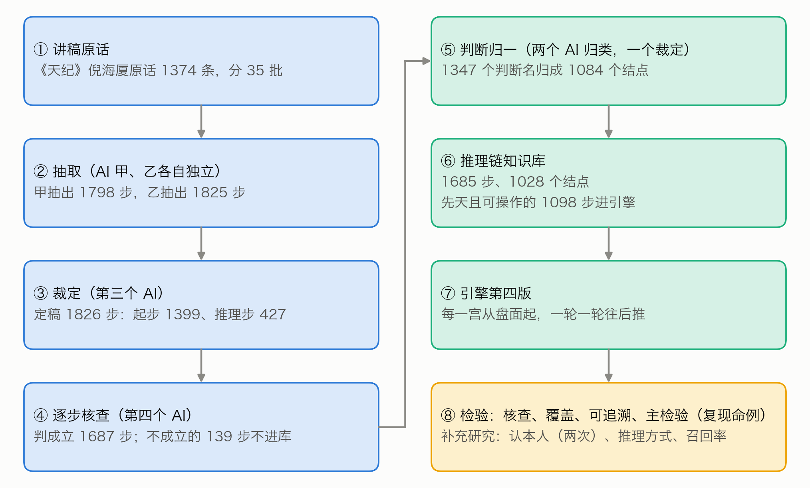
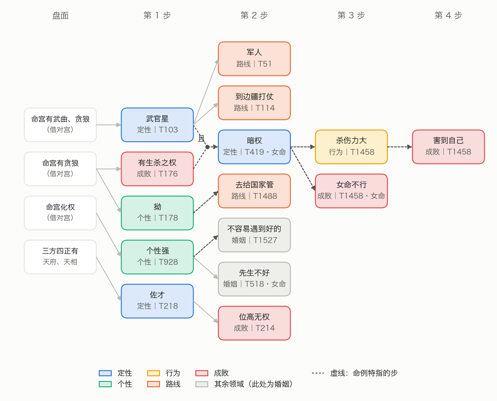
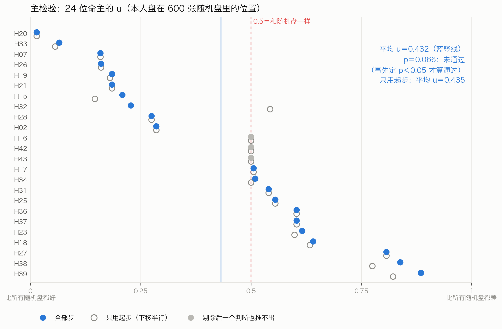
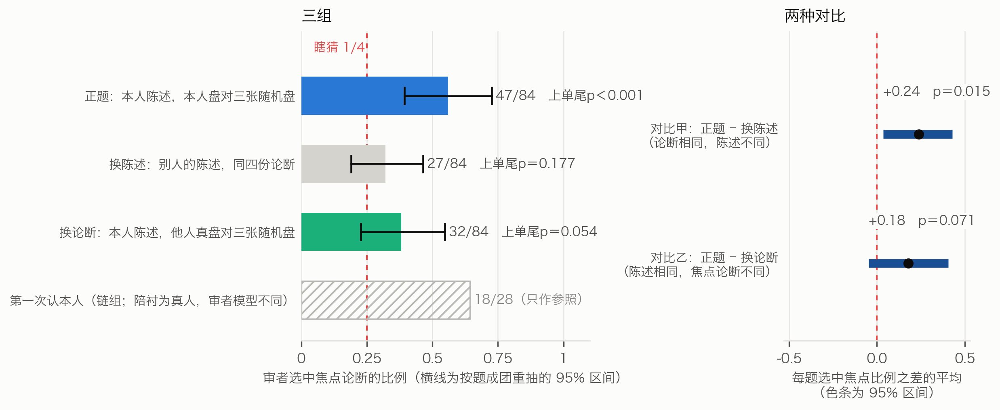
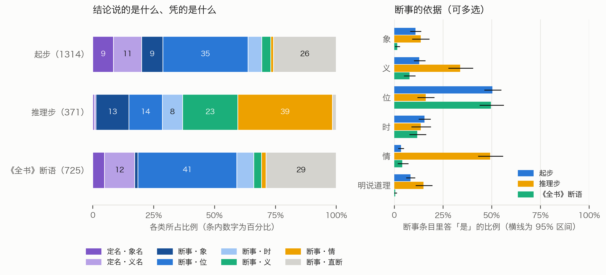
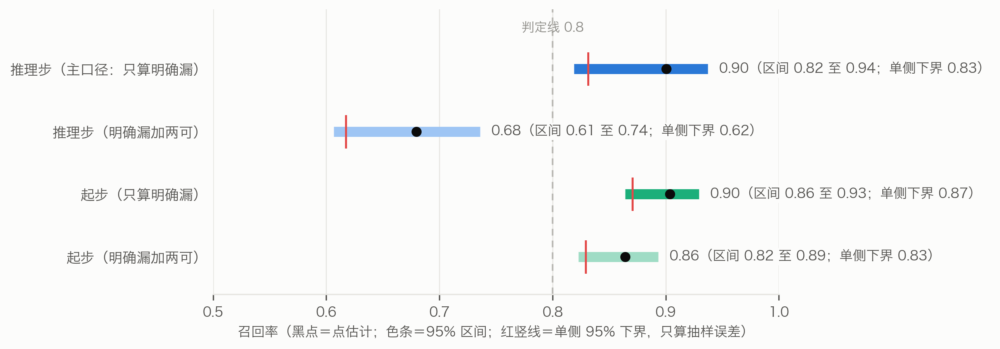

# 从讲述到推理链：倪海厦紫微斗数断法的逐步推理引擎

——以倪海厦《天纪》讲稿为唯一规则来源

于仁坪（独立研究者）

## 摘要

倪海厦讲看命盘，常由一个判断推出下一个判断：先看出这个人属于哪一类，再由个性推到行为，最后推到成败。本文只以他的《天纪》讲稿为规则来源，把他由盘面直接下判断的「起步」，以及「后一个判断由前一个判断推出」的推理步逐条抽出来，做成推理链知识库（1685 步，其中起步 1314、推理步 371；1028 个判断结点，每一步附原话）和第四版引擎；抽取、核查与归一由相互独立的 AI 实例完成。事先登记的主检验剔除倪海厦讲某位命主那几分钟里的全部步，再看本人命盘能否比随机盘更多地推出他对这个人的判断。24 人的结果：本人盘平均胜过 56.8% 的随机盘，比随机水平的一半略好（单侧 p = 0.066），没有达到事先定的 p < 0.05，主检验未通过，未能证明引擎能复现他对命例的具体判断。此后的补充研究都在运行前登记。AI 审者对照倪海厦对某人的描述，从四份先天论断里挑出由本人命盘推出的一份：第一次以另三位命主的真盘作陪衬，28 题认对 18 题（随机期望 7 题，p < 0.001；有 10 题共用论断，按题组成团重算仍显著）；第二次每题至多 6 条陈述，陪衬是每题独用的随机盘，审者挑中本人的比例为 0.56（47/84，95% 区间 0.39–0.73；随机水平 0.25；p < 0.001），把陈述换成别人的，比例降到 0.32（p = 0.18），两者之差 0.24（95% 区间 0.04–0.43，p = 0.015；改按名次算，p = 0.055）。但本人盘换成另一位命主的真盘时，审者选中这份他人真盘的比例仍有 0.38（p = 0.054），审者偏好真人盘本身的解释未能排除。借用易学史对《易传》解释卦爻辞体例的概括（取象、取义、爻位等）为名目，给全部起步、推理步与《紫微斗数全书》725 条断语归类（两名归类者的一致程度 α 为 0.83–0.87）：倪海厦由盘面起步的判断，结构与《全书》断语相近，多凭盘面位置或直断，但明说借象（10.9% 对 1.5%）与明说道理（8.4% 对 0.5%）多得多；推理步明说的理由则多是人情事理（39%）与类别（23%）。只算明确漏掉的，推理步约九成抽到了（单侧 95% 下界 0.83）；找漏与抽取用的是同一种模型，这一估计可能偏高，把「两可」也算漏则为 0.68。推理链把倪海厦明说的推导写成了可运行、可逐步核对的程序；引擎推出的论断整体上贴近他对一个人的描述，却没有证明能推回他说过的那几个具体判断。

**关键词**：紫微斗数；倪海厦；推理链；前向推理；易传；数字人文

**英文题目**：From Lectures to Reasoning Chains: A Step-by-Step Inference Engine for Ni Haixia's Zi Wei Dou Shu Chart Reading

**Author**: Yu Renping (independent researcher)

**Abstract**: From Ni Haixia's *Tian Ji* lectures alone, we extracted the stated steps by which Ni reaches a judgment about a person, either directly from the chart or from another judgment, building a knowledge base of 1,685 steps (1,314 start steps and 371 inference steps; 1,028 judgment nodes, each tied to Ni's words) and a forward-chaining engine; independent language-model instances did the extraction, checking and normalization. The preregistered main test, whether a person's own chart reproduces Ni's case judgments better than random charts once the relevant lecture minutes are excluded, failed (24 persons, one-sided p = 0.066). In preregistered follow-ups, AI judges picked the reading derived from the person's own chart among four natal readings in 18 of 28 items with real-person foils (p < 0.001; still significant when items sharing readings are clustered) and in 47 of 84 judge responses (0.56, 95% CI 0.39–0.73; chance 0.25; p < 0.001) in a redesigned test with single-use random-chart foils and at most six statements per item. The rate fell to 0.32 when the description belonged to someone else (difference 0.24, p = 0.015; p = 0.055 by rank), but judges may also favour real charts as such: another person's real chart was picked in 0.38 of responses (p = 0.054). Coding all steps and 725 classical pronouncements from the *Zi Wei Dou Shu Quanshu* with categories borrowed from accounts of how the *Yijing* commentaries interpret the hexagrams (α 0.83–0.87) showed that Ni's chart-based steps resemble the classical text in structure, resting mostly on chart positions or bare assertion, yet state images (10.9% vs 1.5%) and reasons (8.4% vs 0.5%) far more often; the reasons stated in his inference steps are mostly human affairs (39%) and categories (23%). About nine in ten stated inference steps were extracted (one-sided lower bound 0.83, likely optimistic because the same model searched for omissions; 0.68 if ambiguous cases count as omissions). The engine's readings fit Ni's overall description of a person but did not demonstrably reproduce his specific judgments.

**Keywords**: Zi Wei Dou Shu; Ni Haixia; reasoning chain; forward chaining; *Yijing* commentaries; digital humanities

## 术语说明

本文涉及紫微斗数与统计两方面的用语，先作简要说明；完整的术语表见补充材料 S1。

- **命盘、十二宫**：按出生时间排出的一张图，分十二格，每格叫一宫，各管一类人或事（命宫管本人，夫妻宫管配偶，官禄宫管事业……）。
- **星、亮度、四化**：宫里落的星。同一颗星落在不同的宫有强弱，叫亮度（由强到弱是庙、旺、平、闲、陷）。出生年让四颗星分别带上化禄、化权、化科、化忌，叫四化。
- **三方四正、格局**：看一宫时连同对面一宫和隔四宫的两宫一起看，叫三方四正。几颗星按特定位置组合成的名目叫格。
- **先天、运限**：先天看一生；大限是每十年一段的运，流年是某一年的运。本文的引擎只推先天。
- **判断、结点**：倪海厦说的一个判断，例如「佐才」「位高无权」。不同讲次的说法归并后叫一个结点。
- **起步、推理步**：起步由盘面直接得出一个判断；推理步由前面已得出的判断推出后一个判断。一步接一步连起来叫链。
- **命主、命例**：命主是倪海厦在课上讲过命盘的人；命例是他讲某位命主的那一段话。讲某位命主时说的步叫命例步，其余叫通则步。
- **候选盘、随机盘**：出生时辰不能唯一确定时的几张可能的命盘，叫候选盘；用公开种子生成、不对应真人的命盘叫随机盘。
- **认本人检验**：给 AI 审者一份陈述（倪海厦讲某个人时说的话，改写成白话）和四份论断，其中一份由这个人的命盘推出，另三份由别的命盘推出（叫陪衬），让审者挑出最贴近的一份。随机猜中的机会是四分之一。
- **AI 实例**：同一种大语言模型开出的、互相独立的一次会话或一次调用。下文的抽取者、核查者、归类者、审者都是 AI 实例。
- **p 值、单侧**：假设引擎（或审者）其实认不出本人，结果偶然好到这个程度或更好的机会有多大，就是 p；p 越小，越不像偶然。本文事先定 p < 0.05 算通过。单侧指只问是否更好，不问是否更差。
- **95% 区间**：照手头的数据，这个数大致落在哪一段；区间越宽，数据越少、越不确定。
- **一致程度 α**：两名归类者各自归类，结果有多一致（Krippendorff α）；1 是完全一致，0 相当于随手乱归。
- **召回率**：本该抽出来的步里，实际抽到了几成。

## 一、引言

倪海厦（学生多称倪师）《天纪》讲座的紫微斗数部分流传很广。他讲看命宫的顺序是：

> 「介绍命宫的时候，我们可以看到这个人的长相，这个人的个性。从个性上面可以知道这个人的行为模式。其实开始从命宫一看就已经知道成败」（T409）

讲天相时，他先说它是什么样的星，再说这样的人能做到什么程度：

> 「是非常好的良佐，辅佐的人才，所以天相呢，一定是位高无权」（T214）

「位高无权」不是从星直接读出来的，而是用「所以」从「佐才」推出来的。作者的前一篇论文（于仁坪，2026；下称前作）把同一份讲稿整理成 1064 条「如果……就……」的规则，先后做了三版引擎：第一版逐条推，每条规则各自对照命盘，条件符合就给出结论；第二版加一层综合取舍；第三版把流年改成倪海厦教的起法。规则之间不互相推。这样整理，上面的话会变成三条并列的规则：天相坐命 → 佐才；天相坐命 → 当助理；天相坐命 → 位高无权。三个结论都对，它们之间的推导关系却不见了。

本文做第四版：把规则之间的推导关系做出来，回答四个问题：
1. 倪海厦「后一个判断由前一个判断推出」的推导，能不能从原话里忠实地抽出来？抽漏了多少？
2. 照这些推导，引擎在随机盘上能不能推下去？
3. 引擎能不能复现倪海厦自己读过的命例？这是事先登记的主检验。另用「认本人」检验，看引擎推出的论断整体上是否贴近倪海厦对这个人的描述。
4. 他明说出来的推导凭的是什么？借用《易传》解释卦爻的几种体例的名目来看，起步、推理步和《紫微斗数全书》各是什么样子？

本文的贡献有四：一是一个推理链知识库，1685 步、1028 个判断结点，每一步都附原话、标明出处；二是第四版引擎，从盘面出发一轮一轮往后推，每个判断都带着推出它的完整路径；三是一组事先登记的检验，主检验没有通过，照登记的口径报告；四是四项事先登记的补充研究：认本人（两次，题目设计不同）、推理方式与召回率。本文只问引擎像不像倪海厦，不问紫微斗数准不准。

**可核对性。** 倪海厦已经过世，这套体系唯一的权威是他留下的讲课视频；本文不另请人代表倪师体系复核，而是让每一步都挂着原话与 T 编号（指向视频的分集与时间点，对照表见补充材料 S12），读者可以逐条核对倪海厦有没有这样说。归类与审者的判断仍是解释性的，本文不把「出处可核」写成「归类已核」。

## 二、相关研究

**把专家知识写成规则。** 把专家的条件式知识写成可执行规则、再前向推理，是专家系统的经典路线（Buchanan 与 Shortliffe，1984；Russell 与 Norvig，2020）。Feigenbaum（1977）指出，难处主要在获取与表示知识。本文的规则不是请专家口述的，而是从一位已故老师的讲课录音里逐句认出来的，每一步都要对得回原话。从文本里找出前提与结论是论证挖掘的课题（Lawrence 与 Reed，2019）；Toulmin（1958）把论证拆成依据、结论与担保；Walton、Reed 与 Macagno（2008）整理了日常论证的型式，例如由征兆推论、由规则推论、由语词归类推论、由类比推论、由因及果推论。本文讨论倪海厦的推理方式时会对照这些型式，但对照只是本研究的类比，不是文献的结论。

**象数与术数的推理。** 易学史研究常把《彖》《象》等传解释卦爻辞的做法概括为取象、取义、爻位几种体例；例如刘玉平（2002）论孔颖达时说，「此二传既讲取义，又讲取象，还讲爻位，体例不尽一致」。取象以卦所象的物、人解释卦爻辞（卦象的清单如《说卦》「乾为天……为君，为父」）；取义以卦德解释（卦德如《说卦》「乾，健也。坤，顺也」）；爻位以爻所处的位置及其关系解释，如《系辞下》「二与四同功而异位」。《说卦》的列象、列德，与以象、以义解辞是两层，7.4 分开对应。此外有象数与义理两种诠释取向的区分（郑吉雄，2006）：《四库全书总目》说《易》「推天道以明人事」，又说王弼之后「一变而胡瑗、程子，始阐明儒理」，此后又有参证史事的一路；义理一派里的儒理、史事两路，以人事之理说《易》。还有对「象思维」的现代阐发（王树人，2012）；也有学者提醒，这类概念容易泛化成什么都能装的筐（邢玉瑞，2024）。汉学界讨论过中国的「关联性思维」（Granet，1934；Needham，1956；Graham，1986；Hall 与 Ames，1987）；Henderson（1984）写的是这种宇宙论从兴盛到衰落的历史，Puett（2002）专章讨论战国晚期的关联宇宙论。所以本文只说倪海厦的推理用到了这类资源，不说它代表「中国人的思维方式」。中国术数长期是社会史与思想史的研究对象（Smith，1991；Kalinowski，2003；李零，2006），其认知特征也有专文讨论（郦全民，2018）。紫微斗数方面，已有源流考证（廖维骏，2020）、效度检验（张惠清，2018）与人类学田野研究（Homola，2023）。专门分析紫微斗数论断推理结构的研究，在本研究的检索范围内未见；中国知网、万方、维普与台湾博硕士论文系统没有在站内检索，只用网页检索查了它们公开的条目（途径与词表见补充材料 S13）。

**匹配检验。** 「从几份解读里认出本人」是检验占星解读的经典设计（Carlson，1985；Dean 与 Kelly，2003）。泛泛之论人人都觉得像自己，即巴纳姆效应（Forer，1949），是这类设计要防的主要偏差。本文检索到的研究，陪衬都是别人的真盘或真剖面；本文第二次认本人检验改用随机生成的盘作陪衬，这是新的设计，用两组对照检查它带来的偏差（7.3）。

**数字人文与 AI 作审者。** McCarty（2005）把建模看作人文计算的核心；把结论、推导与出处连起来，可借鉴知识图谱（Hogan 等，2021）与出处数据模型（Moreau 与 Missier，2013）。强模型作评审与人类的一致率可以很高（Zheng 等，2023），但也可能偏好与自己相似的文字（Panickssery 等，2024）。本文的抽取者、核查者属于同一种模型；新的检验与归类改用另一种模型（三、AI 的分工）。

## 三、材料与前作

**讲稿。** 倪海厦《天纪》讲座的紫微斗数部分（B 站视频 BV1KJsLekEfA），转写为开源语料 nihai-tianji-corpus，每条带视频分集与时间码。按整理主题归在紫微斗数各类之下的有 1593 条，去掉讲易经、医理的 177 条与讲排盘的 42 条，余下 1374 条是本文用的全部原话，前作已分成 35 批。下文用 T 编号引用原话。

**命例与随机盘。** 前作按讲课画面上的命盘反推出生资料，纳入检验的命主 28 人；每人记有倪海厦讲他的时段（前后各加 2 分钟）。有的人出生时辰不能唯一确定，有几张候选盘。检验另用 600 张留出随机盘（男命 313 张、女命 287 张），由公开种子逐项算出。

**《紫微斗数全书》。** 用维基文库所录的《紫微斗數全書》卷一至卷三（该本没有注明所据刊本；三卷之数与《中华道教大辞典》（胡孚琛，1995）相合）。前作已把它的原文切成 2990 句（另有 35 段现代导读文字，不收），本文从中随机抽 400 句，作推理方式的对照（7.4）。

**AI 的分工。** 知识库的抽取、裁定、核查、归一，以及第一次认本人检验、旧的推理类型归类、召回率，都由 Claude Opus 5.5 的独立实例完成（推理档位 high）。第二次认本人检验、传统框架的归类与《全书》切分，改由 Claude Fable 5.1 经 API 批量接口完成，每个任务一次独立调用，材料全文在提示里。全部答卷先审计、登记，再读答案或做统计（补充材料 S4）。没有人类专家复核，理由见引言的「可核对性」。

## 四、推理链的写法

照 T409 的顺序，把判断分成七层（表1）：盘面是起点，其余六层是判断。层是判断的类别，不是推导必须走的先后。六层以外另有财、婚姻、子女、健康等十三个领域，下文统称「其余领域」。

**表1　判断的分层**

| 层 | 管什么 | 知识库里的例子 |
|---|---|---|
| 盘面 | 星、亮度、四化、三方四正 | 命宫有天相 |
| 定性 | 这颗星让这个人属于哪一类 | 佐才、武官星、文官带、财星 |
| 长相 | 外貌、体型 | 五短、魁梧高大 |
| 个性 | 性情 | 刚强、个性强、拗 |
| 行为 | 做事的方式 | 意气用事、大怒之下犯大错 |
| 路线 | 走哪条路、做哪一行 | 当助理秘书、军人、做生意 |
| 成败 | 成就高低、得失贵贱 | 位高无权、有生杀之权 |

推理链只有两种步。起步由盘面条件得出一个判断，条件全部成立，就在这一宫得出这个判断；推理步由一个或几个已得出的判断推出后一个判断，可以另加盘面条件（附加条件）。每一步写明出处（T 编号）、宫、适用（先天或运限）、条件或前提、结论（层、判断名、原话说法）、原话摘录、是不是命例特指；推理步另写承接前后的那几个字（连接），例如「所以」「代表」。

**什么算推理步。** 必须是倪海厦自己说出来的推导，下面两种情形有其一：有承接的话（所以、因为、代表、就会……）；或没有承接词，但紧接着的下一句明显在讲前一个判断的后果，连接写「紧接承上」。只是并列几个特征，或前后讲的是不同的星、不同的宫，都不算。原话没说出来的推导，不许为了连贯补上。

## 五、从原话到推理链

**抽取与裁定。** 35 批原话，每批由抽取者甲、乙各自独立抽取，裁定者对照原话和两份抽取逐步定稿。定稿 1826 步：起步 1399 步，推理步 427 步。定稿步里甲乙都抽到的有 1678 步（91.9%）。正式抽取之前先拿 2 批试抽，改定说明后 35 批全部重抽。

**核对与核查。** 脚本核对每一步的原话摘录是该条原话里逐字连续的一段，条件合乎条件词表，1826 步全部合格。全部步再交给没参与抽取的核查者逐步判「成立」与否：起步问原话是不是由这些盘面条件得出这个判断，推理步问原话是不是明说了由前提推出结论。起步 1399 步判成立 1314 步（93.9%），推理步 427 步判成立 373 步（87.4%）；判不成立的 139 步不进知识库（例子见补充材料 S2）。

**判断归一。** 不同讲次说同一个判断用词不一样（「武官星」「将星」「武官的命」……），不归一链就接不上。1347 个判断名由两名归类者各自归并、裁定者定稿，归成 1084 个结点；两人的合并一致率 73.1%，最不稳的是路线、成败一组（63.6%）（补充材料 S3）。

**知识库。** 核查成立的 1687 步换成结点后，有 2 步变成自己推自己，不收。知识库定为 1685 步、1028 个结点（表2；归一表里另有 56 个结点只出现在核查不成立的步里，不进知识库）。引擎这一版只推先天、只用可操作的步，共 1098 步。1685 步里命例特指的 676 步；引擎可用的 1098 步里有 339 步，条件一旦成立，引擎就当通则用（影响见 8.4）。

**表2　推理链知识库的规模（步数）**

| | 先天，可操作 | 先天，不可操作 | 运限，可操作 | 运限，不可操作 | 合计 |
|---|---|---|---|---|---|
| 起步 | 857 | 250 | 100 | 107 | 1314 |
| 推理步 | 241 | 22 | 94 | 14 | 371 |
| 合计 | 1098 | 272 | 194 | 121 | 1685 |

371 条推理步共有 434 条连线。主链六层之内的 176 条里，往后推的 134 条，同层的 27 条，往回推的 15 条。最多的是定性 → 路线（44 条）、路线 → 成败（29 条）、定性 → 成败（20 条）；个性 → 行为只有 11 条。推导集中在少数「枢纽」判断上，例如「武官星」一个判断推出 18 个后续判断（补充材料 S3）。

## 六、引擎第四版

引擎对一张盘的十二宫各推一遍。每一宫里，起步的条件成立就得出判断（深度 1）；推理步的前提都已得出、附加条件也成立，就得出后一个判断（深度 = 1 + 前提里最大的深度）；一轮推完再来一轮，直到推不出新的判断，最多 8 轮。同一层里既有吉又有凶的判断，都列出，标「两说」。读盘、条件判断、空宫借对宫完全沿用前作；候选盘各推一次，只留各张都推出来的判断（细节见补充材料 S5）。

示例盘沿用前作的随机盘 r30（写作之前就定下的）。命宫推出 69 个判断，其中 25 个至少经过一步推理步。最长的一条有 4 步（图4）：

> 命宫有贪狼（借对宫）→ 有生杀之权（T176）→ 暗权（T419；另需武官星，限女命）→ 杀伤力大（T1458）→ 害到自己（T1458）

每一步都对得上原话，例如「一般呢贪狼入命的人他有生杀之权」（T176），「那这种暗权的人她杀伤力会很大」（T1458）。T419 与 T1458 相隔一分多钟，讲的是同一位女命；第四版把它们当通则用（8.4）。也就是说，这条最长的链，后三步不是他讲星曜通义时说的，而是讲一个具体女命时顺着说下来的；引擎遇到条件成立的盘就照推。前作第三版对同一张盘只给出一条条并列的命中，条与条之间没有关系；第四版把其中一部分接成了链。

## 七、检验

检验方案、脚本与判据都在运行之前登记了数字指纹（SHA-256：由文件内容算出的一串号码，文件改一个字，号码就变），结果不论好坏都报（表3）。主检验没通过之后做的诊断与补充分析，也都先登记、再运行；它们的细节放在补充材料 S6。此后又做了四项补充研究（7.3–7.5），方案都先交给独立的 AI 审稿人审查，按意见改定之后才登记。

**表3　各项检验的结果**

| 检验 | 性质 | 结果 |
|---|---|---|
| 核查 | 描述 | 原话摘录全部逐字合格；核查者判成立 1687 / 1826 步（92.4%），只有判成立的步收进知识库 |
| 覆盖 | 描述 | 600 张留出随机盘，98.2% 的盘命宫推到行为、路线或成败；最长链中位数 2 步 |
| 可追溯 | 程序核对 | 150360 条推导路径、119075 个判断，全部合格 |
| 主检验 | 事先登记 | 复现倪海厦读过的命例：24 人平均 u = 0.432，p = 0.066，**未通过** |
| 认本人（第一次） | 补充研究 | 28 题认对 18 题（随机期望 7 题），p < 0.001；按题组成团重算仍显著；换审者模型重审 17/28 |
| 认本人（第二次） | 补充研究 | 正题 47/84（0.56；随机水平 0.25），p < 0.001；比陈述换成别人时高 0.24，p = 0.015（按名次算 p = 0.055） |
| 推理方式 | 补充研究 | 起步 1314、推理步 371、《全书》断语 725 条；类型 α 0.83–0.87 |
| 召回率 | 补充研究 | 只算明确漏：推理步 0.90（95% 区间 0.82–0.94，单侧下界 0.83；同一种模型找漏，可能偏高） |

### 7.1 核查、覆盖与可追溯

**核查**见第五节「核对与核查」：收进知识库的步都经核查者判为成立；核查者与抽取者是同一种模型，核查结果没有人工复核，忠实度本身没有独立于这个模型的度量。

**覆盖。** 在 600 张留出随机盘上各推一次，看命宫（图5）。经推理步推到行为、路线、成败任一层的盘有 589 张（98.2%），推到成败的 542 张（90.3%）。命宫最长一条链（含起步）中位数 2 步，最多 5 步；2 步的盘占 55.2%，4 步以上的约三分之一。命宫推出的判断里，30.9% 至少要经过一步推理步。4 步以上的长链，链上都至少用到一条命例步；只用通则步时，最长链最多 3 步。5 步的 120 张盘，最长链的终点都是「害到自己」；最常见的三条（共 89 张）后四步都出自讲同一位女命的两条原话（T419、T1458）。此外，93.3% 的盘命宫有吉凶并列的「两说」，每张中位数 3 处；引擎不替倪海厦取舍。所以推理链推得下去，多数盘也能推到行为、路线、成败；但多是「起步 + 一步推理步」。

**可追溯**是程序自查：600 张盘上 119075 个判断、150360 条推导路径，每条都有 T 编号，原话摘录逐字出自那一条讲稿，推理步的前提都在同一宫里已经推出，全部合格。它不检验结论对不对。

### 7.2 主检验：复现倪海厦读过的命例

**设计**（补充材料 S图8）。
1. **判断集**：倪海厦讲某人时段内、标了命例特指、适用先天、宫是命宫或身宫的步，它们的结论合成这个人的判断集。
2. **剔除**：把这个人时段内的全部步剔除，引擎只用其余的步推。
3. **得分**：本人盘推出判断集里的几成。
4. **排位**：同一套剔除后的步，在 600 张留出随机盘上各算一个得分。u = 随机盘里得分比本人盘高的比例，相等的算一半；u = 0.5 表示与随机盘一样。
5. **统计**：各人 u 的平均数；每人改抽一张随机盘当「本人盘」，重复 10000 次求单侧 p，p < 0.05 算通过。

**结果**（图6）。28 人里 4 人判断集为空，计入 24 人，判断集按人累计 156 个结点。平均 u = 0.432，即本人盘平均胜过 56.8% 的随机盘（得分相同的算一半）；单侧 p = 0.066，也就是说，如果引擎完全认不出本人，平均 u 偶然低到这么低的机会约为 6.6%，**没有达到事先定的 p < 0.05，主检验未通过**。平均 u 的 95% 区间（事后按人重抽）约为 0.33 至 0.53，既容得下没有效果，也容得下中等效果；这一检验登记时没有估功效。14 人的本人盘一个判断也没推出。只用起步、不用推理步时，平均 u = 0.435，p = 0.071，与用全部步几乎一样。

**诊断**（运行前登记，只作描述，不改「未通过」的结论；全文见补充材料 S6）。首先，多数判断剔除后无处可推：156 个判断里，剔除之后引擎可用的步里还能推出的只有 63 个（40.4%）；查遍整个知识库，本人时段以外有 84 个连一步以它为结论的都没有。其次，推得出的，本人盘也多半没推出：63 个推得出的判断，本人盘只推出 16 个；21 人至少有一个判断推得出，其中 11 人的本人盘一个也没推出（另 3 人的判断集剔除后无一可推，合计即上文的 14 人）。再次，条件对不上盘：判断集里条件写得出的起步 61 步，在重建的本人命盘上成立的 32 步，不成立的 29 步。最后，换几种算法都只作描述：只用通则步、每张候选盘各算、只和同性别比、去掉前后 2 分钟，平均 u 在 0.39 至 0.43 之间。

### 7.3 认本人检验（运行前登记）

主检验问的是：引擎能不能推出倪海厦对某个人说过的那几个具体判断。认本人检验换一个问法：引擎推出的先天论断，整体上是否比别的盘推出的论断更贴近倪海厦对这个人的描述。这一项做了两次，第二次是为了补第一次题目设计上的毛病。两次都在主检验未通过之后设计，方案都先交独立审稿人审查、改定后登记。下文的「正题检验」指认本人检验自己的主判据（方案里也叫主检验），与 7.2 的主检验不是一回事。

**第一次检验。** 沿用前作的 28 题，陪衬是另三位命主的真盘，审者为 Claude Opus 5.5，每题每组一名。推理链写法的论断 28 题认对 18 题（随机期望 7 题），单侧 p < 0.001；同一份推理结果平铺列出，也认对 18 题；前作第三版的先天论断认对 20 题。这次检验有两个毛病。一是 28 题里有 10 题分成 3 组，组内共用同一组四份论断，题目不完全独立，等于同一组论断重复算了几次，区间与 p 值都会显得比实际乐观。按题组成团重算（每组只取一题，共 21 个单位），链组认对 11 至 13 个，单侧 p 在 0.0004 至 0.006 之间，仍显著（事后补算，只作描述）。二是每题陈述 3 到 63 条不等。另用 Claude Fable 5.1 把这 84 份题包原样重审一遍（事先登记，只作描述）：链组 17/28，平铺组 16/28，第三版先天组 18/28。与原来逐题配对，三组的差在 −0.07 至 −0.04 之间，区间都包含 0。换成同一家的另一种模型重审，结果几乎不变；别家的模型没有试过。细节见补充材料 S7。

**第二次检验的设计。** 陈述方面，从前作 28 题的白话陈述（不含命盘术语）里，每题取 6 条：先取不带年龄的，按个性、长相、行为、路线、成就、婚姻、财……的固定次序轮取（全序见补充材料 S8）。不足 6 条的 3 题用全部，共 162 条；换陈述组借用这 3 题的陈述时，条数也不足 6 条。所以只能说条数大致统一（25 题 6 条，3 题 3 至 5 条），条数统一也不等于难度均匀。陪衬方面，每题三张随机生成的盘，与本人同性别、同五行局、同候选结构，每张只用一次，题与题之间不共用。用随机盘作陪衬，在检索到的匹配检验里没有先例。真人盘可能本身就比随机盘更「像一个人」，所以另设两组对照：换陈述组的四份论断不变，陈述换成另一位命主的；换论断组的陈述不变，本人盘换成另一位命主的真盘。这份他人真盘只要求两人性别都定得下时同性别，没有按五行局、候选结构匹配：28 题里五行局相同的 8 题、候选结构相同的 8 题，另有 12 题有一方性别定不下。它与三张陪衬的匹配并不对称。

剔除方面，剔掉本题涉及的三人讲述时段内的步，以及陈述可能出自的原话；再把与两份陈述有 8 字以上相同片段的原话补剔，14 题各补剔了 1–5 条。审者为 Claude Fable 5.1，每题每组 3 名，共 252 名，每人一次独立调用，不知道自己在哪一组。三组的说明一字不差，都写「其中恰好有一份是这个人自己的」。这句在换陈述组与换论断组里都不属实，是有意保留的：说明若不一样，审者就能看出自己被换了陈述或论断。统计方面，正题检验以每题四份各自的得票为条件做精确检验，允许同一题的审者彼此相关；两组之间的对比用符号翻转精确检验，事先定以按比例算的对比甲为主，按名次算的为次要口径。换陈述组借用别题的陈述，题与题之间有轻微依赖；方案已指出，在加性假定下这让符号翻转检验偏保守。功效方面，这样的对比只测得出较大的「贴近本人」效应，测不出不等于没有。模拟里，若审者只偏好真人盘（s = 0.2）而论断并不贴近本人，正题检验也有约一半（0.47）会通过；所以正题必须与两组对照合看（补充材料 S8 表S12）。

**结果**（图7）。正题中，84 卷里 47 卷选中本人论断（0.56，95% 区间 0.39–0.73；随机水平 0.25），单侧 p < 0.001，正题检验通过。名次检验 p < 0.001；按多数票，28 题认对 16 题。换陈述组为 27/84（0.32，区间 0.19–0.46），高于随机水平但不显著（单侧 p = 0.18）。换论断组为 32/84（0.38，区间 0.23–0.55），单侧 p = 0.054。对比甲（正题减换陈述组，论断相同、陈述不同）的平均差 0.24（区间 0.04–0.43），p = 0.015；对比乙（正题减换论断组，陈述相同、焦点论断不同）的平均差 0.18（区间 −0.05 至 0.40），p = 0.071。按焦点名次算（次要口径）：对比甲平均差 0.40，p = 0.055；对比乙 0.52，p = 0.038。两种算法下，甲、乙显著与否正好相反（补充材料 S8 表S9）。252 卷没有一份无效。

**解读**（照事先写定的解读表）。审者挑中本人论断多于随机陪衬，且超出换陈述组的部分显著，提示至少一部分来自论断贴近本人。不过这一差别只在事先定的比例口径下显著，按名次算 p = 0.055，不宜读成稳固的差别。陈述不变时，审者偏向本人盘多于另一位命主的盘：按比例没有达到显著（p = 0.071），按名次达到（p = 0.038）。他人真盘与陪衬的匹配不对称，这一对比只作旁证。换论断组选中他人真盘的比例 0.38 高于随机水平，但没有达到显著（p = 0.054）；这与「真人盘本身比随机盘更受审者青睐」相容，不能据此确认。在两个子集里这一比例达到显著（见下）。「贴近本人」与「真人盘整体上更像一个人」不能完全分开。

**子集分析**（只作描述）。正题在六种事先定的子集里都显著。对比甲在以下子集里仍显著（括号里是对比甲可用的题数）：去掉同八字两对（H30 与 H31、H33 与 H34 出生年月日时相同；16 题，p = 0.037）；去掉含主星排布相同陪衬的题（27 题，p = 0.015）；去掉文字片段异常的题（本人论断与陈述相同的 4 字片段数超过三张陪衬最大值 2 倍以上；26 题，p = 0.019）；去掉本人论断最长的题（18 题，p = 0.018）。在下面两个子集里不显著：陈述满 6 条（三组都满足的 22 题）：p = 0.074；去掉涉及身份存疑者（前作标注其命盘可能是课上的教学示范、不一定对应真人的 H36–H39 四人；18 题）：p = 0.13。换论断组选中他人真盘的比例，在两个子集里达到显著：去掉身份存疑者 27/60（0.45，p = 0.022），去掉同八字两对 25/60（0.42，p = 0.048）；在前一个子集里，对比甲、乙都不显著。这使「真人盘本身更受审者青睐」的解释更难排除。

**两次合看。** 两次的陪衬、陈述与审者模型都不同，都认出了本人：第一次 18/28；第二次正题 0.56，并且超出换陈述组。这与主检验未通过并不矛盾，见 8.3。

### 7.4 推理方式：借用《易传》解易体例的名目（运行前登记）

**为什么换框架。** 本研究的早期稿本（第十三稿）曾用自定的五类给 371 条推理步归类（结果见补充材料 S9）。这一次借用易学史研究归纳的《易传》解释卦爻的几种体例（二、相关研究），改写成能同样用于起步和《紫微斗数全书》断语的问题，并把每一类与传统的对应强弱照实写出（表4）。这套框架由作者从旧五类与传统名目改写而来，不是第三方的编码表。有两点要先说明：其一，「定名」对应的是《说卦》列象、列德那一层，「断事」才对应以象、以义解辞的取象、取义，两层在易学史上并不相同；其二，紫微斗数的宫、星、亮度不出自易卦的爻位系统，下文把宫位比附爻位只是类比。

**表4　类目、出处与对应强弱**

| 类目 | 问的是什么 | 出处 | 与传统的对应 |
|---|---|---|---|
| 定名·象名 | 结论把星或组合说成具体的人物、身份、事物（帝、将、宰相、桃花） | 《说卦》「乾为天……为君，为父」 | 《说卦》式的列象（本文的类比） |
| 定名·义名 | 结论把星或组合说成抽象的性质、德性、吉凶或所主之事（善、刚、主财） | 《说卦》「乾，健也。坤，顺也」 | 《说卦》式的列德（本文的类比） |
| 断事·象 | 原文借形象、比喻、人物或星名字面说明为什么 | 《系辞上》「立象以尽意」 | 取象 |
| 断事·义 | 原文以性质、类别为理由；推理步里，结论是前提那一类的成员或本来特征 | 《说卦》卦德；《系辞上》「方以类聚」「触类而长之」 | 取义 |
| 断事·位 | 原文说出宫位关系、亮度、四化或格局这类盘面机理在起作用 | 《系辞下》「二与四同功而异位」 | 宫位、亮度比附爻位（如当位与否），是本文的类比；四化、格局无直接对应，一并归入只为便于对照 |
| 断事·时 | 原文说出运限、某年某岁在起作用 | 《乾·彖》「六位时成」；《豫·彖》「豫之时义大矣哉」 | 本文的类比 |
| 断事·情 | 原文以性情与做法后果的因果、或身份处境的常理为理由 | — | 取象、取义、爻位三分里无对应；近于义理一派里儒理、史事两路以人事说《易》（本文的类比） |
| 断事·直断 | 原文只说有条件就有结论，没说凭什么 | — | 残余类 |

**编码问题。** 每条先分两种：「定名」指结论说的是这颗星或这个组合是什么；「断事」指结论说的是人或事。断事的五种依据各答「是」或「否」，可以同时答几个「是」；定类按象、位、时、义、情的次序，取第一个「是」。另问一句「明说道理」：原文除了把条件或前提当理由，是否还进一步讲了为什么。依据只许从原话或《全书》原文里摘，不看整理者写的盘面条件。

**对象与做法。** 对象是倪海厦全部 1685 步（起步 1314、推理步 371），以及从《全书》2990 句古籍原文里随机抽的 400 句。《全书》先切分：两人各自把句子切成断语，切法相同的 361 句照用，不同的 39 句由第三人定稿，共切出 725 条断语；另有 102 句没有断语，其中 70 句是卷二《安身命例》的安星口诀与盘式残行，其余散在序、赋与卷三各篇，也有少数说理句。归类时每批两名归类者各自作答，分歧由第三名裁定。切分者、归类者、裁定者都是 Claude Fable 5.1 的独立调用，与第十三稿的归类者（Opus 5.5）不是同一种模型。试编时 40 条达到事先定的停止规则，说明没有改过。

**一致程度。** 类型的 Krippendorff α（Hayes 与 Krippendorff，2007）：起步 0.83，推理步 0.85，《全书》0.87。「定名还是断事」的 α 在 0.89 至 0.97 之间；五种依据与「明说道理」的 α 在 0.76 至 0.97 之间。每类的特定一致率都不低于 0.50，没有触发事先写定的「不报」规则。其中推理步·直断（6 条）正好 0.50，起步·情（15 条）为 0.61：这两格条数少、归类不稳，下文只报比例，不据以作结。

**结果（表5，图8）**

**表5　三组的构成（比例；括号内为 95% 区间，按原话或按句成团重抽；断事各类按象、位、时、义、情的次序取第一个「是」；文中的差值按未取整的比例计算，与表内取整的数相减可差 0.1）**

| | 起步 | 推理步 | 《全书》断语 |
|---|---|---|---|
| 条数 | 1314 | 371 | 725 |
| 定名 | 20.0%（17.2–23.0） | 1.3%（0.3–2.6） | 17.2%（13.3–21.9） |
| 定名里的象名 | 42.6%（34.5–50.6） | 2/5 | 28.0%（16.0–40.1） |
| 断事里：位 | 43.8%（39.5–48.3） | 13.9%（10.2–18.1） | 49.2%（43.6–55.1） |
| 断事里：直断 | 32.3%（28.3–36.4） | 1.6%（0.5–3.0） | 34.8%（29.3–40.4） |
| 断事里：象 | 10.9%（8.4–13.7） | 13.7%（9.6–18.1） | 1.5%（0.5–2.9） |
| 断事里：时 | 7.0%（5.1–9.2） | 8.5%（5.0–12.5） | 8.3%（5.0–12.1） |
| 断事里：义 | 4.6%（3.0–6.2） | 23.0%（17.8–28.4） | 3.8%（2.0–6.2） |
| 断事里：情 | 1.4%（0.7–2.3） | 39.3%（33.4–45.7） | 2.3%（0.7–4.6） |
| 断事里：明说道理 | 8.4%（6.3–10.6） | 15.0%（11.1–19.4） | 0.5%（0–1.2） |

**表6　各类的例子（每组每类按编号次序取第一条，取法事先写定；「依据」是两名归类者从原文摘的字）**

| 类目 | 起步 | 推理步 | 《全书》断语 |
|---|---|---|---|
| 定名·象名 | 紫微 → 帝星：「那这颗星它是帝星」（T2） | 发阴 → 正将星（T97） | 「若还无辅弼……帝为无道主」 |
| 定名·义名 | 紫微 → 官带：「紫微星主的是官，官带」（T3） | 杀星 → 杀上加杀：「本身是杀星……杀会加杀」（T126） | 「帝降七杀为权」 |
| 断事·象 | 紫微 → 五官开阔；依据「标准的帝星紫微星」（T8） | 孤帝 → 僧道：「孤帝，孤独的皇帝。所以是僧道」（T14） | 「亦主财田富足」；依据同段的「天府为禄库」 |
| 断事·位 | 紫微而周围无辅弼 → 厚重：「在命周围辅弼星没有，代表你这个人很厚重」（T15） | 夫妻不在 → 婚姻离散：「对面是化忌就完了一定是散」（T75） | 「更与武曲禄存同宫，身命中尤为奇特」 |
| 断事·时 | 女命太阳陷 → 34 岁后看不到太阳：「34岁以后就已经没有太阳了」（T75） | 看不到太阳 → 事发在 33 岁前（T75） | 「二限若逢之，百事看充足」 |
| 断事·义 | 贵星多 → 能解厄制化：「因为为什么贵星太多了，都能够解厄制化」（T13） | 官带 → 官的命：「紫微星主的是官，官带。所以……官的命」（T3） | 「勤于礼佛」；依据同段的「化气曰善」 |
| 断事·情 | 女命武贪成格 → 爱去游行：「你娶了个老婆是这样子的……没事呢游行她就去了」（T99） | 先生当老板 → 继承：「她先生走掉以后，她应该当公司负责人她去继承」（T6） | 「僧道宜之，主享福」 |
| 断事·直断 | 紫微七杀 → 先生是独子或长子（T6） | 当武官 → 前途黯淡：「你当武官的话前途黯淡无光」（T153） | 「女命逢之作贵妇断」 |

**解读。** 起步与《全书》断语的结构相近：两者都是约两成定名；断事里一半上下靠位置，三成多直断。时、义的比例也相近，两组之差的 95% 区间都包含 0；情在两组里都只占一两个百分点（起步·情这一格归类不稳），不列为依据。需要注意定类次序的影响：断事只取第一个「是」，各类比例随定类次序而变：换成象、义、位、时、情的次序，起步的义从 4.6% 升到 11.7%，推理步从 23.0% 升到 32.0%，《全书》从 3.8% 升到 7.2%（补充材料表S18）。不受次序影响的是图 8 右边各种依据答「是」的比例，比较各组时宜同时看那一面。

两组也有两处不同：倪海厦起步时，明说出理由的比例高得多。明说借象是 10.9% 对 1.5%，差 9.4 个百分点（区间 6.8–12.4）；明说道理是 8.4% 对 0.5%，差 7.9 个百分点（区间 5.7–10.3）。这只说明他把理由说出口的次数多，不等于他的断语更有道理。两边单位相近（都是一条断语），但文体不同：一边是课堂口讲，一边是文言赋诀与论断。

推理步与起步则截然不同。断事里，情占 39.3%，义占 23.0%，直断只有 1.6%；位降到 13.9%，比起步低 29.8 个百分点（区间 24.1–35.3）；明说道理 15.0%，比起步高 6.7 个百分点（区间 2.3–11.3）。也就是说，由盘面起步多凭位置或直断；一旦推到了人，往下的推导明说的理由多是人情与类别。这个差别有一部分是口径造成的：起步的条件本来就是盘面；推理步的前提是判断，只有附加条件才可能涉及盘面，而且必须有明说的承接才会被抽出。所以起步多位、推理步少直断不足为奇。有信息量的是推理步内部情与义的分布，以及推理步明说道理的比例高于起步。

此外，运限的起步：时占 35.5%，直断只有 10.7%；先天的起步直断占 37.2%。至于「以此类推」一类的说法：步的原话摘录里含这类说法的，起步、推理步、《全书》断语各只有 2、0、2 条；但整个原话库里有 13 条原话含「以此类推」（补充材料 S13.1）。这类教人推广的话按本文口径不成为步，所以这个数说明不了他讲类推的多少。

**与第十三稿的旧五类对照**（只看两套归法合不合得上，不证明哪一套更对）。按事先写定的对应，新旧一致率 0.67。把「术数机理对到位、时或义」都算相容，相容率 0.72。各类的去向是：旧「取象」25 步，17 步新归象；旧「类属展开」101 步，63 步新归义；旧「性情因果」47 步里 44 步、「处境常理」61 步里 58 步，新归情；旧「术数机理」132 步最分散：位 47、情 23、象 21、时 20、义 17。新框架问的是原文明说了什么理由，旧框架问的是这一环靠什么道理；旧「术数机理」里有不少步，原文给的理由其实是形象或人情。事先定的规则是：新框架推理步的 α 只要不比旧五类的 0.87 低 0.2 以上，正文就以新框架为主。推理步新类型的 α 是 0.85，合乎这条规则。第二种定类次序（象、义、位、时、情）、按适用分开的全表，以及起步的定名、断事与结论层的交叉计数，见补充材料 S10。

### 7.5 召回率：抽取漏了多少

**做法。** 1374 条原话按知识库分三层（含推理步的、只有起步的、一步都没有的），依次随机抽 104、124、72 条，共 300 条。每条由两名找漏者各自照当初的抽取说明找漏，第三名裁定者判「明确漏」「两可」「不合规矩」或「已有」，标准与当初的核查相同。召回率 = 收下的步 ÷（收下的步 + 估计漏掉的步），区间的算法见补充材料 S11。

**结果（图9）。** 只算明确漏（事先定的主口径）：推理步的召回率 0.90（95% 区间 0.82–0.94），单侧 95% 下界 0.83；起步 0.90（0.86–0.93）。事先定的规则是：推理步召回率的单侧 95% 下界不低于 0.8（图9 灰虚线），就写「抽取漏得不多」，所以照规则写抽取漏得不多。方案原把这个下界写作「至少 x」，本文改称单侧下界，因为它只算了抽样误差，没有算同一种模型找漏可能造成的偏高。把「两可」也算作漏：推理步降到 0.68（0.61–0.74）。样本里确认、能接进知识库的漏步有 10 条（推理步只有 2 条），补回去以后，600 张盘的最长链分布与原来完全相同；对不上结点的漏步、两可的推导会不会把链接长，本文没有检验。还要注意，同一种模型的几次抽取彼此相关：两名找漏者找到的漏步高度重合，据此推算「两人都漏」的是 0 条，这样估漏会偏低。

## 八、讨论

### 8.1 推理链让什么看得见了

**明说出来的推导很短。** 按本文的抽取口径，1685 步里推理步只有 371 步（22%）。在随机盘上，命宫最长的链多半只有两步：先由盘面定性，再推一步；4 步以上的长链都用到了命例步。T409 说「从个性上面可以知道这个人的行为模式」，讲稿里明说的个性 → 行为推导却只有 11 条连线。他口头上讲的是一条长链，按本文口径整理出来，多是从「定性」出发的一层扇形。召回率的估计（7.5）不改变这一点，但跨了几句话、隔了几分钟才接上的推导，本文的口径本来就不收。

**定性是枢纽。** 推导集中在「武官星」「佐才」「文官带」「财星」这类定性判断上：先认出这个人是哪一类，再由此推出路线和成败。

**每一步都对得回原话。** 读者看到「位高无权」，可以顺着链往回查：它由「佐才」推出（T214），「佐才」由三方四正有天府、天相得出（T218），每一步都有 T 编号和原话。

**两项检验都没有测出推理步的增益，但也都不是为测它设计的。** 主检验只用起步时平均 u = 0.435，用全部步是 0.432；可是判断集自身的推理步随本人时段一起剔除了（判断集里的 42 条推理步连线，本人盘只复现 1 条，补充材料 S6.1），这个对照测不太出推理步的用处。第一次认本人里，推理链写法与平铺列出都认对 18 题，前作第三版认对 20 题；比的是写法与知识库版本，不是用不用推理步，配对差的区间都包含 0。所以本文只能说：推理链带来的是可核对的推导路径；它对复现率或认对率有没有帮助，现有的检验测不出。

### 8.2 倪海厦怎样推：起步与古典断语结构相近，推理转向人情事理

**起步与《全书》断语结构相近。** 倪海厦由盘面直接下的判断，结构与《紫微斗数全书》的断语很像（7.4）：约两成是给星定名；断事里一半上下凭宫位、亮度、四化、格局这类盘面机理（本文统称「位」）；三成多只说有某星就怎样，不说凭什么。本文只比了归类后的构成，没有考察倪海厦是否直接承用《全书》的断语，所以只能说结构相近，不能说承接。

**他多出来的是说出口的理由。** 同样是由盘面下判断，倪海厦明说借象的占一成多，《全书》不到 2%；进一步讲出为什么的，他占 8.4%，《全书》只有 0.5%。这与他的自述相合：「我讲过用象来读」（T63）。他还说「我们这一派叫象数宗」（T1133、T1246）。这是他自述的门派名，与易学史上象数、义理之分不一定同义；本文借易学名目衡量的是他原话里明说的依据，不是门派归属。按本文的口径数，由盘面起步的判断里，凭宫位关系与时机的（位、时）远多于明说借形象、比喻的（象）；推理步里两者相差不大（22.4% 对 13.7%）。这里的「象」只收原话明说借象的步；术家所谓「读象」往往也把星曜配置本身当作象，本文的口径收不到这一层，所以这个比例只说明他明说借象的时候少，不说明他看盘时少用象。这里的差别也可能来自文体：一边是课堂口讲，一边是文言赋诀与论断。本文不把它写成「倪海厦比《全书》更讲道理」。

**一推到人，就转向人情与类别。** 推理步与起步截然不同：断事里，明说的理由近四成是人情事理（性情推出做法、处境推出得失），两成多是类别（将星就是武官），直断很少（1.6%，这一格条数少、归类不稳）。换句话说，命盘给出的是「这是哪一类人」；往后的推导，他明说出来的理由多是人情事理，不是星曜的作用。推理步按定义以判断为前提，能引宫位、亮度的只有附加条件，「位」少有一部分是这个结构造成的（7.4）。借易学史的说法，起步偏在以象、位、时说理的一边；推理步以人情事理说理，近于义理一派里儒理、史事两路以人事说《易》的路子。这只是类比：「情」不在取象、取义、爻位三分之内，倪海厦也不是在解经。用论证型式的话说，起步像「由征兆或规则推论」，推理步像「由因及果」与「由语词归类推论」（Walton、Reed 与 Macagno，2008）。这同样只是类比。

**这对「关联性思维」意味着什么。** Graham（1986）区分关联式思维与分析式思维；Hall 与 Ames（1987）也把类比、关联式的思维与因果式的思维对举。按本文的编码，倪海厦由盘面起步下的断事里，明说的依据四成多是位置、一成是象，近于关联式，另有三成多直断，无从归类（给星定名的两成不在此列）；一推到人，推理步明说的理由近四成是性情与处境的因果，近于因果式，但两成多是类属归入，仍属关联式。两种方式在同一套看盘实践里都出现，大致以起步与推理步为界，但界线并不整齐；这与「中国术数就是关联思维」的笼统说法不同。但这只是一个人讲课所见，不能推广；本文也不把他的推理说成「中国人的思维方式」。

### 8.3 主检验没通过，认本人两次都认出了本人

**主检验没通过。** 诊断只能说明数据与哪些解释相容（补充材料 S6）。一是能用的信息少：剔除之后，判断集里六成的判断无处可推。二是推得出的，本人盘多数也没推出：63 个推得出的判断，本人盘只推出 16 个。三是条件对不上重建的本人命盘：说得出盘面的起步约一半不成立。可能的原因有几种：出生资料是从讲课画面反推的；条件写法不对；这一步讲的其实是相邻的命主。本文无法把这几种分开。四是功效不够：只有 24 人，各人也不完全独立；这一检验登记时没有估功效。

**认本人两次都认出了本人。** 两次的靶子与主检验不同：主检验要逐个推出倪海厦说过的那几个结点；认本人只要求本人那一份论断整体上更贴近他对这个人的描述。第二次补了题目设计上的毛病：陪衬每题独用、不再共用论断（只有两对同八字的本人论断几乎相同），每题至多 6 条陈述，换了审者模型。正题仍认出本人，并且按事先定的比例口径比换陈述组高出显著（按名次算不显著）。但真人盘本身可能比随机盘更受审者青睐（换论断组选中他人真盘 0.38，p = 0.054），「贴近本人」与「真人盘更像一个人」分不开；子集里换论断组有两处达到显著，后一种解释更难排除。用 Fable 5.1 原样重审第一次的题，三组认对 16 至 18 题，与原来的审者几乎一样；换的是同一家的另一种模型，别家的模型没有试过。

**合起来看。** 引擎推出的论断，整体上比别的盘的论断更贴近倪海厦对这个人的描述，却没有证明能推回他对这个人说过的那几个具体判断（主检验 p = 0.066；推得出的 63 个判断，本人盘只推出 16 个）。

### 8.4 局限

**AI 的角色。** 全部由 AI 完成，没有人类专家复核：抽取、核查、归一用 Claude Opus 5.5，新的认本人检验与推理方式归类用 Claude Fable 5.1，同属一家的模型。倪海厦的体系只有他的视频可作权威，本文以「每步挂原话、读者可核」代替人工复核；能核的是出处，不是归类与审者判断本身。登记没有第三方时间戳：数字指纹由作者自存，现随本文预印本与数据一并公开，只能证明它们最晚在公开时已经存在；读者能核对文件与指纹是否相符，但不能独立证明登记的先后。

**召回率。** 只在同一口径、同一种模型下估，更可能偏高；「两可」算不算漏，推理步召回率在 0.68 与 0.90 之间。

**认本人。** 陈述是倪海厦讲这个人时说的话，其中不少本身就是他看盘的判断，所以「贴近」衡量的是与他的判断一致，不是与这个人的真实生平一致。审者有可能凭措辞相近认人。部分命主的出生时辰可能是照经历校定的，本人盘可能本来就是「挑来贴合这个人的盘」；随机陪衬没有这层挑选，两种对照也测不到它。两组对照的说明里都有一句有意保留的不实前提；两组对比依赖「真人盘的整体差异在两组里起的作用一样大」这一加性假定。换论断组的他人真盘没有按五行局、候选结构与本人匹配，对比乙只作旁证。剩下的不独立有两处：两组对照借用别题的陈述或真盘，同一位命主的材料在三组里各出现一次；28 人里有两对同八字，本人论断几乎相同。去掉同八字两对后对比甲仍显著（p = 0.037）；借用对区间的影响没有量化。对比只测得出较大的效应；按比例与按名次两种算法下，甲、乙显著与否相反；在陈述满 6 条、去掉身份存疑者两个子集里，对比甲不显著。

**推理方式。** 框架由作者从旧五类与传统名目改写而来；「取象、取义、爻位」的概括据二手研究（刘玉平，2002；引文据转载本核对，原刊页码未核）；「位」「时」「情」的对应都是本文的类比。两名归类者是同一种模型的两次调用，错误可能相关；α 0.83–0.87 是这个模型再归类的稳定性，不能当作与人类专家的一致程度。《全书》只抽 400 句，切分由同一种模型完成；口讲与文言赋诀的文体差别无法控制；没有断语的 102 句里有少数说理句，《全书》的「明说道理」可能略被低估。

**引擎与资料。** 归一的粗细有限：路线、成败一组的合并一致率只有 63.6%。两类步用不上：条件是「其他」（原话没说出盘面）的 393 步，以及先天可操作里条件含「格」的 28 步，照样存档但不推。命例步被当作通则用：引擎可用的步里有 339 步是讲具体命主时说的。命盘可能不准：命主的出生资料是从讲课画面反推的；候选盘男女都有时，带性别条件的步一律推不出。引擎也只做先天。

**设计者事先知道结果。** 设计各项补充研究时，设计者已知道主检验与先前补充研究的结果，读过命例原话。这一点照实写出，方案都在运行前登记。

### 8.5 对数字人文的意义

把一位老师的口授写成推理链，得到的不只是一个能跑的程序，也是一份可以检查的推理清单。模型对不上的地方，正是对他方法最有信息量的发现（McCarty，2005）。就本文而言：讲出来的推导短，以定性为枢纽；起步与古典断语结构相近，多凭位置或直断，但比经典多说出一层理由；往后的推导，明说的理由多是人情事理；引擎推出的论断整体上贴近他对那个人的描述，却没有证明能推回他说过的具体判断。

## 九、结论

只用倪海厦《天纪》讲稿，可以把他明说出来的起步与「后一个判断由前一个判断推出」的推理步逐步抽出来：独立核查判为忠实的 1687 步（起步 1314、推理步 373）收进知识库，归一后为 1685 步、1028 个判断，每一步都对得回原话。照这些步，引擎在随机盘上多数能经一两步推理，从命宫推到行为、路线和成败。

事先登记的主检验没有通过（p = 0.066），未能证明引擎能复现倪海厦对命例的具体判断。之后的补充研究都事先登记。认本人检验两次都认出了本人：第二次陪衬每题独用、每题至多 6 条陈述，AI 审者从四份先天论断里挑中本人的比例为 0.56（随机水平 0.25），按事先定的口径比陈述换成别人时高出显著（换一种算法则不显著）；审者也可能偏好真人盘本身。推理方式方面，借用《易传》解易体例的名目看，倪海厦的起步与《紫微斗数全书》断语结构相近，多凭位置或直断，但明说借象与明说道理多得多；推理步明说的理由则多是人情事理与类别。召回率方面，照本文的口径、只算明确漏掉的，推理步约九成抽到了；这是同一种模型自己找漏的估计，可能偏高。

推理链把倪海厦的推导写成了可运行、可逐步核对的形式，也显出了它的样貌：讲出来的推导很短，起步与古典断语结构相近，往后明说的理由多是人情事理；引擎推出的论断整体上贴近他对一个人的描述，却没有证明能推回他对这个人说过的那几个具体判断。

## 声明

**AI 使用。** 推理链的抽取、裁定、逐步核查、判断归一与归一裁定，都由 Anthropic 的 Claude Opus 5.5 的独立实例完成（推理档位 high）。第一次认本人检验的审者、旧的推理类型归类者、召回率的找漏者与裁定者，也是 Claude Opus 5.5 的独立实例；这些实例只读本批材料，工具记录逐一审计。第二次认本人检验的审者、用 Fable 重审第一次认本人的审者，以及传统框架的切分者、归类者与裁定者，都是 Claude Fable 5.1，经 Claude API 的批量接口逐个独立调用（effort high），材料全文在提示里，答卷逐份审计，花费约 111 美元。各项补充研究的方案，都在运行前交给一名独立的 Claude Opus 5.5 实例审稿。论文另经三轮内审，都经同一接口调用 Claude Fable 5.1，每名审稿人读正文与补充材料的 PDF：第十四稿 6 名（各从一个角度），第十五稿 3 名，第十六稿 2 名，共花费约 16 美元；意见与处理逐条记录，随数据公开。程序编写、统计、逐项核数与论文写作也由 Claude 完成；上游的转写语料由 xAI 的 Grok 整理、Claude 核验。作者提出问题，提供资料与经费，确定目标与范围，审阅分析与文字，对全文内容负责。

**版权。** 《天纪》讲课内容的著作权归倪海厦先生及其权利继承人。转写语料由作者整理开源，用 CC BY-NC-SA 4.0 许可（非商业使用），权利方提出异议即下架。推理链知识库每一步附原话摘录，公开时按语料的许可处理。《紫微斗数全书》为公版古籍。排盘程序里的亮度表、四化表等，据程序注释是反编译文墨天机得来的，权利状况未经法律意见确认。

**数据与代码。** 知识库、归一表、引擎、检验脚本与结果、全部答卷、审计记录、登记文件及其数字指纹，公开于 https://github.com/Renhuai123/ni-haixia-reasoning-chain 。代码以 MIT 许可公开；数据（知识库、结果与答卷等，多含原话摘录）沿用转写语料的 CC BY-NC-SA 4.0 许可。转写语料见 https://github.com/Renhuai123/nihai-tianji-corpus ，本文所用的定版提交号是 c900061。命主只用编号，出生参数不公开。

**登记。** 方案、说明、脚本与中间结果都在运行前登记数字指纹，之后不改；改动另出新版本并写明理由。指纹由作者自存，没有第三方时间戳；登记表随数据公开，读者可核对文件与指纹是否相符。

**伦理。** 命例取自公开的讲课视频，文中只用编号。本文不主张紫微斗数有预测效力。

**基金。** 无；API 费用由作者自付。

**利益冲突。** 作者运营 Metis 排盘网站，计划以本文的知识库与引擎作为断语层；转写语料也由作者整理开源。

**作者贡献。** 于仁坪提出问题，确定材料、目标与范围，审定方案与结论。AI 不列为作者。

## 参考文献

胡孚琛, 1995. 中华道教大辞典[M]. 北京: 中国社会科学出版社.（「紫微斗数」条，据道教文化中心资料库转引）

李零, 2006. 中国方术正考[M]. 北京: 中华书局.

郦全民, 2018. 术数的自然性及其认知特征[J]. 华东师范大学学报（哲学社会科学版）, 50(5): 31-37.

廖维骏, 2020. 唐宋佛道经典及易学传承对紫微斗数全书影响之探讨[D]. 宜兰: 佛光大学宗教学研究所.

刘玉平, 2002. 孔颖达的易学诠释学[J]. 周易研究(3).

倪海厦. 天纪讲座：紫微斗数部分[Z/OL]. 哔哩哔哩视频 BV1KJsLekEfA[2026-10-08]. https://www.bilibili.com/video/BV1KJsLekEfA/. 转写语料 nihai-tianji-corpus（定版提交 c900061）: https://github.com/Renhuai123/nihai-tianji-corpus.

王树人, 2012. 回归原创之思：「象思维」视野下的中国智慧[M]. 南京: 江苏人民出版社.

邢玉瑞, 2024. 再论中医思维方法研究中存在的问题[J]. 中医杂志, 65(15): 1539-1543.

永瑢, 纪昀, 等. 四库全书总目：经部易类小序[Z/OL]. 维基文库[2026-10-08]. https://zh.wikisource.org/wiki/四庫全書總目提要/卷001.

于仁坪, 2026. 从讲述到算法：倪海厦紫微斗数断法的形式化与推理引擎[Z]. 未刊稿（第六稿）.

张惠清, 2018. 紫微斗数与具信效度心理量表的相关[D]. 台中: 中山医学大学心理学系.

郑吉雄, 2006. 论象数诠《易》的效用与限制[J]. 中国文哲研究集刊(29): 205-236.

周易：说卦、系辞与乾、豫二卦彖传[Z/OL]. 维基文库通行本[2026-10-08]. https://zh.wikisource.org/wiki/周易.

紫微斗数全书：卷一至卷三[Z/OL]. 维基文库所录本（未注明所据刊本）[2026-10-08]. https://zh.wikisource.org/wiki/紫微斗數全書.

ANTHROPIC, 2026. Claude Opus 5.5; Claude Fable 5.1[CP/OL]. [2026-10-08]. https://www.anthropic.com/claude.

BUCHANAN B G, SHORTLIFFE E H, 1984. Rule-based expert systems: the MYCIN experiments of the Stanford Heuristic Programming Project[M]. Reading, MA: Addison-Wesley.

CARLSON S, 1985. A double-blind test of astrology[J]. Nature, 318(6045): 419-425.

DEAN G, KELLY I W, 2003. Is astrology relevant to consciousness and psi?[J]. Journal of Consciousness Studies, 10(6-7): 175-198.

FEIGENBAUM E A, 1977. The art of artificial intelligence: themes and case studies of knowledge engineering[C]//Proceedings of the Fifth International Joint Conference on Artificial Intelligence. [S.l.]: [s.n.]: 1014-1029.

FORER B R, 1949. The fallacy of personal validation: a classroom demonstration of gullibility[J]. Journal of Abnormal and Social Psychology, 44(1): 118-123.

GRAHAM A C, 1986. Yin-yang and the nature of correlative thinking[M]. Singapore: Institute of East Asian Philosophies.

GRANET M, 1934. La pensée chinoise[M]. Paris: La Renaissance du livre.

HALL D L, AMES R T, 1987. Thinking through Confucius[M]. Albany: State University of New York Press.

HAYES A F, KRIPPENDORFF K, 2007. Answering the call for a standard reliability measure for coding data[J]. Communication Methods and Measures, 1(1): 77-89.

HENDERSON J B, 1984. The development and decline of Chinese cosmology[M]. New York: Columbia University Press.

HOGAN A, BLOMQVIST E, COCHEZ M, et al., 2021. Knowledge graphs[J]. ACM Computing Surveys, 54(4): 71.

HOMOLA S, 2023. The art of fate calculation: practicing divination in Taipei, Beijing, and Kaifeng[M]. New York: Berghahn Books.

KALINOWSKI M, 2003. Divination et société dans la Chine médiévale[M]. Paris: Bibliothèque nationale de France.

LAWRENCE J, REED C, 2019. Argument mining: a survey[J]. Computational Linguistics, 45(4): 765-818.

MCCARTY W, 2005. Humanities computing[M]. Basingstoke: Palgrave Macmillan.

MOREAU L, MISSIER P, 2013. PROV-DM: the PROV data model[S/OL]. W3C Recommendation[2026-10-08]. https://www.w3.org/TR/2013/REC-prov-dm-20130430/.

NEEDHAM J, 1956. Science and civilisation in China: vol. 2 history of scientific thought[M]. Cambridge: Cambridge University Press.

PANICKSSERY A, BOWMAN S R, FENG S, 2024. LLM evaluators recognize and favor their own generations[C]//Advances in Neural Information Processing Systems 37. [S.l.]: [s.n.].

PUETT M J, 2002. To become a god: cosmology, sacrifice, and self-divinization in early China[M]. Cambridge, MA: Harvard University Asia Center.

RUSSELL S, NORVIG P, 2020. Artificial intelligence: a modern approach[M]. 4th ed. Hoboken, NJ: Pearson.

SMITH R J, 1991. Fortune-tellers and philosophers: divination in traditional Chinese society[M]. Boulder: Westview.

TOULMIN S, 1958. The uses of argument[M]. Cambridge: Cambridge University Press.

WALTON D, REED C, MACAGNO F, 2008. Argumentation schemes[M]. Cambridge: Cambridge University Press.

ZHENG L, CHIANG W-L, SHENG Y, et al., 2023. Judging LLM-as-a-judge with MT-Bench and Chatbot Arena[C]//Advances in Neural Information Processing Systems 36: Datasets and Benchmarks Track. [S.l.]: [s.n.].
